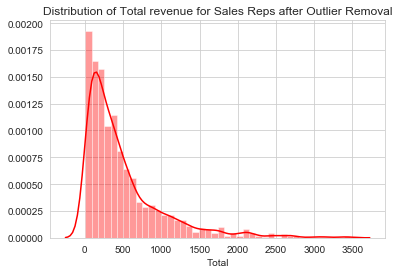

# Mod 3 Final Project

## Student Info

- Name: Michael Burak
- Cohort: fsds_100719
- Instructor: James Irving


<h1>Table of Contents<span class="tocSkip"></span></h1>
<div class="toc"><ul class="toc-item"><li><span><a href="#Mod-3-Final-Project" data-toc-modified-id="Mod-3-Final-Project-1">Mod 3 Final Project</a></span><ul class="toc-item"><li><span><a href="#Student-Info" data-toc-modified-id="Student-Info-1.1">Student Info</a></span></li><li><span><a href="#Importing-libraries-and-functions" data-toc-modified-id="Importing-libraries-and-functions-1.2">Importing libraries and functions</a></span></li><li><span><a href="#List-of-tables-in-database" data-toc-modified-id="List-of-tables-in-database-1.3">List of tables in database</a></span></li></ul></li><li><span><a href="#Hypothesis-1:" data-toc-modified-id="Hypothesis-1:-2">Hypothesis 1:</a></span><ul class="toc-item"><li><span><a href="#No-nulls-in-dataset" data-toc-modified-id="No-nulls-in-dataset-2.1">No nulls in dataset</a></span></li><li><span><a href="#Creating-dataframes-with-and-without-Discounts-being-given-on-orders." data-toc-modified-id="Creating-dataframes-with-and-without-Discounts-being-given-on-orders.-2.2">Creating dataframes with and without Discounts being given on orders.</a></span></li><li><span><a href="#Count-of-Discounts-at-each-level-when-discount-is-given." data-toc-modified-id="Count-of-Discounts-at-each-level-when-discount-is-given.-2.3">Count of Discounts at each level when discount is given.</a></span></li><li><span><a href="#Creating-dataframe-with-only-orders-that-did-not-receive-a-discount." data-toc-modified-id="Creating-dataframe-with-only-orders-that-did-not-receive-a-discount.-2.4">Creating dataframe with only orders that did not receive a discount.</a></span></li><li><span><a href="#Outlier-Removal-on-both-groups(dataframes.)" data-toc-modified-id="Outlier-Removal-on-both-groups(dataframes.)-2.5">Outlier Removal on both groups(dataframes.)</a></span></li><li><span><a href="#Normality-Test-for-both-groups" data-toc-modified-id="Normality-Test-for-both-groups-2.6">Normality Test for both groups</a></span></li><li><span><a href="#Equal-Variance-test-for-both-groups" data-toc-modified-id="Equal-Variance-test-for-both-groups-2.7">Equal Variance test for both groups</a></span></li><li><span><a href="#Welch's-T-Test:-Hypothesis-1" data-toc-modified-id="Welch's-T-Test:-Hypothesis-1-2.8">Welch's T-Test: Hypothesis 1</a></span></li><li><span><a href="#Post-hoc-Tests,-Recommendations,-and-Summary:-Hypothesis-1" data-toc-modified-id="Post-hoc-Tests,-Recommendations,-and-Summary:-Hypothesis-1-2.9">Post-hoc Tests, Recommendations, and Summary: Hypothesis 1</a></span></li><li><span><a href="#Tukey-range-test:-Hypothesis-1" data-toc-modified-id="Tukey-range-test:-Hypothesis-1-2.10">Tukey range test: Hypothesis 1</a></span></li><li><span><a href="#Recommendations-and-Summary:-Hypothesis-1" data-toc-modified-id="Recommendations-and-Summary:-Hypothesis-1-2.11">Recommendations and Summary: Hypothesis 1</a></span></li></ul></li><li><span><a href="#Hypothesis-2:" data-toc-modified-id="Hypothesis-2:-3">Hypothesis 2:</a></span><ul class="toc-item"><li><span><a href="#Getting-the-data-of-employee-hire-date-and-order-discounts-by-employee-and-manipulating-it" data-toc-modified-id="Getting-the-data-of-employee-hire-date-and-order-discounts-by-employee-and-manipulating-it-3.1">Getting the data of employee hire date and order discounts by employee and manipulating it</a></span></li><li><span><a href="#Hire-dates-range-from-2024-04-to-2026-11" data-toc-modified-id="Hire-dates-range-from-2024-04-to-2026-11-3.2">Hire dates range from 2024-04 to 2026-11</a></span></li><li><span><a href="#Defining-recent-hires-as-2026,-all-other-hires(2025,-2024)-are-in-the-other-group." data-toc-modified-id="Defining-recent-hires-as-2026,-all-other-hires(2025,-2024)-are-in-the-other-group.-3.3">Defining recent hires as 2026, all other hires(2025, 2024) are in the other group.</a></span></li><li><span><a href="#Outlier-Removal:-Hypothesis-2" data-toc-modified-id="Outlier-Removal:-Hypothesis-2-3.4">Outlier Removal: Hypothesis 2</a></span></li><li><span><a href="#Normality-tests:-Hypothesis-2" data-toc-modified-id="Normality-tests:-Hypothesis-2-3.5">Normality tests: Hypothesis 2</a></span></li><li><span><a href="#Equal-variance-test:-Hypothesis-2" data-toc-modified-id="Equal-variance-test:-Hypothesis-2-3.6">Equal variance test: Hypothesis 2</a></span></li><li><span><a href="#Welch's-T-Test:-Hypothesis-2" data-toc-modified-id="Welch's-T-Test:-Hypothesis-2-3.7">Welch's T-Test: Hypothesis 2</a></span></li><li><span><a href="#Post-hoc-tests:-Hypothesis-2" data-toc-modified-id="Post-hoc-tests:-Hypothesis-2-3.8">Post-hoc tests: Hypothesis 2</a></span></li><li><span><a href="#Bar-Chart:-Hypothesis-2" data-toc-modified-id="Bar-Chart:-Hypothesis-2-3.9">Bar Chart: Hypothesis 2</a></span></li><li><span><a href="#Recommendations-and-Summary:-Hypothesis-2" data-toc-modified-id="Recommendations-and-Summary:-Hypothesis-2-3.10">Recommendations and Summary: Hypothesis 2</a></span></li></ul></li><li><span><a href="#Hypothesis-3:" data-toc-modified-id="Hypothesis-3:-4">Hypothesis 3:</a></span><ul class="toc-item"><li><span><a href="#Loading-in-data-regarding-employees-and-their-orders" data-toc-modified-id="Loading-in-data-regarding-employees-and-their-orders-4.1">Loading in data regarding employees and their orders</a></span></li><li><span><a href="#Segmenting-by-Title" data-toc-modified-id="Segmenting-by-Title-4.2">Segmenting by Title</a></span></li><li><span><a href="#Outlier-Removal:-Hypothesis-3" data-toc-modified-id="Outlier-Removal:-Hypothesis-3-4.3">Outlier Removal: Hypothesis 3</a></span></li><li><span><a href="#Tests-for-normality,-variance,-final-test:-Hypothesis-3" data-toc-modified-id="Tests-for-normality,-variance,-final-test:-Hypothesis-3-4.4">Tests for normality, variance, final test: Hypothesis 3</a></span></li><li><span><a href="#Post-hoc-tests:-Hypothesis-3" data-toc-modified-id="Post-hoc-tests:-Hypothesis-3-4.5">Post-hoc tests: Hypothesis 3</a></span></li><li><span><a href="#Bar-Plot:-Hypothesis-3" data-toc-modified-id="Bar-Plot:-Hypothesis-3-4.6">Bar Plot: Hypothesis 3</a></span></li></ul></li><li><span><a href="#Recommendations-and-Summary:-Hypothesis-3" data-toc-modified-id="Recommendations-and-Summary:-Hypothesis-3-5">Recommendations and Summary: Hypothesis 3</a></span></li><li><span><a href="#Hypothesis-4:" data-toc-modified-id="Hypothesis-4:-6">Hypothesis 4:</a></span><ul class="toc-item"><li><span><a href="#Distribution-of-Same-vs.-Different-Region-between-Customer-and-Supplier" data-toc-modified-id="Distribution-of-Same-vs.-Different-Region-between-Customer-and-Supplier-6.1">Distribution of Same vs. Different Region between Customer and Supplier</a></span></li><li><span><a href="#Creating-'Total'-column-off-Unit-Price-*-Quantity-*-(1-Discount)-as-metric" data-toc-modified-id="Creating-'Total'-column-off-Unit-Price-*-Quantity-*-(1-Discount)-as-metric-6.2">Creating 'Total' column off Unit Price * Quantity * (1-Discount) as metric</a></span></li><li><span><a href="#Outlier-Removal:-Hypothesis-4" data-toc-modified-id="Outlier-Removal:-Hypothesis-4-6.3">Outlier Removal: Hypothesis 4</a></span></li><li><span><a href="#Normality-and-Variance-Tests:-Hypothesis-4" data-toc-modified-id="Normality-and-Variance-Tests:-Hypothesis-4-6.4">Normality and Variance Tests: Hypothesis 4</a></span></li><li><span><a href="#Welch's-T-test:-Hypothesis-4" data-toc-modified-id="Welch's-T-test:-Hypothesis-4-6.5">Welch's T-test: Hypothesis 4</a></span></li><li><span><a href="#Post-hoc-Tests:-Hypothesis-4" data-toc-modified-id="Post-hoc-Tests:-Hypothesis-4-6.6">Post-hoc Tests: Hypothesis 4</a></span></li><li><span><a href="#Bar-Plot:-Hypothesis-4" data-toc-modified-id="Bar-Plot:-Hypothesis-4-6.7">Bar Plot: Hypothesis 4</a></span></li></ul></li><li><span><a href="#Summary-and-Recommendations:-Hypothesis-4" data-toc-modified-id="Summary-and-Recommendations:-Hypothesis-4-7">Summary and Recommendations: Hypothesis 4</a></span></li><li><span><a href="#Overall-Summary/Conclusion" data-toc-modified-id="Overall-Summary/Conclusion-8">Overall Summary/Conclusion</a></span></li></ul></div>


## Importing libraries and functions


```python
!pip install -U fsds_100719
from fsds_100719.imports import *
import pandas as pd
import numpy as np
import scipy
from statsmodels.stats.multicomp import MultiComparison
```

    fsds_1007219  v0.7.9 loaded.  Read the docs: https://fsds.readthedocs.io/en/latest/ 


<style  type="text/css" >
</style><table id="T_df2d3bfe_5a1d_11ea_912f_6030d4693bb2" ><caption>Loaded Packages and Handles</caption><thead>    <tr>        <th class="col_heading level0 col0" >Handle</th>        <th class="col_heading level0 col1" >Package</th>        <th class="col_heading level0 col2" >Description</th>    </tr></thead><tbody>
                <tr>
                                <td id="T_df2d3bfe_5a1d_11ea_912f_6030d4693bb2row0_col0" class="data row0 col0" >dp</td>
                        <td id="T_df2d3bfe_5a1d_11ea_912f_6030d4693bb2row0_col1" class="data row0 col1" >IPython.display</td>
                        <td id="T_df2d3bfe_5a1d_11ea_912f_6030d4693bb2row0_col2" class="data row0 col2" >Display modules with helpful display and clearing commands.</td>
            </tr>
            <tr>
                                <td id="T_df2d3bfe_5a1d_11ea_912f_6030d4693bb2row1_col0" class="data row1 col0" >fs</td>
                        <td id="T_df2d3bfe_5a1d_11ea_912f_6030d4693bb2row1_col1" class="data row1 col1" >fsds_100719</td>
                        <td id="T_df2d3bfe_5a1d_11ea_912f_6030d4693bb2row1_col2" class="data row1 col2" >Custom data science bootcamp student package</td>
            </tr>
            <tr>
                                <td id="T_df2d3bfe_5a1d_11ea_912f_6030d4693bb2row2_col0" class="data row2 col0" >mpl</td>
                        <td id="T_df2d3bfe_5a1d_11ea_912f_6030d4693bb2row2_col1" class="data row2 col1" >matplotlib</td>
                        <td id="T_df2d3bfe_5a1d_11ea_912f_6030d4693bb2row2_col2" class="data row2 col2" >Matplotlib's base OOP module with formatting artists</td>
            </tr>
            <tr>
                                <td id="T_df2d3bfe_5a1d_11ea_912f_6030d4693bb2row3_col0" class="data row3 col0" >plt</td>
                        <td id="T_df2d3bfe_5a1d_11ea_912f_6030d4693bb2row3_col1" class="data row3 col1" >matplotlib.pyplot</td>
                        <td id="T_df2d3bfe_5a1d_11ea_912f_6030d4693bb2row3_col2" class="data row3 col2" >Matplotlib's matlab-like plotting module</td>
            </tr>
            <tr>
                                <td id="T_df2d3bfe_5a1d_11ea_912f_6030d4693bb2row4_col0" class="data row4 col0" >np</td>
                        <td id="T_df2d3bfe_5a1d_11ea_912f_6030d4693bb2row4_col1" class="data row4 col1" >numpy</td>
                        <td id="T_df2d3bfe_5a1d_11ea_912f_6030d4693bb2row4_col2" class="data row4 col2" >scientific computing with Python</td>
            </tr>
            <tr>
                                <td id="T_df2d3bfe_5a1d_11ea_912f_6030d4693bb2row5_col0" class="data row5 col0" >pd</td>
                        <td id="T_df2d3bfe_5a1d_11ea_912f_6030d4693bb2row5_col1" class="data row5 col1" >pandas</td>
                        <td id="T_df2d3bfe_5a1d_11ea_912f_6030d4693bb2row5_col2" class="data row5 col2" >High performance data structures and tools</td>
            </tr>
            <tr>
                                <td id="T_df2d3bfe_5a1d_11ea_912f_6030d4693bb2row6_col0" class="data row6 col0" >sns</td>
                        <td id="T_df2d3bfe_5a1d_11ea_912f_6030d4693bb2row6_col1" class="data row6 col1" >seaborn</td>
                        <td id="T_df2d3bfe_5a1d_11ea_912f_6030d4693bb2row6_col2" class="data row6 col2" >High-level data visualization library based on matplotlib</td>
            </tr>
    </tbody></table>


        <script type="text/javascript">
        window.PlotlyConfig = {MathJaxConfig: 'local'};
        if (window.MathJax) {MathJax.Hub.Config({SVG: {font: "STIX-Web"}});}
        if (typeof require !== 'undefined') {
        require.undef("plotly");
        requirejs.config({
            paths: {
                'plotly': ['https://cdn.plot.ly/plotly-latest.min']
            }
        });
        require(['plotly'], function(Plotly) {
            window._Plotly = Plotly;
        });
        }
        </script>
        


    ['[i] Pandas .iplot() method activated.']


```python
import plotly.express as px
```


```python
from functions import Cohen_d, find_outliers_IQR,find_outliers_Z
```


```python
# Setting plot style
sns.set_style("whitegrid")
```


```python
def normal_test(x): 
    k2, p = scipy.stats.normaltest(x)
    alpha = .05
    print("p = {}".format(round(p, 4)))
    if p < alpha:  # null hypothesis: x comes from a normal distribution
        print("The null hypothesis can be rejected, data does not appear to be from a normal distribution")
    else:
        print("The null hypothesis cannot be rejected, data appears to be from a normal distribution.")
```


```python
def variance_test(data1,data2): 
    W, p = scipy.stats.levene(data1,data2)
    alpha = .05
    print("p = {}".format(round(p, 4)))
    if p < alpha:  # null hypothesis: groups have equal variance
        print("The null hypothesis can be rejected, data does not appear to have equal variance.")
    else:
        print("The null hypothesis cannot be rejected, data appears to have equal variance.")
```


```python
def t_test(data1, data2, equal_var = True):
    stat, p = scipy.stats.ttest_ind(data1,data2)
    print('Statistics=%.3f, p=%.3f' % (stat, round(p, 4)))
    alpha = 0.05
    if p < alpha: #Null hypothesis: data comes from same distribution
        print('The null hypothesis can be rejected, data appears to be from differing distributions.')
    else:
        print('The null hypothesis cannot be rejected, data appears to be from the same distribution.')
```


```python
def tukey_test(group1, group2):
    mc = MultiComparison(group1,group2)
    result = mc.tukeyhsd()
    print(result)
    print(mc.groupsunique)
```


```python
import sqlite3
connect = sqlite3.connect('Northwind_small.sqlite')
c = connect.cursor()
```

## List of tables in database


```python
c.execute("""SELECT name FROM sqlite_master WHERE type='table';""")
df_tables = pd.DataFrame(c.fetchall(), columns=['Table'])
df_tables
```


<div>
<style scoped>
    .dataframe tbody tr th:only-of-type {
        vertical-align: middle;
    }

    .dataframe tbody tr th {
        vertical-align: top;
    }

    .dataframe thead th {
        text-align: right;
    }
</style>
<table border="1" class="dataframe">
  <thead>
    <tr style="text-align: right;">
      <th></th>
      <th>Table</th>
    </tr>
  </thead>
  <tbody>
    <tr>
      <td>0</td>
      <td>Employee</td>
    </tr>
    <tr>
      <td>1</td>
      <td>Category</td>
    </tr>
    <tr>
      <td>2</td>
      <td>Customer</td>
    </tr>
    <tr>
      <td>3</td>
      <td>Shipper</td>
    </tr>
    <tr>
      <td>4</td>
      <td>Supplier</td>
    </tr>
    <tr>
      <td>5</td>
      <td>Order</td>
    </tr>
    <tr>
      <td>6</td>
      <td>Product</td>
    </tr>
    <tr>
      <td>7</td>
      <td>OrderDetail</td>
    </tr>
    <tr>
      <td>8</td>
      <td>CustomerCustomerDemo</td>
    </tr>
    <tr>
      <td>9</td>
      <td>CustomerDemographic</td>
    </tr>
    <tr>
      <td>10</td>
      <td>Region</td>
    </tr>
    <tr>
      <td>11</td>
      <td>Territory</td>
    </tr>
    <tr>
      <td>12</td>
      <td>EmployeeTerritory</td>
    </tr>
  </tbody>
</table>
</div>


# Hypothesis 1: 


### -Does discount amount have a statistically significant effect on the quantity of a product in an order? If so, at what level(s) of discount?
### - $H_0$ :  Discount does not have a statistically significant effect on the quantity of a product in an order.
### - $H_1$ : Discount has a statstically significant effect on the quantity of a product in an order.


```python
c.execute("SELECT * FROM OrderDetail")
 
df_od = pd.DataFrame(c.fetchall())
df_od.columns = [x[0] for x in c.description]

df_od
```


<div>
<style scoped>
    .dataframe tbody tr th:only-of-type {
        vertical-align: middle;
    }

    .dataframe tbody tr th {
        vertical-align: top;
    }

    .dataframe thead th {
        text-align: right;
    }
</style>
<table border="1" class="dataframe">
  <thead>
    <tr style="text-align: right;">
      <th></th>
      <th>Id</th>
      <th>OrderId</th>
      <th>ProductId</th>
      <th>UnitPrice</th>
      <th>Quantity</th>
      <th>Discount</th>
    </tr>
  </thead>
  <tbody>
    <tr>
      <td>0</td>
      <td>10248/11</td>
      <td>10248</td>
      <td>11</td>
      <td>14.00</td>
      <td>12</td>
      <td>0.00</td>
    </tr>
    <tr>
      <td>1</td>
      <td>10248/42</td>
      <td>10248</td>
      <td>42</td>
      <td>9.80</td>
      <td>10</td>
      <td>0.00</td>
    </tr>
    <tr>
      <td>2</td>
      <td>10248/72</td>
      <td>10248</td>
      <td>72</td>
      <td>34.80</td>
      <td>5</td>
      <td>0.00</td>
    </tr>
    <tr>
      <td>3</td>
      <td>10249/14</td>
      <td>10249</td>
      <td>14</td>
      <td>18.60</td>
      <td>9</td>
      <td>0.00</td>
    </tr>
    <tr>
      <td>4</td>
      <td>10249/51</td>
      <td>10249</td>
      <td>51</td>
      <td>42.40</td>
      <td>40</td>
      <td>0.00</td>
    </tr>
    <tr>
      <td>...</td>
      <td>...</td>
      <td>...</td>
      <td>...</td>
      <td>...</td>
      <td>...</td>
      <td>...</td>
    </tr>
    <tr>
      <td>2150</td>
      <td>11077/64</td>
      <td>11077</td>
      <td>64</td>
      <td>33.25</td>
      <td>2</td>
      <td>0.03</td>
    </tr>
    <tr>
      <td>2151</td>
      <td>11077/66</td>
      <td>11077</td>
      <td>66</td>
      <td>17.00</td>
      <td>1</td>
      <td>0.00</td>
    </tr>
    <tr>
      <td>2152</td>
      <td>11077/73</td>
      <td>11077</td>
      <td>73</td>
      <td>15.00</td>
      <td>2</td>
      <td>0.01</td>
    </tr>
    <tr>
      <td>2153</td>
      <td>11077/75</td>
      <td>11077</td>
      <td>75</td>
      <td>7.75</td>
      <td>4</td>
      <td>0.00</td>
    </tr>
    <tr>
      <td>2154</td>
      <td>11077/77</td>
      <td>11077</td>
      <td>77</td>
      <td>13.00</td>
      <td>2</td>
      <td>0.00</td>
    </tr>
  </tbody>
</table>
<p>2155 rows × 6 columns</p>
</div>


## No nulls in dataset


```python
df_od.info()
```

    <class 'pandas.core.frame.DataFrame'>
    RangeIndex: 2155 entries, 0 to 2154
    Data columns (total 6 columns):
    Id           2155 non-null object
    OrderId      2155 non-null int64
    ProductId    2155 non-null int64
    UnitPrice    2155 non-null float64
    Quantity     2155 non-null int64
    Discount     2155 non-null float64
    dtypes: float64(2), int64(3), object(1)
    memory usage: 101.1+ KB


```python
sns.stripplot(x="Discount", y="Quantity", data=df_od, color="goldenrod", jitter=True)

ax = plt.gca()

ax.set_title('Frequency of Discounts given out.')
```


    Text(0.5, 1.0, 'Frequency of Discounts given out.')


## Creating dataframes with and without Discounts being given on orders.


```python
df_dis = df_od.loc[df_od['Discount'] > 0]

df_dis.head(10)
```


<div>
<style scoped>
    .dataframe tbody tr th:only-of-type {
        vertical-align: middle;
    }

    .dataframe tbody tr th {
        vertical-align: top;
    }

    .dataframe thead th {
        text-align: right;
    }
</style>
<table border="1" class="dataframe">
  <thead>
    <tr style="text-align: right;">
      <th></th>
      <th>Id</th>
      <th>OrderId</th>
      <th>ProductId</th>
      <th>UnitPrice</th>
      <th>Quantity</th>
      <th>Discount</th>
    </tr>
  </thead>
  <tbody>
    <tr>
      <td>6</td>
      <td>10250/51</td>
      <td>10250</td>
      <td>51</td>
      <td>42.4</td>
      <td>35</td>
      <td>0.15</td>
    </tr>
    <tr>
      <td>7</td>
      <td>10250/65</td>
      <td>10250</td>
      <td>65</td>
      <td>16.8</td>
      <td>15</td>
      <td>0.15</td>
    </tr>
    <tr>
      <td>8</td>
      <td>10251/22</td>
      <td>10251</td>
      <td>22</td>
      <td>16.8</td>
      <td>6</td>
      <td>0.05</td>
    </tr>
    <tr>
      <td>9</td>
      <td>10251/57</td>
      <td>10251</td>
      <td>57</td>
      <td>15.6</td>
      <td>15</td>
      <td>0.05</td>
    </tr>
    <tr>
      <td>11</td>
      <td>10252/20</td>
      <td>10252</td>
      <td>20</td>
      <td>64.8</td>
      <td>40</td>
      <td>0.05</td>
    </tr>
    <tr>
      <td>12</td>
      <td>10252/33</td>
      <td>10252</td>
      <td>33</td>
      <td>2.0</td>
      <td>25</td>
      <td>0.05</td>
    </tr>
    <tr>
      <td>17</td>
      <td>10254/24</td>
      <td>10254</td>
      <td>24</td>
      <td>3.6</td>
      <td>15</td>
      <td>0.15</td>
    </tr>
    <tr>
      <td>18</td>
      <td>10254/55</td>
      <td>10254</td>
      <td>55</td>
      <td>19.2</td>
      <td>21</td>
      <td>0.15</td>
    </tr>
    <tr>
      <td>29</td>
      <td>10258/2</td>
      <td>10258</td>
      <td>2</td>
      <td>15.2</td>
      <td>50</td>
      <td>0.20</td>
    </tr>
    <tr>
      <td>30</td>
      <td>10258/5</td>
      <td>10258</td>
      <td>5</td>
      <td>17.0</td>
      <td>65</td>
      <td>0.20</td>
    </tr>
  </tbody>
</table>
</div>


## Count of Discounts at each level when discount is given.


```python
df_dis['Discount'].value_counts()
```


    0.05    185
    0.10    173
    0.20    161
    0.15    157
    0.25    154
    0.03      3
    0.02      2
    0.04      1
    0.06      1
    0.01      1
    Name: Discount, dtype: int64


```python
sns.swarmplot(x="Discount", y="Quantity", data=df_dis, color="goldenrod")

ax = plt.gca()

ax.set_title('Quantity of product sold by Discount given when Discount is given')
```


    Text(0.5, 1.0, 'Quantity of product sold by Discount given when Discount is given')


## Creating dataframe with only orders that did not receive a discount.


```python
df_no_dis = df_od.loc[df_od['Discount'] == 0]

df_no_dis.head(10)
```


<div>
<style scoped>
    .dataframe tbody tr th:only-of-type {
        vertical-align: middle;
    }

    .dataframe tbody tr th {
        vertical-align: top;
    }

    .dataframe thead th {
        text-align: right;
    }
</style>
<table border="1" class="dataframe">
  <thead>
    <tr style="text-align: right;">
      <th></th>
      <th>Id</th>
      <th>OrderId</th>
      <th>ProductId</th>
      <th>UnitPrice</th>
      <th>Quantity</th>
      <th>Discount</th>
    </tr>
  </thead>
  <tbody>
    <tr>
      <td>0</td>
      <td>10248/11</td>
      <td>10248</td>
      <td>11</td>
      <td>14.0</td>
      <td>12</td>
      <td>0.0</td>
    </tr>
    <tr>
      <td>1</td>
      <td>10248/42</td>
      <td>10248</td>
      <td>42</td>
      <td>9.8</td>
      <td>10</td>
      <td>0.0</td>
    </tr>
    <tr>
      <td>2</td>
      <td>10248/72</td>
      <td>10248</td>
      <td>72</td>
      <td>34.8</td>
      <td>5</td>
      <td>0.0</td>
    </tr>
    <tr>
      <td>3</td>
      <td>10249/14</td>
      <td>10249</td>
      <td>14</td>
      <td>18.6</td>
      <td>9</td>
      <td>0.0</td>
    </tr>
    <tr>
      <td>4</td>
      <td>10249/51</td>
      <td>10249</td>
      <td>51</td>
      <td>42.4</td>
      <td>40</td>
      <td>0.0</td>
    </tr>
    <tr>
      <td>5</td>
      <td>10250/41</td>
      <td>10250</td>
      <td>41</td>
      <td>7.7</td>
      <td>10</td>
      <td>0.0</td>
    </tr>
    <tr>
      <td>10</td>
      <td>10251/65</td>
      <td>10251</td>
      <td>65</td>
      <td>16.8</td>
      <td>20</td>
      <td>0.0</td>
    </tr>
    <tr>
      <td>13</td>
      <td>10252/60</td>
      <td>10252</td>
      <td>60</td>
      <td>27.2</td>
      <td>40</td>
      <td>0.0</td>
    </tr>
    <tr>
      <td>14</td>
      <td>10253/31</td>
      <td>10253</td>
      <td>31</td>
      <td>10.0</td>
      <td>20</td>
      <td>0.0</td>
    </tr>
    <tr>
      <td>15</td>
      <td>10253/39</td>
      <td>10253</td>
      <td>39</td>
      <td>14.4</td>
      <td>42</td>
      <td>0.0</td>
    </tr>
  </tbody>
</table>
</div>


```python
df_no_dis['Discount'].value_counts()
```


    0.0    1317
    Name: Discount, dtype: int64


## Outlier Removal on both groups(dataframes.)


```python
df_dis['Quantity'].describe()
```


    count    838.000000
    mean      27.109785
    std       20.771439
    min        1.000000
    25%       12.000000
    50%       20.000000
    75%       36.000000
    max      130.000000
    Name: Quantity, dtype: float64


```python
sns.distplot(df_dis['Quantity'], color="firebrick")

ax = plt.gca()

ax.set_alpha(0.75)
ax.set_title('Distribution of Quantity sold at a Discount')
```


    Text(0.5, 1.0, 'Distribution of Quantity sold at a Discount')


```python
idx_outs = find_outliers_Z(df_dis['Quantity'])
idx_outs.value_counts()
```


    False    823
    True      15
    dtype: int64


```python
df_dis = df_dis[~idx_outs].copy()

sns.distplot(df_dis['Quantity'], color="red")

ax = plt.gca()

ax.set_title('Distribution of Quantity sold at a Discount after Outlier Removal')
```


    Text(0.5, 1.0, 'Distribution of Quantity sold at a Discount after Outlier Removal')


```python
len(df_dis)
```


    823


```python
sns.distplot(df_no_dis['Quantity'], color="firebrick")

ax = plt.gca()

ax.set_title('Distribution of Quantity sold without a Discount after Outlier Removal')
```


    Text(0.5, 1.0, 'Distribution of Quantity sold without a Discount after Outlier Removal')


```python
idx_outs = find_outliers_Z(df_no_dis['Quantity'])
idx_outs.value_counts()
```


    False    1297
    True       20
    dtype: int64


```python
df_no_dis = df_no_dis[~idx_outs].copy()

sns.distplot(df_no_dis['Quantity'], color="red")

ax = plt.gca()

ax.set_title('Distribution of Quantity sold without a Discount after Outlier Removal')
```


    Text(0.5, 1.0, 'Distribution of Quantity sold without a Discount after Outlier Removal')


```python
len(df_no_dis)
```


    1297


## Normality Test for both groups


```python
normal_test(df_dis['Quantity'])
```

    p = 0.0
    The null hypothesis can be rejected, data does not appear to be from a normal distribution


```python
normal_test(df_no_dis['Quantity'])
```

    p = 0.0
    The null hypothesis can be rejected, data does not appear to be from a normal distribution


- The null hypothesis here is that the data comes from a normal distribution. However, 
the data is large enough to ignore assumption of normality rules.

## Equal Variance test for both groups


```python
variance_test(df_dis['Quantity'],df_no_dis['Quantity'])
```

    p = 0.0
    The null hypothesis can be rejected, data does not appear to have equal variance.


- Given that the normality assumption is bypassed by group size, but there is not equal variance between groups, a Welch's T-Test is the test to perform.

## Welch's T-Test: Hypothesis 1


```python
t_test(df_dis['Quantity'],df_no_dis['Quantity'], equal_var=False)
```

    Statistics=7.181, p=0.000
    The null hypothesis can be rejected, data appears to be from differing distributions.


## Post-hoc Tests, Recommendations, and Summary: Hypothesis 1


```python
Cohen_d(df_dis['Quantity'],df_no_dis['Quantity'])
```


    0.32001140965727837


###  Cohen's D suggests a small effect size


```python
df_dis['DiscountApplied'] = 'True'
df_no_dis['DiscountApplied'] = "False"
```


```python
df_dis_conc = df_dis.append(df_no_dis)

df_dis_conc.head()
```


<div>
<style scoped>
    .dataframe tbody tr th:only-of-type {
        vertical-align: middle;
    }

    .dataframe tbody tr th {
        vertical-align: top;
    }

    .dataframe thead th {
        text-align: right;
    }
</style>
<table border="1" class="dataframe">
  <thead>
    <tr style="text-align: right;">
      <th></th>
      <th>Id</th>
      <th>OrderId</th>
      <th>ProductId</th>
      <th>UnitPrice</th>
      <th>Quantity</th>
      <th>Discount</th>
      <th>DiscountApplied</th>
    </tr>
  </thead>
  <tbody>
    <tr>
      <td>6</td>
      <td>10250/51</td>
      <td>10250</td>
      <td>51</td>
      <td>42.4</td>
      <td>35</td>
      <td>0.15</td>
      <td>True</td>
    </tr>
    <tr>
      <td>7</td>
      <td>10250/65</td>
      <td>10250</td>
      <td>65</td>
      <td>16.8</td>
      <td>15</td>
      <td>0.15</td>
      <td>True</td>
    </tr>
    <tr>
      <td>8</td>
      <td>10251/22</td>
      <td>10251</td>
      <td>22</td>
      <td>16.8</td>
      <td>6</td>
      <td>0.05</td>
      <td>True</td>
    </tr>
    <tr>
      <td>9</td>
      <td>10251/57</td>
      <td>10251</td>
      <td>57</td>
      <td>15.6</td>
      <td>15</td>
      <td>0.05</td>
      <td>True</td>
    </tr>
    <tr>
      <td>11</td>
      <td>10252/20</td>
      <td>10252</td>
      <td>20</td>
      <td>64.8</td>
      <td>40</td>
      <td>0.05</td>
      <td>True</td>
    </tr>
  </tbody>
</table>
</div>


```python
df_dis_conc.Discount.value_counts()
```


    0.00    1297
    0.05     181
    0.10     170
    0.20     159
    0.15     154
    0.25     151
    0.03       3
    0.02       2
    0.01       1
    0.04       1
    0.06       1
    Name: Discount, dtype: int64


## Tukey range test: Hypothesis 1


```python
tukey_test(df_dis_conc['Quantity'], df_dis_conc['Discount'])
```

     Multiple Comparison of Means - Tukey HSD, FWER=0.05 
    =====================================================
    group1 group2 meandiff p-adj   lower    upper  reject
    -----------------------------------------------------
       0.0   0.01 -18.5405    0.9 -69.9335 32.8526  False
       0.0   0.02 -18.5405 0.8499 -54.8948 17.8139  False
       0.0   0.03 -18.8738 0.5986 -48.5684 10.8208  False
       0.0   0.04 -19.5405    0.9 -70.9335 31.8526  False
       0.0   0.05   5.7137  0.001   1.6374    9.79   True
       0.0   0.06 -18.5405    0.9 -69.9335 32.8526  False
       0.0    0.1   2.9654 0.4514   -1.225  7.1558  False
       0.0   0.15   6.5115  0.001   2.1328 10.8901   True
       0.0    0.2   5.6293 0.0014   1.3127   9.946   True
       0.0   0.25   6.1416  0.001   1.7243  10.559   True
      0.01   0.02      0.0    0.9 -62.9191 62.9191  False
      0.01   0.03  -0.3333    0.9  -59.654 58.9874  False
      0.01   0.04     -1.0    0.9 -73.6527 71.6527  False
      0.01   0.05  24.2541    0.9 -27.2608 75.7691  False
      0.01   0.06      0.0    0.9 -72.6527 72.6527  False
      0.01    0.1  21.5059    0.9 -30.0182   73.03  False
      0.01   0.15  25.0519 0.8978 -26.4878 76.5917  False
      0.01    0.2  24.1698    0.9 -27.3647 75.7043  False
      0.01   0.25  24.6821    0.9 -26.8609 76.2252  False
      0.02   0.03  -0.3333    0.9 -47.2305 46.5638  False
      0.02   0.04     -1.0    0.9 -63.9191 61.9191  False
      0.02   0.05  24.2541 0.5417 -12.2724 60.7807  False
      0.02   0.06      0.0    0.9 -62.9191 62.9191  False
      0.02    0.1  21.5059 0.6927 -15.0335 58.0453  False
      0.02   0.15  25.0519 0.4993 -11.5095 61.6134  False
      0.02    0.2  24.1698 0.5473 -12.3843 60.7239  False
      0.02   0.25  24.6821 0.5197  -11.884 61.2483  False
      0.03   0.04  -0.6667    0.9 -59.9874  58.654  False
      0.03   0.05  24.5875 0.2244  -5.3177 54.4926  False
      0.03   0.06   0.3333    0.9 -58.9874  59.654  False
      0.03    0.1  21.8392 0.4018  -8.0817 51.7601  False
      0.03   0.15  25.3853 0.1863  -4.5626 55.3331  False
      0.03    0.2  24.5031 0.2304  -5.4357  54.442  False
      0.03   0.25  25.0155 0.2045  -4.9381  54.969  False
      0.04   0.05  25.2541 0.8895 -26.2608 76.7691  False
      0.04   0.06      1.0    0.9 -71.6527 73.6527  False
      0.04    0.1  22.5059    0.9 -29.0182   74.03  False
      0.04   0.15  26.0519  0.859 -25.4878 77.5917  False
      0.04    0.2  25.1698 0.8931 -26.3647 76.7043  False
      0.04   0.25  25.6821 0.8734 -25.8609 77.2252  False
      0.05   0.06 -24.2541    0.9 -75.7691 27.2608  False
      0.05    0.1  -2.7483 0.8682  -8.2352  2.7386  False
      0.05   0.15   0.7978    0.9  -4.8342  6.4298  False
      0.05    0.2  -0.0843    0.9  -5.6682  5.4996  False
      0.05   0.25    0.428    0.9  -5.2341  6.0901  False
      0.06    0.1  21.5059    0.9 -30.0182   73.03  False
      0.06   0.15  25.0519 0.8978 -26.4878 76.5917  False
      0.06    0.2  24.1698    0.9 -27.3647 75.7043  False
      0.06   0.25  24.6821    0.9 -26.8609 76.2252  False
       0.1   0.15   3.5461 0.6289   -2.169  9.2612  False
       0.1    0.2   2.6639    0.9  -3.0038  8.3317  False
       0.1   0.25   3.1762 0.7641  -2.5686  8.9211  False
      0.15    0.2  -0.8821    0.9  -6.6905  4.9262  False
      0.15   0.25  -0.3698    0.9  -6.2534  5.5137  False
       0.2   0.25   0.5123    0.9  -5.3252  6.3499  False
    -----------------------------------------------------
    [0.   0.01 0.02 0.03 0.04 0.05 0.06 0.1  0.15 0.2  0.25]


### Bar Chart: Hypothesis 1


```python
sns.barplot(data=df_dis_conc, x="Discount", y="Quantity", ci=68, palette="coolwarm")

ax = plt.gca()

ax.set_title('Quantity of Product sold at varying discount levels')
```


    Text(0.5, 1.0, 'Quantity of Product sold at varying discount levels')


## Recommendations and Summary: Hypothesis 1 
- D’Agostino and Pearson's test was performed to check for normality between the two groups of discounts given and not, which failed. However, the group sizes were large enough to move on to check for variance with Levene's test, which indicated the groups did not have an equal distribution. 
- Accordingly, a Welch's T-test was performed with a p of 0, rejecting the null hypothesis and indicating the data came from different distributions. Cohen's d test indicated a small effect size, while Tukey's range test indicated several groups rejecting the null hypothesis that their means were similar, the lowest of which was .05 in discount compared to 0 discount.
- Recommendation: <br> .05 is the lowest maximal discount, which does sell more product than not giving a discount, given that discounts are significant, beyond that, there is not much more impact to giving discounts. If giving discounts, use .05 as the discount level only to avoid losing revenue to too high discounts.

# Hypothesis 2: 
- **Is there an effect on discounts given by an employee's hire date being in 2026 or not?**
### - $H_0$ :  There is no effect on the amount of discounts if an employee was hired in 2026 compared to employees hired earlier.
### - $H_1$ : There is an effect on the amount of discounts if an employee was hired in 2026 compared to employees hired earlier.

## Getting the data of employee hire date and order discounts by employee and manipulating it


```python
c.execute("""SELECT E.HireDate, OD.Discount
             FROM Employee E JOIN `Order` O 
                              ON E.Id = O.EmployeeID
                              JOIN OrderDetail OD 
                              ON OD.OrderID = O.Id;""")
df_hire = pd.DataFrame(c.fetchall())
df_hire.columns = [x[0] for x in c.description]
df_hire.head(10)
```


<div>
<style scoped>
    .dataframe tbody tr th:only-of-type {
        vertical-align: middle;
    }

    .dataframe tbody tr th {
        vertical-align: top;
    }

    .dataframe thead th {
        text-align: right;
    }
</style>
<table border="1" class="dataframe">
  <thead>
    <tr style="text-align: right;">
      <th></th>
      <th>HireDate</th>
      <th>Discount</th>
    </tr>
  </thead>
  <tbody>
    <tr>
      <td>0</td>
      <td>2025-10-17</td>
      <td>0.00</td>
    </tr>
    <tr>
      <td>1</td>
      <td>2025-10-17</td>
      <td>0.00</td>
    </tr>
    <tr>
      <td>2</td>
      <td>2025-10-17</td>
      <td>0.00</td>
    </tr>
    <tr>
      <td>3</td>
      <td>2025-10-17</td>
      <td>0.00</td>
    </tr>
    <tr>
      <td>4</td>
      <td>2025-10-17</td>
      <td>0.00</td>
    </tr>
    <tr>
      <td>5</td>
      <td>2025-05-03</td>
      <td>0.00</td>
    </tr>
    <tr>
      <td>6</td>
      <td>2025-05-03</td>
      <td>0.15</td>
    </tr>
    <tr>
      <td>7</td>
      <td>2025-05-03</td>
      <td>0.15</td>
    </tr>
    <tr>
      <td>8</td>
      <td>2024-04-01</td>
      <td>0.05</td>
    </tr>
    <tr>
      <td>9</td>
      <td>2024-04-01</td>
      <td>0.05</td>
    </tr>
  </tbody>
</table>
</div>


```python
len(df_hire)
```


    2155


## Hire dates range from 2024-04 to 2026-11


```python
df_hire['HireDate'].value_counts().sort_index()
```


    2024-04-01    321
    2024-05-01    345
    2024-08-14    241
    2025-05-03    420
    2025-10-17    285
    2026-01-02    176
    2026-03-05    260
    2026-11-15    107
    Name: HireDate, dtype: int64


```python
fig = px.scatter(df_hire, x="HireDate", y="Discount", marginal_x="histogram",size_max=60,)
fig.show()
```


<div>
        
        
            <div id="c7d5241e-a39b-4422-bc4a-3dd24dbf30dc" class="plotly-graph-div" style="height:525px; width:100%;"></div>
            <script type="text/javascript">
                require(["plotly"], function(Plotly) {
                    window.PLOTLYENV=window.PLOTLYENV || {};
                    
                if (document.getElementById("c7d5241e-a39b-4422-bc4a-3dd24dbf30dc")) {
                    Plotly.newPlot(
                        'c7d5241e-a39b-4422-bc4a-3dd24dbf30dc',
                        [{"hoverlabel": {"namelength": 0}, "hovertemplate": "HireDate=%{x}<br>Discount=%{y}", "legendgroup": "", "marker": {"color": "#636efa", "symbol": "circle"}, "mode": "markers", "name": "", "showlegend": false, "type": "scattergl", "x": ["2025-10-17", "2025-10-17", "2025-10-17", "2025-10-17", "2025-10-17", "2025-05-03", "2025-05-03", "2025-05-03", "2024-04-01", "2024-04-01", "2024-04-01", "2025-05-03", "2025-05-03", "2025-05-03", "2024-04-01", "2024-04-01", "2024-04-01", "2025-10-17", "2025-10-17", "2025-10-17", "2026-11-15", "2026-11-15", "2026-11-15", "2026-11-15", "2024-04-01", "2024-04-01", "2025-05-03", "2025-05-03", "2025-05-03", "2024-05-01", "2024-05-01", "2024-05-01", "2025-05-03", "2025-05-03", "2025-05-03", "2025-05-03", "2025-05-03", "2025-05-03", "2025-05-03", "2025-05-03", "2026-03-05", "2026-03-05", "2026-03-05", "2026-11-15", "2026-11-15", "2026-11-15", "2026-11-15", "2025-10-17", "2025-10-17", "2024-08-14", "2024-08-14", "2024-04-01", "2025-05-03", "2025-05-03", "2025-05-03", "2026-03-05", "2026-03-05", "2025-10-17", "2025-10-17", "2024-05-01", "2024-05-01", "2025-10-17", "2025-10-17", "2025-10-17", "2025-10-17", "2024-04-01", "2024-04-01", "2024-04-01", "2024-04-01", "2024-04-01", "2025-10-17", "2025-10-17", "2024-05-01", "2024-05-01", "2026-03-05", "2026-03-05", "2024-08-14", "2024-08-14", "2026-03-05", "2026-03-05", "2026-03-05", "2026-03-05", "2026-03-05", "2024-08-14", "2024-08-14", "2024-08-14", "2025-05-03", "2025-05-03", "2025-05-03", "2025-05-03", "2025-05-03", "2024-04-01", "2024-04-01", "2024-04-01", "2024-04-01", "2025-05-03", "2025-05-03", "2025-05-03", "2025-05-03", "2024-05-01", "2024-05-01", "2024-05-01", "2026-03-05", "2026-03-05", "2026-03-05", "2026-03-05", "2026-03-05", "2025-05-03", "2025-05-03", "2026-01-02", "2026-01-02", "2026-03-05", "2026-03-05", "2026-03-05", "2026-03-05", "2025-10-17", "2025-10-17", "2025-10-17", "2024-05-01", "2024-05-01", "2024-05-01", "2024-05-01", "2024-05-01", "2025-05-03", "2025-05-03", "2025-05-03", "2025-05-03", "2025-05-03", "2024-08-14", "2025-10-17", "2025-10-17", "2025-10-17", "2025-10-17", "2025-10-17", "2025-10-17", "2025-10-17", "2025-10-17", "2025-10-17", "2025-05-03", "2025-05-03", "2024-08-14", "2024-08-14", "2026-03-05", "2026-03-05", "2025-05-03", "2025-05-03", "2025-05-03", "2026-01-02", "2026-01-02", "2026-01-02", "2024-05-01", "2024-05-01", "2024-05-01", "2026-03-05", "2026-03-05", "2026-03-05", "2024-05-01", "2024-05-01", "2024-05-01", "2024-08-14", "2024-08-14", "2026-01-02", "2026-01-02", "2024-04-01", "2024-04-01", "2024-04-01", "2024-04-01", "2024-04-01", "2026-03-05", "2026-03-05", "2024-05-01", "2024-05-01", "2024-08-14", "2024-08-14", "2024-08-14", "2024-08-14", "2024-08-14", "2024-05-01", "2024-05-01", "2024-05-01", "2025-05-03", "2025-05-03", "2024-05-01", "2024-05-01", "2025-10-17", "2026-03-05", "2026-03-05", "2026-01-02", "2026-01-02", "2026-01-02", "2025-10-17", "2024-04-01", "2026-01-02", "2025-05-03", "2025-05-03", "2025-05-03", "2026-11-15", "2026-11-15", "2026-11-15", "2026-11-15", "2026-11-15", "2024-05-01", "2024-05-01", "2024-05-01", "2024-05-01", "2024-05-01", "2025-05-03", "2025-05-03", "2025-05-03", "2024-08-14", "2024-08-14", "2024-08-14", "2024-08-14", "2025-05-03", "2025-05-03", "2025-05-03", "2025-05-03", "2025-05-03", "2025-05-03", "2025-05-03", "2024-04-01", "2024-04-01", "2026-11-15", "2024-04-01", "2024-04-01", "2024-04-01", "2025-10-17", "2025-10-17", "2025-10-17", "2026-03-05", "2026-03-05", "2026-01-02", "2026-01-02", "2026-01-02", "2026-01-02", "2026-01-02", "2025-05-03", "2025-05-03", "2025-05-03", "2025-05-03", "2025-05-03", "2025-05-03", "2025-05-03", "2024-08-14", "2024-08-14", "2024-08-14", "2024-05-01", "2024-05-01", "2024-05-01", "2026-01-02", "2026-01-02", "2025-05-03", "2025-05-03", "2025-05-03", "2025-05-03", "2025-05-03", "2025-05-03", "2025-05-03", "2025-05-03", "2025-05-03", "2024-08-14", "2024-08-14", "2024-08-14", "2024-04-01", "2024-04-01", "2025-05-03", "2025-05-03", "2025-05-03", "2025-05-03", "2025-05-03", "2025-05-03", "2026-01-02", "2025-10-17", "2025-10-17", "2024-05-01", "2024-05-01", "2024-05-01", "2024-05-01", "2024-04-01", "2024-04-01", "2026-01-02", "2026-01-02", "2026-03-05", "2026-03-05", "2025-10-17", "2025-10-17", "2025-10-17", "2025-10-17", "2025-10-17", "2024-05-01", "2024-05-01", "2024-05-01", "2025-10-17", "2025-10-17", "2025-10-17", "2025-10-17", "2025-10-17", "2025-10-17", "2025-05-03", "2025-05-03", "2025-05-03", "2025-05-03", "2025-05-03", "2024-05-01", "2024-05-01", "2024-04-01", "2024-04-01", "2024-04-01", "2025-05-03", "2025-05-03", "2025-05-03", "2024-05-01", "2024-05-01", "2024-04-01", "2026-03-05", "2026-03-05", "2026-01-02", "2026-01-02", "2026-01-02", "2026-01-02", "2024-08-14", "2024-08-14", "2024-08-14", "2024-08-14", "2026-03-05", "2026-03-05", "2025-10-17", "2025-10-17", "2025-10-17", "2024-05-01", "2025-10-17", "2025-10-17", "2025-10-17", "2025-10-17", "2025-05-03", "2025-05-03", "2024-05-01", "2024-05-01", "2024-04-01", "2024-04-01", "2024-05-01", "2024-05-01", "2024-05-01", "2025-10-17", "2024-08-14", "2024-08-14", "2024-08-14", "2026-03-05", "2026-03-05", "2026-03-05", "2026-03-05", "2024-04-01", "2025-05-03", "2025-05-03", "2025-05-03", "2025-05-03", "2025-05-03", "2026-03-05", "2026-03-05", "2026-03-05", "2024-04-01", "2024-04-01", "2024-05-01", "2024-05-01", "2024-05-01", "2026-11-15", "2026-11-15", "2024-05-01", "2024-05-01", "2024-05-01", "2024-05-01", "2024-08-14", "2024-08-14", "2024-08-14", "2025-05-03", "2025-05-03", "2025-05-03", "2025-05-03", "2025-10-17", "2025-10-17", "2025-10-17", "2025-10-17", "2024-04-01", "2024-08-14", "2024-05-01", "2024-05-01", "2024-05-01", "2024-05-01", "2024-05-01", "2024-05-01", "2024-05-01", "2025-10-17", "2025-10-17", "2025-10-17", "2024-05-01", "2024-05-01", "2024-05-01", "2025-10-17", "2025-10-17", "2024-08-14", "2024-08-14", "2026-03-05", "2026-03-05", "2026-03-05", "2026-03-05", "2024-05-01", "2024-05-01", "2024-05-01", "2024-05-01", "2024-05-01", "2024-05-01", "2024-05-01", "2026-03-05", "2026-03-05", "2025-05-03", "2025-05-03", "2024-08-14", "2024-08-14", "2024-08-14", "2024-05-01", "2026-01-02", "2026-01-02", "2026-01-02", "2026-01-02", "2026-01-02", "2024-08-14", "2024-08-14", "2024-08-14", "2026-03-05", "2026-03-05", "2026-03-05", "2024-04-01", "2024-04-01", "2024-04-01", "2024-04-01", "2026-11-15", "2026-11-15", "2026-11-15", "2026-03-05", "2024-04-01", "2024-04-01", "2024-04-01", "2024-08-14", "2024-08-14", "2024-04-01", "2024-04-01", "2026-03-05", "2026-03-05", "2026-03-05", "2025-05-03", "2025-05-03", "2025-05-03", "2025-05-03", "2025-05-03", "2025-05-03", "2025-05-03", "2025-05-03", "2025-05-03", "2025-05-03", "2024-04-01", "2024-04-01", "2024-04-01", "2024-04-01", "2026-03-05", "2026-03-05", "2026-03-05", "2026-03-05", "2024-08-14", "2025-10-17", "2025-10-17", "2026-01-02", "2026-01-02", "2026-01-02", "2025-10-17", "2025-10-17", "2025-05-03", "2025-05-03", "2025-05-03", "2026-01-02", "2024-04-01", "2024-04-01", "2025-05-03", "2025-05-03", "2025-05-03", "2025-05-03", "2025-05-03", "2025-05-03", "2025-05-03", "2024-04-01", "2024-04-01", "2024-04-01", "2024-04-01", "2024-04-01", "2026-03-05", "2026-03-05", "2026-03-05", "2024-04-01", "2024-04-01", "2024-04-01", "2024-04-01", "2026-03-05", "2024-04-01", "2024-04-01", "2024-04-01", "2025-10-17", "2025-10-17", "2025-10-17", "2025-10-17", "2025-05-03", "2025-05-03", "2025-05-03", "2025-05-03", "2024-04-01", "2024-04-01", "2024-04-01", "2024-04-01", "2026-03-05", "2026-03-05", "2024-04-01", "2024-04-01", "2024-04-01", "2024-04-01", "2024-04-01", "2024-04-01", "2025-10-17", "2025-10-17", "2025-10-17", "2025-10-17", "2025-05-03", "2025-05-03", "2025-05-03", "2025-05-03", "2025-05-03", "2024-04-01", "2024-04-01", "2024-04-01", "2026-03-05", "2026-03-05", "2025-05-03", "2025-05-03", "2025-05-03", "2025-05-03", "2026-03-05", "2026-03-05", "2024-05-01", "2024-05-01", "2025-05-03", "2025-05-03", "2025-05-03", "2026-03-05", "2026-03-05", "2026-03-05", "2026-03-05", "2026-03-05", "2026-03-05", "2024-08-14", "2026-01-02", "2026-01-02", "2026-01-02", "2026-01-02", "2026-01-02", "2025-05-03", "2025-05-03", "2025-05-03", "2026-03-05", "2026-03-05", "2024-05-01", "2024-05-01", "2024-05-01", "2024-08-14", "2024-08-14", "2025-10-17", "2025-10-17", "2025-05-03", "2025-05-03", "2025-05-03", "2025-05-03", "2024-05-01", "2024-05-01", "2024-05-01", "2024-05-01", "2024-05-01", "2025-05-03", "2025-05-03", "2026-03-05", "2026-03-05", "2024-04-01", "2024-04-01", "2024-05-01", "2024-05-01", "2024-05-01", "2025-05-03", "2025-05-03", "2025-05-03", "2024-08-14", "2024-08-14", "2026-03-05", "2026-03-05", "2024-05-01", "2024-05-01", "2025-10-17", "2025-10-17", "2025-10-17", "2025-10-17", "2026-11-15", "2026-11-15", "2026-11-15", "2026-03-05", "2026-03-05", "2025-10-17", "2025-10-17", "2025-10-17", "2024-08-14", "2024-04-01", "2024-04-01", "2024-04-01", "2024-04-01", "2025-10-17", "2025-10-17", "2026-03-05", "2026-03-05", "2024-05-01", "2026-01-02", "2026-01-02", "2024-04-01", "2024-04-01", "2024-04-01", "2025-05-03", "2025-05-03", "2025-05-03", "2025-05-03", "2024-05-01", "2024-05-01", "2024-05-01", "2024-08-14", "2024-08-14", "2024-08-14", "2026-03-05", "2026-03-05", "2025-10-17", "2025-10-17", "2026-01-02", "2026-01-02", "2026-01-02", "2026-03-05", "2026-03-05", "2024-04-01", "2024-04-01", "2025-05-03", "2025-05-03", "2025-05-03", "2025-05-03", "2024-04-01", "2024-04-01", "2024-04-01", "2026-01-02", "2026-01-02", "2026-01-02", "2026-01-02", "2026-03-05", "2026-03-05", "2026-03-05", "2025-05-03", "2025-05-03", "2025-10-17", "2025-10-17", "2026-11-15", "2024-08-14", "2024-08-14", "2024-08-14", "2025-10-17", "2025-10-17", "2025-05-03", "2025-05-03", "2025-05-03", "2025-05-03", "2024-04-01", "2026-11-15", "2026-11-15", "2026-01-02", "2026-01-02", "2024-05-01", "2024-05-01", "2025-05-03", "2025-10-17", "2025-10-17", "2025-05-03", "2025-05-03", "2025-05-03", "2026-01-02", "2026-01-02", "2026-01-02", "2026-01-02", "2026-01-02", "2026-01-02", "2026-01-02", "2024-04-01", "2024-04-01", "2024-04-01", "2024-04-01", "2024-04-01", "2024-08-14", "2024-08-14", "2024-08-14", "2024-08-14", "2024-08-14", "2024-08-14", "2024-08-14", "2024-08-14", "2024-04-01", "2024-04-01", "2024-04-01", "2025-05-03", "2025-05-03", "2025-05-03", "2025-10-17", "2025-10-17", "2025-10-17", "2026-01-02", "2026-01-02", "2026-03-05", "2026-03-05", "2026-03-05", "2025-05-03", "2025-05-03", "2025-05-03", "2025-05-03", "2026-01-02", "2026-01-02", "2026-01-02", "2026-01-02", "2024-05-01", "2024-05-01", "2024-05-01", "2024-05-01", "2024-05-01", "2024-05-01", "2025-05-03", "2025-05-03", "2025-05-03", "2026-01-02", "2026-01-02", "2025-10-17", "2025-10-17", "2025-10-17", "2025-10-17", "2025-10-17", "2025-10-17", "2024-04-01", "2024-04-01", "2024-04-01", "2024-04-01", "2026-01-02", "2026-01-02", "2026-01-02", "2026-03-05", "2026-03-05", "2026-03-05", "2026-03-05", "2026-03-05", "2026-03-05", "2025-05-03", "2025-05-03", "2025-05-03", "2025-05-03", "2024-04-01", "2024-04-01", "2024-04-01", "2024-04-01", "2024-05-01", "2024-05-01", "2024-05-01", "2024-05-01", "2024-05-01", "2026-11-15", "2026-11-15", "2025-10-17", "2025-10-17", "2025-10-17", "2025-10-17", "2024-04-01", "2024-04-01", "2024-04-01", "2024-04-01", "2024-08-14", "2024-08-14", "2024-08-14", "2024-08-14", "2024-05-01", "2024-05-01", "2026-03-05", "2026-03-05", "2025-05-03", "2025-05-03", "2026-03-05", "2024-05-01", "2024-05-01", "2024-05-01", "2024-04-01", "2024-04-01", "2024-04-01", "2024-04-01", "2025-10-17", "2025-10-17", "2025-10-17", "2026-01-02", "2026-01-02", "2026-01-02", "2026-01-02", "2025-05-03", "2025-05-03", "2025-05-03", "2024-08-14", "2024-08-14", "2024-08-14", "2024-08-14", "2024-08-14", "2024-08-14", "2024-08-14", "2025-05-03", "2025-05-03", "2025-05-03", "2025-05-03", "2025-10-17", "2025-10-17", "2025-10-17", "2025-10-17", "2025-10-17", "2024-08-14", "2026-11-15", "2026-11-15", "2024-05-01", "2024-05-01", "2024-05-01", "2024-05-01", "2024-05-01", "2025-10-17", "2025-10-17", "2026-03-05", "2026-03-05", "2024-08-14", "2024-08-14", "2024-05-01", "2024-05-01", "2024-08-14", "2024-08-14", "2025-05-03", "2025-05-03", "2025-05-03", "2026-03-05", "2026-03-05", "2026-11-15", "2026-11-15", "2026-11-15", "2024-05-01", "2024-05-01", "2024-05-01", "2024-04-01", "2025-10-17", "2025-10-17", "2024-04-01", "2024-04-01", "2026-03-05", "2026-03-05", "2024-04-01", "2024-04-01", "2024-04-01", "2024-04-01", "2026-01-02", "2026-01-02", "2026-01-02", "2025-05-03", "2025-05-03", "2025-05-03", "2025-05-03", "2025-10-17", "2025-10-17", "2025-10-17", "2025-10-17", "2024-04-01", "2024-04-01", "2024-04-01", "2026-11-15", "2026-11-15", "2026-11-15", "2025-05-03", "2025-05-03", "2024-05-01", "2024-05-01", "2025-05-03", "2025-05-03", "2025-05-03", "2024-04-01", "2024-04-01", "2024-04-01", "2024-08-14", "2024-08-14", "2024-08-14", "2025-05-03", "2026-01-02", "2026-11-15", "2024-05-01", "2024-05-01", "2024-05-01", "2024-08-14", "2024-08-14", "2026-03-05", "2025-05-03", "2025-05-03", "2024-05-01", "2024-05-01", "2024-05-01", "2024-04-01", "2024-04-01", "2026-01-02", "2026-01-02", "2026-01-02", "2024-04-01", "2024-04-01", "2024-08-14", "2024-08-14", "2024-08-14", "2026-03-05", "2026-03-05", "2026-03-05", "2026-01-02", "2026-01-02", "2026-01-02", "2024-05-01", "2024-05-01", "2025-10-17", "2025-05-03", "2025-05-03", "2026-01-02", "2026-01-02", "2026-03-05", "2026-03-05", "2026-03-05", "2024-05-01", "2024-05-01", "2024-05-01", "2024-05-01", "2024-05-01", "2024-05-01", "2025-05-03", "2025-05-03", "2025-05-03", "2025-10-17", "2025-10-17", "2025-10-17", "2025-10-17", "2025-10-17", "2025-05-03", "2026-01-02", "2026-01-02", "2026-01-02", "2026-03-05", "2025-10-17", "2025-10-17", "2025-10-17", "2024-05-01", "2024-05-01", "2024-05-01", "2024-05-01", "2024-05-01", "2025-05-03", "2025-05-03", "2026-03-05", "2026-03-05", "2026-03-05", "2024-08-14", "2024-05-01", "2024-05-01", "2024-05-01", "2024-05-01", "2025-05-03", "2024-05-01", "2024-05-01", "2024-05-01", "2024-04-01", "2024-04-01", "2024-08-14", "2024-08-14", "2025-05-03", "2025-05-03", "2025-05-03", "2025-05-03", "2025-05-03", "2025-05-03", "2026-03-05", "2026-03-05", "2026-03-05", "2026-03-05", "2026-03-05", "2025-05-03", "2025-05-03", "2025-05-03", "2024-04-01", "2024-04-01", "2024-04-01", "2024-05-01", "2024-05-01", "2024-05-01", "2026-03-05", "2026-03-05", "2025-05-03", "2025-05-03", "2025-05-03", "2024-05-01", "2024-05-01", "2026-03-05", "2026-03-05", "2026-03-05", "2026-01-02", "2026-01-02", "2026-01-02", "2026-01-02", "2025-05-03", "2025-05-03", "2025-05-03", "2025-05-03", "2026-03-05", "2026-03-05", "2026-03-05", "2025-05-03", "2025-05-03", "2025-10-17", "2025-10-17", "2025-10-17", "2024-04-01", "2024-04-01", "2024-04-01", "2026-01-02", "2025-05-03", "2025-05-03", "2025-05-03", "2025-05-03", "2026-01-02", "2026-01-02", "2025-10-17", "2025-10-17", "2025-10-17", "2024-04-01", "2024-04-01", "2024-04-01", "2025-05-03", "2025-05-03", "2026-11-15", "2026-11-15", "2026-11-15", "2026-11-15", "2025-05-03", "2025-05-03", "2025-10-17", "2025-10-17", "2025-10-17", "2025-10-17", "2025-10-17", "2025-10-17", "2025-10-17", "2026-03-05", "2026-03-05", "2025-05-03", "2025-05-03", "2024-05-01", "2024-05-01", "2025-10-17", "2025-10-17", "2025-10-17", "2024-05-01", "2025-10-17", "2025-10-17", "2025-10-17", "2024-08-14", "2024-08-14", "2024-08-14", "2024-08-14", "2024-08-14", "2024-08-14", "2025-05-03", "2025-05-03", "2025-05-03", "2025-05-03", "2026-01-02", "2026-01-02", "2026-01-02", "2026-03-05", "2026-01-02", "2026-01-02", "2024-04-01", "2024-08-14", "2024-08-14", "2024-08-14", "2024-05-01", "2024-05-01", "2024-05-01", "2024-05-01", "2024-05-01", "2024-05-01", "2026-01-02", "2026-01-02", "2026-01-02", "2026-01-02", "2024-05-01", "2024-05-01", "2024-05-01", "2024-08-14", "2025-05-03", "2025-05-03", "2025-05-03", "2025-05-03", "2025-05-03", "2024-05-01", "2024-05-01", "2024-05-01", "2026-11-15", "2026-11-15", "2024-08-14", "2024-08-14", "2024-08-14", "2025-05-03", "2025-10-17", "2025-10-17", "2025-10-17", "2024-08-14", "2024-08-14", "2024-08-14", "2024-05-01", "2024-05-01", "2026-01-02", "2026-01-02", "2026-01-02", "2026-01-02", "2026-03-05", "2024-05-01", "2024-05-01", "2024-05-01", "2024-04-01", "2024-04-01", "2024-04-01", "2024-04-01", "2024-04-01", "2024-04-01", "2024-08-14", "2024-04-01", "2024-04-01", "2024-04-01", "2025-05-03", "2025-05-03", "2025-05-03", "2024-08-14", "2024-08-14", "2026-11-15", "2026-11-15", "2026-11-15", "2025-05-03", "2025-05-03", "2025-05-03", "2024-05-01", "2024-05-01", "2024-05-01", "2024-08-14", "2024-08-14", "2024-08-14", "2024-08-14", "2024-08-14", "2025-05-03", "2024-04-01", "2024-04-01", "2024-04-01", "2024-04-01", "2026-03-05", "2026-03-05", "2026-03-05", "2026-01-02", "2026-01-02", "2026-01-02", "2026-03-05", "2026-03-05", "2024-04-01", "2024-04-01", "2024-04-01", "2024-04-01", "2025-05-03", "2025-05-03", "2025-05-03", "2025-05-03", "2025-05-03", "2024-04-01", "2024-04-01", "2024-04-01", "2024-04-01", "2024-04-01", "2025-10-17", "2025-10-17", "2025-10-17", "2025-05-03", "2025-05-03", "2025-10-17", "2025-10-17", "2025-10-17", "2025-10-17", "2025-10-17", "2025-10-17", "2026-11-15", "2026-11-15", "2026-03-05", "2026-03-05", "2026-03-05", "2025-05-03", "2025-05-03", "2025-05-03", "2025-10-17", "2025-10-17", "2024-05-01", "2024-05-01", "2024-05-01", "2024-05-01", "2024-05-01", "2025-10-17", "2025-10-17", "2025-10-17", "2024-04-01", "2024-04-01", "2024-05-01", "2024-05-01", "2024-05-01", "2024-05-01", "2025-10-17", "2025-10-17", "2025-10-17", "2025-10-17", "2025-10-17", "2024-04-01", "2024-04-01", "2025-05-03", "2025-05-03", "2025-05-03", "2024-05-01", "2024-05-01", "2024-05-01", "2024-05-01", "2024-05-01", "2024-05-01", "2024-05-01", "2026-03-05", "2026-03-05", "2026-03-05", "2026-03-05", "2026-03-05", "2025-10-17", "2026-03-05", "2026-03-05", "2026-03-05", "2026-03-05", "2024-04-01", "2026-03-05", "2026-03-05", "2025-05-03", "2025-05-03", "2025-05-03", "2025-05-03", "2025-05-03", "2024-08-14", "2024-08-14", "2024-08-14", "2025-05-03", "2025-05-03", "2025-05-03", "2025-05-03", "2026-03-05", "2026-03-05", "2026-03-05", "2025-10-17", "2025-10-17", "2025-10-17", "2026-01-02", "2026-01-02", "2024-04-01", "2024-05-01", "2024-05-01", "2024-05-01", "2024-08-14", "2024-08-14", "2024-08-14", "2025-10-17", "2025-10-17", "2026-11-15", "2026-11-15", "2024-08-14", "2024-08-14", "2024-08-14", "2024-04-01", "2024-04-01", "2025-05-03", "2025-05-03", "2025-05-03", "2025-05-03", "2025-05-03", "2024-04-01", "2024-04-01", "2024-04-01", "2024-05-01", "2025-10-17", "2026-11-15", "2026-11-15", "2026-11-15", "2026-11-15", "2024-05-01", "2024-05-01", "2024-05-01", "2024-05-01", "2025-10-17", "2025-10-17", "2025-10-17", "2025-10-17", "2024-04-01", "2024-04-01", "2024-04-01", "2025-05-03", "2025-05-03", "2025-05-03", "2026-11-15", "2026-11-15", "2026-11-15", "2024-04-01", "2024-04-01", "2024-04-01", "2024-04-01", "2024-08-14", "2024-08-14", "2024-04-01", "2024-04-01", "2025-10-17", "2025-05-03", "2025-05-03", "2025-05-03", "2025-05-03", "2026-03-05", "2026-03-05", "2026-03-05", "2026-03-05", "2025-10-17", "2025-10-17", "2025-10-17", "2025-10-17", "2024-04-01", "2024-04-01", "2024-04-01", "2024-04-01", "2025-05-03", "2025-05-03", "2025-05-03", "2025-10-17", "2025-10-17", "2024-04-01", "2024-04-01", "2024-04-01", "2024-04-01", "2024-04-01", "2024-04-01", "2024-04-01", "2025-10-17", "2025-10-17", "2024-04-01", "2025-05-03", "2025-05-03", "2025-05-03", "2025-05-03", "2024-04-01", "2024-04-01", "2024-04-01", "2024-04-01", "2024-04-01", "2024-04-01", "2024-04-01", "2024-04-01", "2026-03-05", "2026-11-15", "2024-04-01", "2024-04-01", "2024-05-01", "2024-05-01", "2024-05-01", "2025-05-03", "2025-05-03", "2026-01-02", "2026-01-02", "2024-05-01", "2024-05-01", "2024-05-01", "2024-05-01", "2026-01-02", "2024-04-01", "2024-04-01", "2024-04-01", "2024-08-14", "2024-08-14", "2024-08-14", "2024-08-14", "2024-08-14", "2026-11-15", "2025-05-03", "2025-05-03", "2025-05-03", "2025-05-03", "2025-05-03", "2024-05-01", "2024-05-01", "2026-03-05", "2026-03-05", "2026-03-05", "2024-08-14", "2024-08-14", "2024-05-01", "2024-05-01", "2024-05-01", "2024-05-01", "2024-05-01", "2024-05-01", "2025-10-17", "2025-10-17", "2025-10-17", "2025-10-17", "2024-05-01", "2024-05-01", "2024-05-01", "2024-04-01", "2024-04-01", "2025-10-17", "2025-10-17", "2026-03-05", "2026-03-05", "2024-04-01", "2024-04-01", "2024-04-01", "2024-04-01", "2026-01-02", "2024-08-14", "2024-08-14", "2026-11-15", "2026-11-15", "2026-11-15", "2024-05-01", "2024-05-01", "2024-05-01", "2025-05-03", "2025-05-03", "2025-05-03", "2025-05-03", "2025-05-03", "2025-05-03", "2025-05-03", "2025-05-03", "2025-05-03", "2025-10-17", "2025-10-17", "2025-10-17", "2024-08-14", "2024-08-14", "2024-04-01", "2024-04-01", "2024-04-01", "2025-05-03", "2024-08-14", "2024-08-14", "2026-01-02", "2024-08-14", "2024-08-14", "2024-08-14", "2026-03-05", "2026-03-05", "2026-03-05", "2025-10-17", "2025-10-17", "2025-10-17", "2024-05-01", "2024-05-01", "2024-04-01", "2024-04-01", "2024-04-01", "2024-04-01", "2024-08-14", "2025-05-03", "2025-05-03", "2024-04-01", "2024-04-01", "2024-04-01", "2024-04-01", "2026-01-02", "2026-01-02", "2024-08-14", "2024-08-14", "2024-04-01", "2024-05-01", "2024-05-01", "2025-10-17", "2025-10-17", "2025-10-17", "2025-10-17", "2025-10-17", "2025-10-17", "2026-03-05", "2026-03-05", "2024-05-01", "2024-05-01", "2025-10-17", "2025-10-17", "2024-05-01", "2024-05-01", "2026-11-15", "2026-11-15", "2026-11-15", "2026-11-15", "2026-11-15", "2026-11-15", "2025-05-03", "2025-05-03", "2025-05-03", "2025-05-03", "2024-04-01", "2024-04-01", "2024-04-01", "2024-04-01", "2024-08-14", "2024-08-14", "2024-08-14", "2024-08-14", "2025-10-17", "2025-10-17", "2025-10-17", "2024-05-01", "2024-05-01", "2024-05-01", "2024-05-01", "2026-01-02", "2026-01-02", "2026-01-02", "2026-01-02", "2026-01-02", "2026-11-15", "2026-11-15", "2026-11-15", "2026-11-15", "2024-04-01", "2024-04-01", "2024-04-01", "2024-04-01", "2024-04-01", "2025-05-03", "2025-05-03", "2025-10-17", "2025-10-17", "2025-10-17", "2025-10-17", "2024-05-01", "2024-05-01", "2024-05-01", "2024-05-01", "2025-05-03", "2026-03-05", "2026-03-05", "2026-03-05", "2026-03-05", "2026-03-05", "2026-03-05", "2024-08-14", "2024-08-14", "2024-08-14", "2025-05-03", "2025-05-03", "2025-05-03", "2025-05-03", "2025-05-03", "2025-05-03", "2026-01-02", "2026-01-02", "2026-11-15", "2026-11-15", "2024-05-01", "2024-05-01", "2024-05-01", "2025-10-17", "2025-10-17", "2025-10-17", "2025-10-17", "2026-03-05", "2026-03-05", "2026-03-05", "2026-11-15", "2024-04-01", "2024-04-01", "2024-04-01", "2024-04-01", "2024-04-01", "2024-04-01", "2024-04-01", "2024-04-01", "2026-03-05", "2026-03-05", "2026-03-05", "2024-08-14", "2024-08-14", "2024-08-14", "2024-05-01", "2024-05-01", "2024-05-01", "2024-04-01", "2024-04-01", "2025-05-03", "2025-05-03", "2025-05-03", "2025-05-03", "2025-05-03", "2026-03-05", "2026-03-05", "2025-05-03", "2025-05-03", "2025-05-03", "2025-05-03", "2024-08-14", "2024-08-14", "2025-10-17", "2025-10-17", "2025-10-17", "2025-10-17", "2026-01-02", "2026-01-02", "2026-01-02", "2025-10-17", "2025-10-17", "2025-10-17", "2025-10-17", "2025-10-17", "2025-10-17", "2026-11-15", "2026-11-15", "2026-11-15", "2025-10-17", "2025-10-17", "2025-10-17", "2025-10-17", "2025-05-03", "2025-05-03", "2025-10-17", "2025-05-03", "2025-05-03", "2025-05-03", "2026-01-02", "2026-01-02", "2024-05-01", "2024-05-01", "2025-05-03", "2024-04-01", "2024-04-01", "2024-04-01", "2026-01-02", "2026-01-02", "2026-01-02", "2025-05-03", "2025-05-03", "2025-05-03", "2025-05-03", "2026-03-05", "2025-05-03", "2025-05-03", "2025-05-03", "2025-10-17", "2025-10-17", "2025-10-17", "2025-10-17", "2024-05-01", "2024-05-01", "2024-05-01", "2026-03-05", "2024-05-01", "2024-05-01", "2026-11-15", "2026-11-15", "2026-01-02", "2026-01-02", "2026-01-02", "2026-01-02", "2025-05-03", "2026-11-15", "2026-11-15", "2026-11-15", "2026-11-15", "2026-11-15", "2024-05-01", "2024-05-01", "2024-05-01", "2024-04-01", "2024-04-01", "2024-04-01", "2024-04-01", "2026-01-02", "2026-01-02", "2024-04-01", "2024-04-01", "2025-05-03", "2025-10-17", "2024-05-01", "2025-05-03", "2025-05-03", "2024-05-01", "2024-05-01", "2024-04-01", "2024-04-01", "2024-04-01", "2024-04-01", "2024-04-01", "2026-11-15", "2025-05-03", "2025-10-17", "2025-05-03", "2025-05-03", "2024-05-01", "2024-05-01", "2024-05-01", "2024-05-01", "2024-05-01", "2024-05-01", "2024-04-01", "2024-04-01", "2024-04-01", "2024-08-14", "2024-08-14", "2025-05-03", "2025-05-03", "2025-05-03", "2025-10-17", "2024-08-14", "2024-08-14", "2024-08-14", "2024-05-01", "2024-05-01", "2024-05-01", "2025-05-03", "2025-05-03", "2024-04-01", "2024-04-01", "2024-08-14", "2024-08-14", "2024-08-14", "2025-05-03", "2024-05-01", "2024-05-01", "2025-10-17", "2025-10-17", "2026-01-02", "2026-01-02", "2026-01-02", "2024-04-01", "2024-04-01", "2024-04-01", "2024-04-01", "2024-04-01", "2025-05-03", "2025-05-03", "2025-05-03", "2025-05-03", "2025-05-03", "2025-05-03", "2025-05-03", "2024-05-01", "2024-05-01", "2025-10-17", "2025-10-17", "2025-10-17", "2025-05-03", "2025-05-03", "2025-05-03", "2025-05-03", "2025-05-03", "2025-05-03", "2026-03-05", "2026-03-05", "2026-03-05", "2026-03-05", "2025-10-17", "2025-10-17", "2024-04-01", "2025-05-03", "2025-05-03", "2025-05-03", "2024-04-01", "2026-01-02", "2026-01-02", "2024-04-01", "2024-04-01", "2024-04-01", "2024-04-01", "2024-08-14", "2024-08-14", "2026-03-05", "2026-03-05", "2026-01-02", "2026-01-02", "2026-01-02", "2026-01-02", "2026-11-15", "2025-05-03", "2025-05-03", "2025-05-03", "2025-10-17", "2025-10-17", "2025-10-17", "2025-05-03", "2025-05-03", "2024-05-01", "2024-05-01", "2024-05-01", "2024-04-01", "2024-04-01", "2024-04-01", "2024-04-01", "2024-08-14", "2024-08-14", "2024-08-14", "2024-08-14", "2024-05-01", "2026-11-15", "2026-11-15", "2026-11-15", "2024-05-01", "2024-05-01", "2026-11-15", "2026-11-15", "2025-10-17", "2025-10-17", "2025-10-17", "2025-10-17", "2026-03-05", "2025-10-17", "2025-10-17", "2025-10-17", "2026-03-05", "2026-03-05", "2026-03-05", "2026-01-02", "2026-01-02", "2026-01-02", "2025-10-17", "2024-04-01", "2024-04-01", "2026-03-05", "2026-03-05", "2026-03-05", "2026-03-05", "2026-03-05", "2026-03-05", "2026-03-05", "2026-11-15", "2024-04-01", "2024-04-01", "2024-04-01", "2025-10-17", "2025-05-03", "2025-05-03", "2025-05-03", "2024-08-14", "2024-08-14", "2024-05-01", "2024-05-01", "2024-05-01", "2024-05-01", "2026-11-15", "2024-08-14", "2025-05-03", "2025-05-03", "2025-10-17", "2025-10-17", "2025-10-17", "2024-04-01", "2024-05-01", "2024-05-01", "2024-05-01", "2026-03-05", "2026-03-05", "2026-03-05", "2026-03-05", "2026-11-15", "2026-11-15", "2026-11-15", "2026-11-15", "2026-03-05", "2026-03-05", "2026-03-05", "2026-03-05", "2026-03-05", "2026-03-05", "2025-05-03", "2024-05-01", "2024-08-14", "2024-08-14", "2024-08-14", "2024-08-14", "2024-05-01", "2024-05-01", "2024-05-01", "2024-08-14", "2024-08-14", "2024-08-14", "2026-03-05", "2026-03-05", "2026-03-05", "2026-03-05", "2026-03-05", "2026-03-05", "2026-03-05", "2024-04-01", "2024-04-01", "2024-08-14", "2024-08-14", "2024-08-14", "2024-08-14", "2024-08-14", "2024-08-14", "2024-08-14", "2024-05-01", "2024-05-01", "2024-05-01", "2024-05-01", "2026-01-02", "2026-01-02", "2024-08-14", "2024-05-01", "2024-05-01", "2025-05-03", "2026-03-05", "2026-03-05", "2026-03-05", "2026-03-05", "2026-03-05", "2026-03-05", "2026-03-05", "2025-10-17", "2025-10-17", "2025-10-17", "2024-08-14", "2024-08-14", "2024-08-14", "2024-08-14", "2024-08-14", "2024-08-14", "2024-08-14", "2025-05-03", "2025-05-03", "2025-05-03", "2025-05-03", "2024-04-01", "2024-04-01", "2024-04-01", "2024-04-01", "2024-04-01", "2024-08-14", "2024-08-14", "2024-04-01", "2024-04-01", "2026-03-05", "2026-03-05", "2026-03-05", "2026-01-02", "2026-01-02", "2026-01-02", "2024-08-14", "2024-08-14", "2024-08-14", "2024-08-14", "2024-08-14", "2024-04-01", "2024-04-01", "2024-05-01", "2024-05-01", "2024-05-01", "2024-08-14", "2024-08-14", "2024-08-14", "2024-08-14", "2024-08-14", "2024-08-14", "2024-08-14", "2026-11-15", "2026-11-15", "2026-11-15", "2026-11-15", "2026-11-15", "2025-05-03", "2025-05-03", "2025-05-03", "2025-10-17", "2025-10-17", "2024-08-14", "2024-04-01", "2024-04-01", "2024-04-01", "2024-04-01", "2024-04-01", "2026-11-15", "2026-11-15", "2024-05-01", "2024-05-01", "2025-05-03", "2025-05-03", "2025-05-03", "2025-05-03", "2025-10-17", "2025-10-17", "2025-05-03", "2025-05-03", "2024-05-01", "2024-05-01", "2024-08-14", "2024-08-14", "2025-05-03", "2025-05-03", "2026-01-02", "2026-01-02", "2026-01-02", "2026-01-02", "2025-10-17", "2025-10-17", "2025-10-17", "2025-10-17", "2025-10-17", "2024-08-14", "2024-08-14", "2024-08-14", "2026-01-02", "2026-01-02", "2026-03-05", "2026-03-05", "2026-03-05", "2024-08-14", "2024-08-14", "2024-08-14", "2024-08-14", "2026-03-05", "2026-03-05", "2026-01-02", "2024-05-01", "2024-05-01", "2024-05-01", "2024-05-01", "2024-05-01", "2024-05-01", "2024-05-01", "2025-05-03", "2024-04-01", "2024-04-01", "2024-08-14", "2024-08-14", "2025-10-17", "2025-05-03", "2025-10-17", "2025-10-17", "2026-03-05", "2026-03-05", "2026-03-05", "2026-01-02", "2026-01-02", "2026-01-02", "2024-04-01", "2024-04-01", "2026-03-05", "2026-01-02", "2024-04-01", "2024-04-01", "2024-08-14", "2024-08-14", "2024-08-14", "2026-03-05", "2026-03-05", "2026-01-02", "2026-01-02", "2026-01-02", "2026-01-02", "2026-03-05", "2026-03-05", "2026-03-05", "2024-04-01", "2026-11-15", "2026-11-15", "2026-11-15", "2024-08-14", "2024-08-14", "2024-08-14", "2024-08-14", "2024-08-14", "2025-05-03", "2025-05-03", "2025-05-03", "2024-04-01", "2024-04-01", "2024-04-01", "2024-05-01", "2024-05-01", "2024-05-01", "2024-05-01", "2024-05-01", "2026-03-05", "2026-03-05", "2026-01-02", "2026-01-02", "2026-01-02", "2024-05-01", "2026-03-05", "2026-03-05", "2026-03-05", "2024-05-01", "2024-08-14", "2024-08-14", "2024-08-14", "2024-08-14", "2024-05-01", "2024-05-01", "2025-05-03", "2025-05-03", "2025-05-03", "2025-05-03", "2024-08-14", "2024-08-14", "2026-01-02", "2026-03-05", "2026-03-05", "2026-03-05", "2025-05-03", "2025-05-03", "2025-05-03", "2024-05-01", "2024-05-01", "2024-05-01", "2024-05-01", "2024-05-01", "2024-05-01", "2024-05-01", "2024-05-01", "2024-05-01", "2024-05-01", "2024-05-01", "2024-05-01", "2024-05-01", "2024-05-01", "2024-05-01", "2024-05-01", "2024-05-01", "2024-05-01", "2024-05-01", "2024-05-01", "2024-05-01", "2024-05-01", "2024-05-01", "2024-05-01", "2024-05-01"], "xaxis": "x", "y": [0.0, 0.0, 0.0, 0.0, 0.0, 0.0, 0.15, 0.15, 0.05, 0.05, 0.0, 0.05, 0.05, 0.0, 0.0, 0.0, 0.0, 0.15, 0.15, 0.0, 0.0, 0.0, 0.0, 0.0, 0.0, 0.0, 0.0, 0.0, 0.0, 0.2, 0.2, 0.2, 0.0, 0.0, 0.25, 0.0, 0.25, 0.25, 0.0, 0.0, 0.2, 0.0, 0.0, 0.25, 0.0, 0.25, 0.25, 0.0, 0.15, 0.0, 0.0, 0.05, 0.0, 0.15, 0.15, 0.0, 0.0, 0.05, 0.05, 0.0, 0.0, 0.0, 0.0, 0.0, 0.0, 0.05, 0.05, 0.0, 0.05, 0.05, 0.0, 0.0, 0.05, 0.05, 0.0, 0.0, 0.0, 0.0, 0.0, 0.0, 0.0, 0.0, 0.25, 0.0, 0.0, 0.0, 0.0, 0.0, 0.0, 0.0, 0.0, 0.0, 0.0, 0.0, 0.0, 0.25, 0.0, 0.25, 0.25, 0.2, 0.2, 0.2, 0.0, 0.0, 0.15, 0.0, 0.15, 0.1, 0.1, 0.0, 0.0, 0.0, 0.0, 0.0, 0.0, 0.1, 0.1, 0.1, 0.0, 0.0, 0.0, 0.0, 0.0, 0.0, 0.0, 0.0, 0.0, 0.0, 0.0, 0.0, 0.0, 0.0, 0.0, 0.0, 0.0, 0.25, 0.25, 0.0, 0.0, 0.0, 0.0, 0.0, 0.0, 0.0, 0.0, 0.0, 0.0, 0.1, 0.1, 0.1, 0.0, 0.0, 0.0, 0.1, 0.1, 0.1, 0.0, 0.0, 0.0, 0.0, 0.0, 0.0, 0.0, 0.0, 0.0, 0.0, 0.0, 0.0, 0.0, 0.0, 0.0, 0.0, 0.0, 0.0, 0.0, 0.0, 0.0, 0.1, 0.1, 0.1, 0.0, 0.0, 0.0, 0.0, 0.0, 0.0, 0.0, 0.0, 0.0, 0.0, 0.0, 0.0, 0.0, 0.0, 0.0, 0.0, 0.15, 0.15, 0.0, 0.15, 0.15, 0.0, 0.0, 0.0, 0.0, 0.0, 0.0, 0.0, 0.0, 0.2, 0.2, 0.2, 0.2, 0.0, 0.0, 0.0, 0.05, 0.05, 0.05, 0.05, 0.15, 0.15, 0.0, 0.2, 0.2, 0.2, 0.0, 0.1, 0.1, 0.0, 0.0, 0.2, 0.2, 0.2, 0.2, 0.1, 0.0, 0.0, 0.0, 0.0, 0.0, 0.0, 0.0, 0.0, 0.05, 0.0, 0.05, 0.05, 0.05, 0.0, 0.15, 0.2, 0.2, 0.2, 0.2, 0.0, 0.05, 0.0, 0.0, 0.25, 0.0, 0.0, 0.0, 0.1, 0.0, 0.0, 0.15, 0.0, 0.15, 0.15, 0.0, 0.0, 0.1, 0.1, 0.05, 0.0, 0.05, 0.05, 0.0, 0.15, 0.2, 0.2, 0.0, 0.0, 0.0, 0.0, 0.0, 0.0, 0.0, 0.2, 0.0, 0.2, 0.05, 0.05, 0.05, 0.05, 0.05, 0.05, 0.0, 0.0, 0.0, 0.0, 0.0, 0.1, 0.1, 0.0, 0.0, 0.0, 0.0, 0.0, 0.0, 0.0, 0.0, 0.0, 0.0, 0.0, 0.0, 0.0, 0.0, 0.0, 0.1, 0.1, 0.0, 0.1, 0.0, 0.25, 0.15, 0.0, 0.15, 0.2, 0.25, 0.25, 0.25, 0.25, 0.2, 0.2, 0.0, 0.0, 0.0, 0.0, 0.05, 0.15, 0.15, 0.0, 0.1, 0.1, 0.1, 0.1, 0.1, 0.1, 0.0, 0.0, 0.0, 0.0, 0.0, 0.0, 0.0, 0.0, 0.0, 0.0, 0.0, 0.0, 0.2, 0.2, 0.2, 0.0, 0.0, 0.0, 0.0, 0.0, 0.0, 0.2, 0.2, 0.0, 0.0, 0.0, 0.0, 0.0, 0.1, 0.1, 0.0, 0.1, 0.0, 0.0, 0.25, 0.25, 0.25, 0.25, 0.0, 0.0, 0.0, 0.1, 0.1, 0.0, 0.0, 0.0, 0.0, 0.15, 0.15, 0.0, 0.1, 0.0, 0.0, 0.0, 0.0, 0.0, 0.0, 0.0, 0.0, 0.0, 0.0, 0.0, 0.0, 0.0, 0.15, 0.15, 0.05, 0.05, 0.05, 0.0, 0.0, 0.1, 0.1, 0.1, 0.1, 0.0, 0.0, 0.0, 0.0, 0.0, 0.0, 0.0, 0.0, 0.0, 0.0, 0.2, 0.2, 0.2, 0.1, 0.0, 0.0, 0.0, 0.05, 0.0, 0.0, 0.0, 0.0, 0.0, 0.0, 0.0, 0.25, 0.25, 0.0, 0.0, 0.0, 0.0, 0.0, 0.05, 0.05, 0.1, 0.1, 0.1, 0.1, 0.15, 0.0, 0.15, 0.15, 0.0, 0.0, 0.0, 0.2, 0.2, 0.2, 0.25, 0.25, 0.0, 0.0, 0.0, 0.0, 0.0, 0.25, 0.2, 0.0, 0.0, 0.2, 0.25, 0.25, 0.25, 0.0, 0.0, 0.0, 0.0, 0.15, 0.0, 0.0, 0.0, 0.0, 0.1, 0.1, 0.1, 0.0, 0.2, 0.2, 0.2, 0.0, 0.0, 0.0, 0.0, 0.15, 0.15, 0.15, 0.15, 0.0, 0.0, 0.0, 0.0, 0.2, 0.0, 0.0, 0.0, 0.0, 0.0, 0.0, 0.0, 0.1, 0.1, 0.1, 0.1, 0.0, 0.0, 0.0, 0.0, 0.0, 0.0, 0.0, 0.0, 0.2, 0.2, 0.1, 0.1, 0.1, 0.1, 0.0, 0.05, 0.1, 0.1, 0.2, 0.2, 0.2, 0.0, 0.0, 0.0, 0.0, 0.15, 0.15, 0.0, 0.0, 0.0, 0.0, 0.0, 0.0, 0.05, 0.05, 0.0, 0.25, 0.25, 0.25, 0.25, 0.25, 0.0, 0.0, 0.0, 0.0, 0.2, 0.0, 0.2, 0.0, 0.0, 0.1, 0.0, 0.1, 0.0, 0.0, 0.0, 0.0, 0.0, 0.0, 0.0, 0.15, 0.15, 0.15, 0.0, 0.0, 0.0, 0.0, 0.0, 0.05, 0.0, 0.0, 0.0, 0.0, 0.0, 0.0, 0.0, 0.15, 0.15, 0.15, 0.05, 0.0, 0.0, 0.25, 0.25, 0.05, 0.0, 0.0, 0.0, 0.0, 0.0, 0.0, 0.0, 0.0, 0.0, 0.05, 0.05, 0.0, 0.0, 0.0, 0.1, 0.1, 0.1, 0.1, 0.0, 0.0, 0.0, 0.0, 0.0, 0.25, 0.0, 0.2, 0.25, 0.0, 0.0, 0.0, 0.0, 0.15, 0.15, 0.05, 0.05, 0.1, 0.1, 0.1, 0.0, 0.0, 0.0, 0.0, 0.05, 0.0, 0.0, 0.0, 0.0, 0.0, 0.0, 0.0, 0.0, 0.05, 0.05, 0.0, 0.0, 0.0, 0.0, 0.0, 0.0, 0.0, 0.0, 0.0, 0.0, 0.0, 0.1, 0.1, 0.15, 0.15, 0.0, 0.0, 0.0, 0.0, 0.1, 0.15, 0.15, 0.15, 0.15, 0.15, 0.15, 0.15, 0.2, 0.2, 0.2, 0.0, 0.0, 0.0, 0.0, 0.0, 0.15, 0.0, 0.0, 0.15, 0.15, 0.1, 0.1, 0.0, 0.0, 0.0, 0.0, 0.0, 0.0, 0.0, 0.05, 0.0, 0.05, 0.0, 0.0, 0.0, 0.0, 0.0, 0.2, 0.0, 0.2, 0.2, 0.1, 0.1, 0.1, 0.1, 0.0, 0.0, 0.0, 0.0, 0.0, 0.1, 0.15, 0.0, 0.15, 0.1, 0.1, 0.0, 0.2, 0.0, 0.0, 0.0, 0.0, 0.0, 0.0, 0.0, 0.0, 0.0, 0.0, 0.0, 0.05, 0.0, 0.05, 0.0, 0.2, 0.2, 0.1, 0.1, 0.1, 0.1, 0.25, 0.0, 0.0, 0.25, 0.0, 0.0, 0.0, 0.0, 0.0, 0.0, 0.0, 0.0, 0.0, 0.0, 0.0, 0.0, 0.0, 0.0, 0.0, 0.1, 0.1, 0.1, 0.1, 0.05, 0.05, 0.15, 0.15, 0.0, 0.0, 0.0, 0.0, 0.0, 0.0, 0.15, 0.0, 0.25, 0.0, 0.15, 0.15, 0.15, 0.1, 0.0, 0.1, 0.1, 0.15, 0.15, 0.0, 0.0, 0.0, 0.0, 0.0, 0.0, 0.0, 0.0, 0.05, 0.05, 0.05, 0.05, 0.2, 0.2, 0.2, 0.2, 0.2, 0.0, 0.0, 0.0, 0.0, 0.0, 0.0, 0.0, 0.0, 0.05, 0.05, 0.0, 0.25, 0.0, 0.0, 0.1, 0.1, 0.0, 0.0, 0.05, 0.05, 0.05, 0.1, 0.1, 0.15, 0.15, 0.0, 0.2, 0.0, 0.2, 0.0, 0.2, 0.0, 0.05, 0.05, 0.15, 0.15, 0.1, 0.1, 0.0, 0.1, 0.0, 0.0, 0.0, 0.0, 0.0, 0.0, 0.0, 0.0, 0.0, 0.0, 0.0, 0.0, 0.0, 0.0, 0.0, 0.0, 0.0, 0.0, 0.0, 0.0, 0.0, 0.05, 0.05, 0.05, 0.2, 0.0, 0.0, 0.0, 0.15, 0.15, 0.05, 0.0, 0.15, 0.0, 0.0, 0.0, 0.2, 0.2, 0.0, 0.0, 0.05, 0.0, 0.0, 0.0, 0.05, 0.05, 0.2, 0.2, 0.2, 0.0, 0.0, 0.25, 0.25, 0.25, 0.2, 0.2, 0.2, 0.2, 0.0, 0.2, 0.0, 0.0, 0.0, 0.0, 0.0, 0.0, 0.0, 0.25, 0.0, 0.05, 0.1, 0.1, 0.05, 0.05, 0.05, 0.05, 0.2, 0.2, 0.2, 0.0, 0.0, 0.0, 0.0, 0.0, 0.0, 0.0, 0.0, 0.0, 0.25, 0.0, 0.0, 0.0, 0.0, 0.0, 0.0, 0.0, 0.0, 0.1, 0.0, 0.0, 0.0, 0.0, 0.0, 0.05, 0.0, 0.05, 0.05, 0.15, 0.0, 0.0, 0.0, 0.0, 0.0, 0.0, 0.0, 0.0, 0.0, 0.0, 0.0, 0.0, 0.2, 0.0, 0.1, 0.1, 0.0, 0.1, 0.0, 0.0, 0.0, 0.0, 0.0, 0.0, 0.0, 0.0, 0.0, 0.0, 0.15, 0.0, 0.0, 0.0, 0.05, 0.0, 0.1, 0.05, 0.05, 0.15, 0.15, 0.15, 0.15, 0.0, 0.0, 0.0, 0.0, 0.1, 0.1, 0.0, 0.0, 0.0, 0.0, 0.05, 0.05, 0.0, 0.0, 0.0, 0.0, 0.25, 0.25, 0.0, 0.0, 0.2, 0.2, 0.25, 0.25, 0.25, 0.1, 0.0, 0.1, 0.0, 0.0, 0.25, 0.25, 0.25, 0.25, 0.0, 0.0, 0.0, 0.15, 0.0, 0.0, 0.0, 0.05, 0.0, 0.25, 0.25, 0.25, 0.0, 0.1, 0.1, 0.1, 0.1, 0.1, 0.2, 0.1, 0.1, 0.1, 0.0, 0.0, 0.0, 0.0, 0.0, 0.0, 0.0, 0.05, 0.05, 0.05, 0.05, 0.05, 0.05, 0.0, 0.2, 0.2, 0.0, 0.05, 0.05, 0.05, 0.15, 0.15, 0.15, 0.0, 0.0, 0.0, 0.0, 0.0, 0.2, 0.2, 0.1, 0.1, 0.1, 0.0, 0.0, 0.0, 0.0, 0.0, 0.0, 0.0, 0.0, 0.0, 0.1, 0.0, 0.0, 0.0, 0.0, 0.0, 0.0, 0.0, 0.0, 0.0, 0.0, 0.0, 0.15, 0.15, 0.0, 0.0, 0.0, 0.0, 0.0, 0.25, 0.25, 0.25, 0.1, 0.1, 0.0, 0.0, 0.0, 0.0, 0.0, 0.0, 0.0, 0.0, 0.0, 0.0, 0.0, 0.2, 0.0, 0.25, 0.0, 0.25, 0.1, 0.1, 0.0, 0.25, 0.25, 0.25, 0.0, 0.0, 0.0, 0.0, 0.0, 0.0, 0.0, 0.15, 0.15, 0.15, 0.0, 0.0, 0.0, 0.0, 0.0, 0.0, 0.0, 0.0, 0.25, 0.25, 0.25, 0.25, 0.0, 0.05, 0.05, 0.05, 0.05, 0.0, 0.2, 0.2, 0.2, 0.2, 0.15, 0.15, 0.15, 0.0, 0.0, 0.0, 0.0, 0.0, 0.0, 0.0, 0.0, 0.0, 0.0, 0.0, 0.0, 0.0, 0.0, 0.0, 0.15, 0.0, 0.0, 0.0, 0.0, 0.0, 0.0, 0.0, 0.0, 0.0, 0.0, 0.05, 0.0, 0.0, 0.0, 0.0, 0.0, 0.25, 0.25, 0.25, 0.25, 0.25, 0.0, 0.0, 0.0, 0.0, 0.0, 0.05, 0.0, 0.05, 0.0, 0.0, 0.0, 0.0, 0.25, 0.25, 0.25, 0.0, 0.0, 0.05, 0.0, 0.0, 0.0, 0.0, 0.0, 0.0, 0.0, 0.0, 0.0, 0.0, 0.0, 0.0, 0.05, 0.05, 0.05, 0.0, 0.0, 0.0, 0.0, 0.0, 0.0, 0.0, 0.05, 0.05, 0.05, 0.05, 0.05, 0.0, 0.0, 0.0, 0.0, 0.0, 0.0, 0.0, 0.1, 0.1, 0.0, 0.0, 0.0, 0.0, 0.0, 0.0, 0.0, 0.2, 0.2, 0.2, 0.2, 0.2, 0.0, 0.0, 0.0, 0.05, 0.2, 0.0, 0.0, 0.0, 0.0, 0.0, 0.0, 0.0, 0.0, 0.0, 0.0, 0.0, 0.0, 0.0, 0.0, 0.0, 0.0, 0.0, 0.0, 0.15, 0.15, 0.15, 0.1, 0.0, 0.1, 0.0, 0.0, 0.0, 0.0, 0.0, 0.0, 0.25, 0.25, 0.25, 0.25, 0.2, 0.2, 0.2, 0.2, 0.0, 0.0, 0.0, 0.0, 0.0, 0.0, 0.0, 0.0, 0.25, 0.0, 0.25, 0.25, 0.0, 0.0, 0.0, 0.0, 0.0, 0.0, 0.0, 0.0, 0.1, 0.1, 0.1, 0.0, 0.0, 0.0, 0.0, 0.0, 0.0, 0.0, 0.0, 0.05, 0.05, 0.0, 0.0, 0.25, 0.0, 0.0, 0.0, 0.0, 0.2, 0.2, 0.25, 0.0, 0.0, 0.0, 0.05, 0.05, 0.05, 0.05, 0.2, 0.0, 0.0, 0.0, 0.0, 0.0, 0.2, 0.2, 0.0, 0.0, 0.0, 0.0, 0.0, 0.15, 0.15, 0.0, 0.0, 0.2, 0.2, 0.2, 0.05, 0.05, 0.05, 0.05, 0.0, 0.0, 0.0, 0.0, 0.15, 0.15, 0.05, 0.05, 0.0, 0.0, 0.0, 0.0, 0.0, 0.2, 0.2, 0.0, 0.25, 0.2, 0.0, 0.2, 0.2, 0.0, 0.0, 0.0, 0.15, 0.15, 0.0, 0.1, 0.1, 0.1, 0.25, 0.25, 0.25, 0.25, 0.25, 0.25, 0.05, 0.05, 0.05, 0.0, 0.0, 0.15, 0.0, 0.0, 0.25, 0.0, 0.25, 0.0, 0.15, 0.15, 0.0, 0.0, 0.0, 0.0, 0.0, 0.0, 0.0, 0.1, 0.1, 0.0, 0.2, 0.0, 0.0, 0.15, 0.15, 0.15, 0.0, 0.05, 0.05, 0.15, 0.0, 0.15, 0.15, 0.0, 0.0, 0.0, 0.0, 0.0, 0.0, 0.0, 0.0, 0.0, 0.1, 0.0, 0.1, 0.1, 0.0, 0.0, 0.0, 0.0, 0.0, 0.0, 0.0, 0.0, 0.0, 0.0, 0.0, 0.0, 0.0, 0.0, 0.0, 0.0, 0.0, 0.0, 0.0, 0.0, 0.0, 0.0, 0.2, 0.2, 0.2, 0.0, 0.1, 0.1, 0.1, 0.05, 0.05, 0.0, 0.2, 0.0, 0.0, 0.0, 0.0, 0.0, 0.0, 0.0, 0.25, 0.25, 0.25, 0.25, 0.25, 0.1, 0.1, 0.2, 0.2, 0.0, 0.0, 0.0, 0.0, 0.0, 0.0, 0.0, 0.0, 0.25, 0.0, 0.1, 0.1, 0.1, 0.1, 0.0, 0.0, 0.0, 0.0, 0.2, 0.2, 0.2, 0.2, 0.2, 0.2, 0.0, 0.0, 0.0, 0.15, 0.15, 0.15, 0.15, 0.05, 0.05, 0.05, 0.05, 0.0, 0.0, 0.0, 0.0, 0.15, 0.15, 0.0, 0.0, 0.0, 0.15, 0.0, 0.0, 0.0, 0.25, 0.25, 0.0, 0.0, 0.0, 0.25, 0.25, 0.25, 0.0, 0.0, 0.0, 0.0, 0.0, 0.0, 0.0, 0.0, 0.0, 0.15, 0.15, 0.0, 0.0, 0.05, 0.05, 0.25, 0.25, 0.25, 0.0, 0.0, 0.0, 0.1, 0.0, 0.0, 0.0, 0.0, 0.0, 0.0, 0.05, 0.05, 0.05, 0.05, 0.05, 0.05, 0.05, 0.0, 0.0, 0.0, 0.0, 0.1, 0.0, 0.0, 0.0, 0.25, 0.0, 0.05, 0.0, 0.0, 0.0, 0.2, 0.2, 0.2, 0.0, 0.0, 0.15, 0.15, 0.0, 0.05, 0.05, 0.05, 0.0, 0.0, 0.0, 0.0, 0.0, 0.0, 0.0, 0.0, 0.0, 0.0, 0.0, 0.0, 0.0, 0.0, 0.0, 0.05, 0.05, 0.0, 0.0, 0.0, 0.0, 0.0, 0.05, 0.05, 0.05, 0.0, 0.0, 0.0, 0.0, 0.0, 0.0, 0.0, 0.0, 0.0, 0.15, 0.25, 0.0, 0.0, 0.15, 0.15, 0.0, 0.0, 0.0, 0.0, 0.0, 0.05, 0.0, 0.0, 0.05, 0.05, 0.0, 0.0, 0.0, 0.0, 0.0, 0.0, 0.0, 0.0, 0.0, 0.25, 0.25, 0.25, 0.25, 0.0, 0.0, 0.0, 0.0, 0.0, 0.0, 0.0, 0.0, 0.0, 0.0, 0.25, 0.25, 0.0, 0.0, 0.0, 0.0, 0.0, 0.0, 0.0, 0.0, 0.2, 0.2, 0.2, 0.1, 0.1, 0.0, 0.15, 0.15, 0.0, 0.0, 0.0, 0.0, 0.0, 0.0, 0.0, 0.0, 0.0, 0.0, 0.0, 0.0, 0.0, 0.0, 0.2, 0.2, 0.15, 0.0, 0.1, 0.1, 0.0, 0.1, 0.0, 0.0, 0.0, 0.0, 0.25, 0.25, 0.2, 0.0, 0.0, 0.25, 0.25, 0.25, 0.25, 0.15, 0.15, 0.0, 0.0, 0.25, 0.25, 0.25, 0.0, 0.0, 0.0, 0.0, 0.0, 0.25, 0.25, 0.0, 0.0, 0.0, 0.0, 0.0, 0.0, 0.0, 0.0, 0.0, 0.0, 0.0, 0.0, 0.0, 0.0, 0.0, 0.05, 0.05, 0.05, 0.05, 0.0, 0.05, 0.05, 0.15, 0.15, 0.0, 0.15, 0.2, 0.0, 0.0, 0.0, 0.0, 0.0, 0.0, 0.0, 0.0, 0.0, 0.15, 0.25, 0.0, 0.05, 0.0, 0.0, 0.0, 0.0, 0.0, 0.0, 0.15, 0.0, 0.0, 0.0, 0.0, 0.0, 0.15, 0.15, 0.0, 0.0, 0.0, 0.0, 0.0, 0.0, 0.2, 0.0, 0.0, 0.0, 0.0, 0.0, 0.0, 0.0, 0.0, 0.0, 0.0, 0.0, 0.0, 0.0, 0.0, 0.15, 0.15, 0.0, 0.15, 0.0, 0.0, 0.0, 0.0, 0.0, 0.0, 0.2, 0.0, 0.0, 0.0, 0.15, 0.0, 0.0, 0.0, 0.0, 0.1, 0.1, 0.1, 0.0, 0.0, 0.0, 0.0, 0.0, 0.0, 0.0, 0.0, 0.1, 0.0, 0.0, 0.0, 0.0, 0.15, 0.15, 0.15, 0.2, 0.2, 0.2, 0.0, 0.25, 0.25, 0.05, 0.0, 0.0, 0.0, 0.0, 0.25, 0.25, 0.0, 0.0, 0.0, 0.0, 0.05, 0.05, 0.05, 0.25, 0.25, 0.0, 0.0, 0.0, 0.0, 0.0, 0.0, 0.15, 0.15, 0.0, 0.0, 0.0, 0.0, 0.0, 0.0, 0.0, 0.0, 0.0, 0.25, 0.0, 0.0, 0.0, 0.05, 0.05, 0.0, 0.0, 0.25, 0.0, 0.0, 0.0, 0.05, 0.0, 0.05, 0.05, 0.05, 0.0, 0.0, 0.0, 0.0, 0.1, 0.0, 0.0, 0.0, 0.0, 0.0, 0.0, 0.0, 0.0, 0.0, 0.0, 0.0, 0.0, 0.15, 0.25, 0.0, 0.0, 0.25, 0.0, 0.0, 0.0, 0.0, 0.0, 0.0, 0.0, 0.0, 0.0, 0.1, 0.1, 0.0, 0.0, 0.25, 0.25, 0.0, 0.0, 0.0, 0.0, 0.25, 0.0, 0.25, 0.25, 0.0, 0.0, 0.0, 0.0, 0.0, 0.0, 0.0, 0.0, 0.1, 0.1, 0.1, 0.0, 0.0, 0.0, 0.0, 0.0, 0.0, 0.0, 0.0, 0.0, 0.2, 0.0, 0.0, 0.0, 0.0, 0.0, 0.0, 0.0, 0.2, 0.0, 0.0, 0.0, 0.0, 0.0, 0.0, 0.0, 0.05, 0.05, 0.05, 0.25, 0.25, 0.0, 0.2, 0.2, 0.1, 0.2, 0.2, 0.2, 0.2, 0.0, 0.2, 0.0, 0.0, 0.0, 0.0, 0.0, 0.0, 0.0, 0.0, 0.0, 0.0, 0.0, 0.0, 0.0, 0.0, 0.0, 0.0, 0.0, 0.0, 0.0, 0.2, 0.2, 0.0, 0.1, 0.1, 0.1, 0.0, 0.1, 0.1, 0.0, 0.25, 0.25, 0.0, 0.0, 0.0, 0.0, 0.15, 0.15, 0.15, 0.0, 0.15, 0.15, 0.15, 0.0, 0.05, 0.05, 0.0, 0.0, 0.0, 0.0, 0.0, 0.0, 0.05, 0.15, 0.15, 0.15, 0.25, 0.25, 0.25, 0.2, 0.0, 0.0, 0.02, 0.05, 0.1, 0.0, 0.05, 0.0, 0.03, 0.03, 0.04, 0.0, 0.0, 0.05, 0.0, 0.02, 0.0, 0.0, 0.06, 0.03, 0.0, 0.01, 0.0, 0.0], "yaxis": "y"}, {"alignmentgroup": "True", "bingroup": "x", "hoverlabel": {"namelength": 0}, "hovertemplate": "HireDate=%{x}<br>count=%{y}", "legendgroup": "", "marker": {"color": "#636efa"}, "name": "", "offsetgroup": "", "opacity": 0.5, "showlegend": false, "type": "histogram", "x": ["2025-10-17", "2025-10-17", "2025-10-17", "2025-10-17", "2025-10-17", "2025-05-03", "2025-05-03", "2025-05-03", "2024-04-01", "2024-04-01", "2024-04-01", "2025-05-03", "2025-05-03", "2025-05-03", "2024-04-01", "2024-04-01", "2024-04-01", "2025-10-17", "2025-10-17", "2025-10-17", "2026-11-15", "2026-11-15", "2026-11-15", "2026-11-15", "2024-04-01", "2024-04-01", "2025-05-03", "2025-05-03", "2025-05-03", "2024-05-01", "2024-05-01", "2024-05-01", "2025-05-03", "2025-05-03", "2025-05-03", "2025-05-03", "2025-05-03", "2025-05-03", "2025-05-03", "2025-05-03", "2026-03-05", "2026-03-05", "2026-03-05", "2026-11-15", "2026-11-15", "2026-11-15", "2026-11-15", "2025-10-17", "2025-10-17", "2024-08-14", "2024-08-14", "2024-04-01", "2025-05-03", "2025-05-03", "2025-05-03", "2026-03-05", "2026-03-05", "2025-10-17", "2025-10-17", "2024-05-01", "2024-05-01", "2025-10-17", "2025-10-17", "2025-10-17", "2025-10-17", "2024-04-01", "2024-04-01", "2024-04-01", "2024-04-01", "2024-04-01", "2025-10-17", "2025-10-17", "2024-05-01", "2024-05-01", "2026-03-05", "2026-03-05", "2024-08-14", "2024-08-14", "2026-03-05", "2026-03-05", "2026-03-05", "2026-03-05", "2026-03-05", "2024-08-14", "2024-08-14", "2024-08-14", "2025-05-03", "2025-05-03", "2025-05-03", "2025-05-03", "2025-05-03", "2024-04-01", "2024-04-01", "2024-04-01", "2024-04-01", "2025-05-03", "2025-05-03", "2025-05-03", "2025-05-03", "2024-05-01", "2024-05-01", "2024-05-01", "2026-03-05", "2026-03-05", "2026-03-05", "2026-03-05", "2026-03-05", "2025-05-03", "2025-05-03", "2026-01-02", "2026-01-02", "2026-03-05", "2026-03-05", "2026-03-05", "2026-03-05", "2025-10-17", "2025-10-17", "2025-10-17", "2024-05-01", "2024-05-01", "2024-05-01", "2024-05-01", "2024-05-01", "2025-05-03", "2025-05-03", "2025-05-03", "2025-05-03", "2025-05-03", "2024-08-14", "2025-10-17", "2025-10-17", "2025-10-17", "2025-10-17", "2025-10-17", "2025-10-17", "2025-10-17", "2025-10-17", "2025-10-17", "2025-05-03", "2025-05-03", "2024-08-14", "2024-08-14", "2026-03-05", "2026-03-05", "2025-05-03", "2025-05-03", "2025-05-03", "2026-01-02", "2026-01-02", "2026-01-02", "2024-05-01", "2024-05-01", "2024-05-01", "2026-03-05", "2026-03-05", "2026-03-05", "2024-05-01", "2024-05-01", "2024-05-01", "2024-08-14", "2024-08-14", "2026-01-02", "2026-01-02", "2024-04-01", "2024-04-01", "2024-04-01", "2024-04-01", "2024-04-01", "2026-03-05", "2026-03-05", "2024-05-01", "2024-05-01", "2024-08-14", "2024-08-14", "2024-08-14", "2024-08-14", "2024-08-14", "2024-05-01", "2024-05-01", "2024-05-01", "2025-05-03", "2025-05-03", "2024-05-01", "2024-05-01", "2025-10-17", "2026-03-05", "2026-03-05", "2026-01-02", "2026-01-02", "2026-01-02", "2025-10-17", "2024-04-01", "2026-01-02", "2025-05-03", "2025-05-03", "2025-05-03", "2026-11-15", "2026-11-15", "2026-11-15", "2026-11-15", "2026-11-15", "2024-05-01", "2024-05-01", "2024-05-01", "2024-05-01", "2024-05-01", "2025-05-03", "2025-05-03", "2025-05-03", "2024-08-14", "2024-08-14", "2024-08-14", "2024-08-14", "2025-05-03", "2025-05-03", "2025-05-03", "2025-05-03", "2025-05-03", "2025-05-03", "2025-05-03", "2024-04-01", "2024-04-01", "2026-11-15", "2024-04-01", "2024-04-01", "2024-04-01", "2025-10-17", "2025-10-17", "2025-10-17", "2026-03-05", "2026-03-05", "2026-01-02", "2026-01-02", "2026-01-02", "2026-01-02", "2026-01-02", "2025-05-03", "2025-05-03", "2025-05-03", "2025-05-03", "2025-05-03", "2025-05-03", "2025-05-03", "2024-08-14", "2024-08-14", "2024-08-14", "2024-05-01", "2024-05-01", "2024-05-01", "2026-01-02", "2026-01-02", "2025-05-03", "2025-05-03", "2025-05-03", "2025-05-03", "2025-05-03", "2025-05-03", "2025-05-03", "2025-05-03", "2025-05-03", "2024-08-14", "2024-08-14", "2024-08-14", "2024-04-01", "2024-04-01", "2025-05-03", "2025-05-03", "2025-05-03", "2025-05-03", "2025-05-03", "2025-05-03", "2026-01-02", "2025-10-17", "2025-10-17", "2024-05-01", "2024-05-01", "2024-05-01", "2024-05-01", "2024-04-01", "2024-04-01", "2026-01-02", "2026-01-02", "2026-03-05", "2026-03-05", "2025-10-17", "2025-10-17", "2025-10-17", "2025-10-17", "2025-10-17", "2024-05-01", "2024-05-01", "2024-05-01", "2025-10-17", "2025-10-17", "2025-10-17", "2025-10-17", "2025-10-17", "2025-10-17", "2025-05-03", "2025-05-03", "2025-05-03", "2025-05-03", "2025-05-03", "2024-05-01", "2024-05-01", "2024-04-01", "2024-04-01", "2024-04-01", "2025-05-03", "2025-05-03", "2025-05-03", "2024-05-01", "2024-05-01", "2024-04-01", "2026-03-05", "2026-03-05", "2026-01-02", "2026-01-02", "2026-01-02", "2026-01-02", "2024-08-14", "2024-08-14", "2024-08-14", "2024-08-14", "2026-03-05", "2026-03-05", "2025-10-17", "2025-10-17", "2025-10-17", "2024-05-01", "2025-10-17", "2025-10-17", "2025-10-17", "2025-10-17", "2025-05-03", "2025-05-03", "2024-05-01", "2024-05-01", "2024-04-01", "2024-04-01", "2024-05-01", "2024-05-01", "2024-05-01", "2025-10-17", "2024-08-14", "2024-08-14", "2024-08-14", "2026-03-05", "2026-03-05", "2026-03-05", "2026-03-05", "2024-04-01", "2025-05-03", "2025-05-03", "2025-05-03", "2025-05-03", "2025-05-03", "2026-03-05", "2026-03-05", "2026-03-05", "2024-04-01", "2024-04-01", "2024-05-01", "2024-05-01", "2024-05-01", "2026-11-15", "2026-11-15", "2024-05-01", "2024-05-01", "2024-05-01", "2024-05-01", "2024-08-14", "2024-08-14", "2024-08-14", "2025-05-03", "2025-05-03", "2025-05-03", "2025-05-03", "2025-10-17", "2025-10-17", "2025-10-17", "2025-10-17", "2024-04-01", "2024-08-14", "2024-05-01", "2024-05-01", "2024-05-01", "2024-05-01", "2024-05-01", "2024-05-01", "2024-05-01", "2025-10-17", "2025-10-17", "2025-10-17", "2024-05-01", "2024-05-01", "2024-05-01", "2025-10-17", "2025-10-17", "2024-08-14", "2024-08-14", "2026-03-05", "2026-03-05", "2026-03-05", "2026-03-05", "2024-05-01", "2024-05-01", "2024-05-01", "2024-05-01", "2024-05-01", "2024-05-01", "2024-05-01", "2026-03-05", "2026-03-05", "2025-05-03", "2025-05-03", "2024-08-14", "2024-08-14", "2024-08-14", "2024-05-01", "2026-01-02", "2026-01-02", "2026-01-02", "2026-01-02", "2026-01-02", "2024-08-14", "2024-08-14", "2024-08-14", "2026-03-05", "2026-03-05", "2026-03-05", "2024-04-01", "2024-04-01", "2024-04-01", "2024-04-01", "2026-11-15", "2026-11-15", "2026-11-15", "2026-03-05", "2024-04-01", "2024-04-01", "2024-04-01", "2024-08-14", "2024-08-14", "2024-04-01", "2024-04-01", "2026-03-05", "2026-03-05", "2026-03-05", "2025-05-03", "2025-05-03", "2025-05-03", "2025-05-03", "2025-05-03", "2025-05-03", "2025-05-03", "2025-05-03", "2025-05-03", "2025-05-03", "2024-04-01", "2024-04-01", "2024-04-01", "2024-04-01", "2026-03-05", "2026-03-05", "2026-03-05", "2026-03-05", "2024-08-14", "2025-10-17", "2025-10-17", "2026-01-02", "2026-01-02", "2026-01-02", "2025-10-17", "2025-10-17", "2025-05-03", "2025-05-03", "2025-05-03", "2026-01-02", "2024-04-01", "2024-04-01", "2025-05-03", "2025-05-03", "2025-05-03", "2025-05-03", "2025-05-03", "2025-05-03", "2025-05-03", "2024-04-01", "2024-04-01", "2024-04-01", "2024-04-01", "2024-04-01", "2026-03-05", "2026-03-05", "2026-03-05", "2024-04-01", "2024-04-01", "2024-04-01", "2024-04-01", "2026-03-05", "2024-04-01", "2024-04-01", "2024-04-01", "2025-10-17", "2025-10-17", "2025-10-17", "2025-10-17", "2025-05-03", "2025-05-03", "2025-05-03", "2025-05-03", "2024-04-01", "2024-04-01", "2024-04-01", "2024-04-01", "2026-03-05", "2026-03-05", "2024-04-01", "2024-04-01", "2024-04-01", "2024-04-01", "2024-04-01", "2024-04-01", "2025-10-17", "2025-10-17", "2025-10-17", "2025-10-17", "2025-05-03", "2025-05-03", "2025-05-03", "2025-05-03", "2025-05-03", "2024-04-01", "2024-04-01", "2024-04-01", "2026-03-05", "2026-03-05", "2025-05-03", "2025-05-03", "2025-05-03", "2025-05-03", "2026-03-05", "2026-03-05", "2024-05-01", "2024-05-01", "2025-05-03", "2025-05-03", "2025-05-03", "2026-03-05", "2026-03-05", "2026-03-05", "2026-03-05", "2026-03-05", "2026-03-05", "2024-08-14", "2026-01-02", "2026-01-02", "2026-01-02", "2026-01-02", "2026-01-02", "2025-05-03", "2025-05-03", "2025-05-03", "2026-03-05", "2026-03-05", "2024-05-01", "2024-05-01", "2024-05-01", "2024-08-14", "2024-08-14", "2025-10-17", "2025-10-17", "2025-05-03", "2025-05-03", "2025-05-03", "2025-05-03", "2024-05-01", "2024-05-01", "2024-05-01", "2024-05-01", "2024-05-01", "2025-05-03", "2025-05-03", "2026-03-05", "2026-03-05", "2024-04-01", "2024-04-01", "2024-05-01", "2024-05-01", "2024-05-01", "2025-05-03", "2025-05-03", "2025-05-03", "2024-08-14", "2024-08-14", "2026-03-05", "2026-03-05", "2024-05-01", "2024-05-01", "2025-10-17", "2025-10-17", "2025-10-17", "2025-10-17", "2026-11-15", "2026-11-15", "2026-11-15", "2026-03-05", "2026-03-05", "2025-10-17", "2025-10-17", "2025-10-17", "2024-08-14", "2024-04-01", "2024-04-01", "2024-04-01", "2024-04-01", "2025-10-17", "2025-10-17", "2026-03-05", "2026-03-05", "2024-05-01", "2026-01-02", "2026-01-02", "2024-04-01", "2024-04-01", "2024-04-01", "2025-05-03", "2025-05-03", "2025-05-03", "2025-05-03", "2024-05-01", "2024-05-01", "2024-05-01", "2024-08-14", "2024-08-14", "2024-08-14", "2026-03-05", "2026-03-05", "2025-10-17", "2025-10-17", "2026-01-02", "2026-01-02", "2026-01-02", "2026-03-05", "2026-03-05", "2024-04-01", "2024-04-01", "2025-05-03", "2025-05-03", "2025-05-03", "2025-05-03", "2024-04-01", "2024-04-01", "2024-04-01", "2026-01-02", "2026-01-02", "2026-01-02", "2026-01-02", "2026-03-05", "2026-03-05", "2026-03-05", "2025-05-03", "2025-05-03", "2025-10-17", "2025-10-17", "2026-11-15", "2024-08-14", "2024-08-14", "2024-08-14", "2025-10-17", "2025-10-17", "2025-05-03", "2025-05-03", "2025-05-03", "2025-05-03", "2024-04-01", "2026-11-15", "2026-11-15", "2026-01-02", "2026-01-02", "2024-05-01", "2024-05-01", "2025-05-03", "2025-10-17", "2025-10-17", "2025-05-03", "2025-05-03", "2025-05-03", "2026-01-02", "2026-01-02", "2026-01-02", "2026-01-02", "2026-01-02", "2026-01-02", "2026-01-02", "2024-04-01", "2024-04-01", "2024-04-01", "2024-04-01", "2024-04-01", "2024-08-14", "2024-08-14", "2024-08-14", "2024-08-14", "2024-08-14", "2024-08-14", "2024-08-14", "2024-08-14", "2024-04-01", "2024-04-01", "2024-04-01", "2025-05-03", "2025-05-03", "2025-05-03", "2025-10-17", "2025-10-17", "2025-10-17", "2026-01-02", "2026-01-02", "2026-03-05", "2026-03-05", "2026-03-05", "2025-05-03", "2025-05-03", "2025-05-03", "2025-05-03", "2026-01-02", "2026-01-02", "2026-01-02", "2026-01-02", "2024-05-01", "2024-05-01", "2024-05-01", "2024-05-01", "2024-05-01", "2024-05-01", "2025-05-03", "2025-05-03", "2025-05-03", "2026-01-02", "2026-01-02", "2025-10-17", "2025-10-17", "2025-10-17", "2025-10-17", "2025-10-17", "2025-10-17", "2024-04-01", "2024-04-01", "2024-04-01", "2024-04-01", "2026-01-02", "2026-01-02", "2026-01-02", "2026-03-05", "2026-03-05", "2026-03-05", "2026-03-05", "2026-03-05", "2026-03-05", "2025-05-03", "2025-05-03", "2025-05-03", "2025-05-03", "2024-04-01", "2024-04-01", "2024-04-01", "2024-04-01", "2024-05-01", "2024-05-01", "2024-05-01", "2024-05-01", "2024-05-01", "2026-11-15", "2026-11-15", "2025-10-17", "2025-10-17", "2025-10-17", "2025-10-17", "2024-04-01", "2024-04-01", "2024-04-01", "2024-04-01", "2024-08-14", "2024-08-14", "2024-08-14", "2024-08-14", "2024-05-01", "2024-05-01", "2026-03-05", "2026-03-05", "2025-05-03", "2025-05-03", "2026-03-05", "2024-05-01", "2024-05-01", "2024-05-01", "2024-04-01", "2024-04-01", "2024-04-01", "2024-04-01", "2025-10-17", "2025-10-17", "2025-10-17", "2026-01-02", "2026-01-02", "2026-01-02", "2026-01-02", "2025-05-03", "2025-05-03", "2025-05-03", "2024-08-14", "2024-08-14", "2024-08-14", "2024-08-14", "2024-08-14", "2024-08-14", "2024-08-14", "2025-05-03", "2025-05-03", "2025-05-03", "2025-05-03", "2025-10-17", "2025-10-17", "2025-10-17", "2025-10-17", "2025-10-17", "2024-08-14", "2026-11-15", "2026-11-15", "2024-05-01", "2024-05-01", "2024-05-01", "2024-05-01", "2024-05-01", "2025-10-17", "2025-10-17", "2026-03-05", "2026-03-05", "2024-08-14", "2024-08-14", "2024-05-01", "2024-05-01", "2024-08-14", "2024-08-14", "2025-05-03", "2025-05-03", "2025-05-03", "2026-03-05", "2026-03-05", "2026-11-15", "2026-11-15", "2026-11-15", "2024-05-01", "2024-05-01", "2024-05-01", "2024-04-01", "2025-10-17", "2025-10-17", "2024-04-01", "2024-04-01", "2026-03-05", "2026-03-05", "2024-04-01", "2024-04-01", "2024-04-01", "2024-04-01", "2026-01-02", "2026-01-02", "2026-01-02", "2025-05-03", "2025-05-03", "2025-05-03", "2025-05-03", "2025-10-17", "2025-10-17", "2025-10-17", "2025-10-17", "2024-04-01", "2024-04-01", "2024-04-01", "2026-11-15", "2026-11-15", "2026-11-15", "2025-05-03", "2025-05-03", "2024-05-01", "2024-05-01", "2025-05-03", "2025-05-03", "2025-05-03", "2024-04-01", "2024-04-01", "2024-04-01", "2024-08-14", "2024-08-14", "2024-08-14", "2025-05-03", "2026-01-02", "2026-11-15", "2024-05-01", "2024-05-01", "2024-05-01", "2024-08-14", "2024-08-14", "2026-03-05", "2025-05-03", "2025-05-03", "2024-05-01", "2024-05-01", "2024-05-01", "2024-04-01", "2024-04-01", "2026-01-02", "2026-01-02", "2026-01-02", "2024-04-01", "2024-04-01", "2024-08-14", "2024-08-14", "2024-08-14", "2026-03-05", "2026-03-05", "2026-03-05", "2026-01-02", "2026-01-02", "2026-01-02", "2024-05-01", "2024-05-01", "2025-10-17", "2025-05-03", "2025-05-03", "2026-01-02", "2026-01-02", "2026-03-05", "2026-03-05", "2026-03-05", "2024-05-01", "2024-05-01", "2024-05-01", "2024-05-01", "2024-05-01", "2024-05-01", "2025-05-03", "2025-05-03", "2025-05-03", "2025-10-17", "2025-10-17", "2025-10-17", "2025-10-17", "2025-10-17", "2025-05-03", "2026-01-02", "2026-01-02", "2026-01-02", "2026-03-05", "2025-10-17", "2025-10-17", "2025-10-17", "2024-05-01", "2024-05-01", "2024-05-01", "2024-05-01", "2024-05-01", "2025-05-03", "2025-05-03", "2026-03-05", "2026-03-05", "2026-03-05", "2024-08-14", "2024-05-01", "2024-05-01", "2024-05-01", "2024-05-01", "2025-05-03", "2024-05-01", "2024-05-01", "2024-05-01", "2024-04-01", "2024-04-01", "2024-08-14", "2024-08-14", "2025-05-03", "2025-05-03", "2025-05-03", "2025-05-03", "2025-05-03", "2025-05-03", "2026-03-05", "2026-03-05", "2026-03-05", "2026-03-05", "2026-03-05", "2025-05-03", "2025-05-03", "2025-05-03", "2024-04-01", "2024-04-01", "2024-04-01", "2024-05-01", "2024-05-01", "2024-05-01", "2026-03-05", "2026-03-05", "2025-05-03", "2025-05-03", "2025-05-03", "2024-05-01", "2024-05-01", "2026-03-05", "2026-03-05", "2026-03-05", "2026-01-02", "2026-01-02", "2026-01-02", "2026-01-02", "2025-05-03", "2025-05-03", "2025-05-03", "2025-05-03", "2026-03-05", "2026-03-05", "2026-03-05", "2025-05-03", "2025-05-03", "2025-10-17", "2025-10-17", "2025-10-17", "2024-04-01", "2024-04-01", "2024-04-01", "2026-01-02", "2025-05-03", "2025-05-03", "2025-05-03", "2025-05-03", "2026-01-02", "2026-01-02", "2025-10-17", "2025-10-17", "2025-10-17", "2024-04-01", "2024-04-01", "2024-04-01", "2025-05-03", "2025-05-03", "2026-11-15", "2026-11-15", "2026-11-15", "2026-11-15", "2025-05-03", "2025-05-03", "2025-10-17", "2025-10-17", "2025-10-17", "2025-10-17", "2025-10-17", "2025-10-17", "2025-10-17", "2026-03-05", "2026-03-05", "2025-05-03", "2025-05-03", "2024-05-01", "2024-05-01", "2025-10-17", "2025-10-17", "2025-10-17", "2024-05-01", "2025-10-17", "2025-10-17", "2025-10-17", "2024-08-14", "2024-08-14", "2024-08-14", "2024-08-14", "2024-08-14", "2024-08-14", "2025-05-03", "2025-05-03", "2025-05-03", "2025-05-03", "2026-01-02", "2026-01-02", "2026-01-02", "2026-03-05", "2026-01-02", "2026-01-02", "2024-04-01", "2024-08-14", "2024-08-14", "2024-08-14", "2024-05-01", "2024-05-01", "2024-05-01", "2024-05-01", "2024-05-01", "2024-05-01", "2026-01-02", "2026-01-02", "2026-01-02", "2026-01-02", "2024-05-01", "2024-05-01", "2024-05-01", "2024-08-14", "2025-05-03", "2025-05-03", "2025-05-03", "2025-05-03", "2025-05-03", "2024-05-01", "2024-05-01", "2024-05-01", "2026-11-15", "2026-11-15", "2024-08-14", "2024-08-14", "2024-08-14", "2025-05-03", "2025-10-17", "2025-10-17", "2025-10-17", "2024-08-14", "2024-08-14", "2024-08-14", "2024-05-01", "2024-05-01", "2026-01-02", "2026-01-02", "2026-01-02", "2026-01-02", "2026-03-05", "2024-05-01", "2024-05-01", "2024-05-01", "2024-04-01", "2024-04-01", "2024-04-01", "2024-04-01", "2024-04-01", "2024-04-01", "2024-08-14", "2024-04-01", "2024-04-01", "2024-04-01", "2025-05-03", "2025-05-03", "2025-05-03", "2024-08-14", "2024-08-14", "2026-11-15", "2026-11-15", "2026-11-15", "2025-05-03", "2025-05-03", "2025-05-03", "2024-05-01", "2024-05-01", "2024-05-01", "2024-08-14", "2024-08-14", "2024-08-14", "2024-08-14", "2024-08-14", "2025-05-03", "2024-04-01", "2024-04-01", "2024-04-01", "2024-04-01", "2026-03-05", "2026-03-05", "2026-03-05", "2026-01-02", "2026-01-02", "2026-01-02", "2026-03-05", "2026-03-05", "2024-04-01", "2024-04-01", "2024-04-01", "2024-04-01", "2025-05-03", "2025-05-03", "2025-05-03", "2025-05-03", "2025-05-03", "2024-04-01", "2024-04-01", "2024-04-01", "2024-04-01", "2024-04-01", "2025-10-17", "2025-10-17", "2025-10-17", "2025-05-03", "2025-05-03", "2025-10-17", "2025-10-17", "2025-10-17", "2025-10-17", "2025-10-17", "2025-10-17", "2026-11-15", "2026-11-15", "2026-03-05", "2026-03-05", "2026-03-05", "2025-05-03", "2025-05-03", "2025-05-03", "2025-10-17", "2025-10-17", "2024-05-01", "2024-05-01", "2024-05-01", "2024-05-01", "2024-05-01", "2025-10-17", "2025-10-17", "2025-10-17", "2024-04-01", "2024-04-01", "2024-05-01", "2024-05-01", "2024-05-01", "2024-05-01", "2025-10-17", "2025-10-17", "2025-10-17", "2025-10-17", "2025-10-17", "2024-04-01", "2024-04-01", "2025-05-03", "2025-05-03", "2025-05-03", "2024-05-01", "2024-05-01", "2024-05-01", "2024-05-01", "2024-05-01", "2024-05-01", "2024-05-01", "2026-03-05", "2026-03-05", "2026-03-05", "2026-03-05", "2026-03-05", "2025-10-17", "2026-03-05", "2026-03-05", "2026-03-05", "2026-03-05", "2024-04-01", "2026-03-05", "2026-03-05", "2025-05-03", "2025-05-03", "2025-05-03", "2025-05-03", "2025-05-03", "2024-08-14", "2024-08-14", "2024-08-14", "2025-05-03", "2025-05-03", "2025-05-03", "2025-05-03", "2026-03-05", "2026-03-05", "2026-03-05", "2025-10-17", "2025-10-17", "2025-10-17", "2026-01-02", "2026-01-02", "2024-04-01", "2024-05-01", "2024-05-01", "2024-05-01", "2024-08-14", "2024-08-14", "2024-08-14", "2025-10-17", "2025-10-17", "2026-11-15", "2026-11-15", "2024-08-14", "2024-08-14", "2024-08-14", "2024-04-01", "2024-04-01", "2025-05-03", "2025-05-03", "2025-05-03", "2025-05-03", "2025-05-03", "2024-04-01", "2024-04-01", "2024-04-01", "2024-05-01", "2025-10-17", "2026-11-15", "2026-11-15", "2026-11-15", "2026-11-15", "2024-05-01", "2024-05-01", "2024-05-01", "2024-05-01", "2025-10-17", "2025-10-17", "2025-10-17", "2025-10-17", "2024-04-01", "2024-04-01", "2024-04-01", "2025-05-03", "2025-05-03", "2025-05-03", "2026-11-15", "2026-11-15", "2026-11-15", "2024-04-01", "2024-04-01", "2024-04-01", "2024-04-01", "2024-08-14", "2024-08-14", "2024-04-01", "2024-04-01", "2025-10-17", "2025-05-03", "2025-05-03", "2025-05-03", "2025-05-03", "2026-03-05", "2026-03-05", "2026-03-05", "2026-03-05", "2025-10-17", "2025-10-17", "2025-10-17", "2025-10-17", "2024-04-01", "2024-04-01", "2024-04-01", "2024-04-01", "2025-05-03", "2025-05-03", "2025-05-03", "2025-10-17", "2025-10-17", "2024-04-01", "2024-04-01", "2024-04-01", "2024-04-01", "2024-04-01", "2024-04-01", "2024-04-01", "2025-10-17", "2025-10-17", "2024-04-01", "2025-05-03", "2025-05-03", "2025-05-03", "2025-05-03", "2024-04-01", "2024-04-01", "2024-04-01", "2024-04-01", "2024-04-01", "2024-04-01", "2024-04-01", "2024-04-01", "2026-03-05", "2026-11-15", "2024-04-01", "2024-04-01", "2024-05-01", "2024-05-01", "2024-05-01", "2025-05-03", "2025-05-03", "2026-01-02", "2026-01-02", "2024-05-01", "2024-05-01", "2024-05-01", "2024-05-01", "2026-01-02", "2024-04-01", "2024-04-01", "2024-04-01", "2024-08-14", "2024-08-14", "2024-08-14", "2024-08-14", "2024-08-14", "2026-11-15", "2025-05-03", "2025-05-03", "2025-05-03", "2025-05-03", "2025-05-03", "2024-05-01", "2024-05-01", "2026-03-05", "2026-03-05", "2026-03-05", "2024-08-14", "2024-08-14", "2024-05-01", "2024-05-01", "2024-05-01", "2024-05-01", "2024-05-01", "2024-05-01", "2025-10-17", "2025-10-17", "2025-10-17", "2025-10-17", "2024-05-01", "2024-05-01", "2024-05-01", "2024-04-01", "2024-04-01", "2025-10-17", "2025-10-17", "2026-03-05", "2026-03-05", "2024-04-01", "2024-04-01", "2024-04-01", "2024-04-01", "2026-01-02", "2024-08-14", "2024-08-14", "2026-11-15", "2026-11-15", "2026-11-15", "2024-05-01", "2024-05-01", "2024-05-01", "2025-05-03", "2025-05-03", "2025-05-03", "2025-05-03", "2025-05-03", "2025-05-03", "2025-05-03", "2025-05-03", "2025-05-03", "2025-10-17", "2025-10-17", "2025-10-17", "2024-08-14", "2024-08-14", "2024-04-01", "2024-04-01", "2024-04-01", "2025-05-03", "2024-08-14", "2024-08-14", "2026-01-02", "2024-08-14", "2024-08-14", "2024-08-14", "2026-03-05", "2026-03-05", "2026-03-05", "2025-10-17", "2025-10-17", "2025-10-17", "2024-05-01", "2024-05-01", "2024-04-01", "2024-04-01", "2024-04-01", "2024-04-01", "2024-08-14", "2025-05-03", "2025-05-03", "2024-04-01", "2024-04-01", "2024-04-01", "2024-04-01", "2026-01-02", "2026-01-02", "2024-08-14", "2024-08-14", "2024-04-01", "2024-05-01", "2024-05-01", "2025-10-17", "2025-10-17", "2025-10-17", "2025-10-17", "2025-10-17", "2025-10-17", "2026-03-05", "2026-03-05", "2024-05-01", "2024-05-01", "2025-10-17", "2025-10-17", "2024-05-01", "2024-05-01", "2026-11-15", "2026-11-15", "2026-11-15", "2026-11-15", "2026-11-15", "2026-11-15", "2025-05-03", "2025-05-03", "2025-05-03", "2025-05-03", "2024-04-01", "2024-04-01", "2024-04-01", "2024-04-01", "2024-08-14", "2024-08-14", "2024-08-14", "2024-08-14", "2025-10-17", "2025-10-17", "2025-10-17", "2024-05-01", "2024-05-01", "2024-05-01", "2024-05-01", "2026-01-02", "2026-01-02", "2026-01-02", "2026-01-02", "2026-01-02", "2026-11-15", "2026-11-15", "2026-11-15", "2026-11-15", "2024-04-01", "2024-04-01", "2024-04-01", "2024-04-01", "2024-04-01", "2025-05-03", "2025-05-03", "2025-10-17", "2025-10-17", "2025-10-17", "2025-10-17", "2024-05-01", "2024-05-01", "2024-05-01", "2024-05-01", "2025-05-03", "2026-03-05", "2026-03-05", "2026-03-05", "2026-03-05", "2026-03-05", "2026-03-05", "2024-08-14", "2024-08-14", "2024-08-14", "2025-05-03", "2025-05-03", "2025-05-03", "2025-05-03", "2025-05-03", "2025-05-03", "2026-01-02", "2026-01-02", "2026-11-15", "2026-11-15", "2024-05-01", "2024-05-01", "2024-05-01", "2025-10-17", "2025-10-17", "2025-10-17", "2025-10-17", "2026-03-05", "2026-03-05", "2026-03-05", "2026-11-15", "2024-04-01", "2024-04-01", "2024-04-01", "2024-04-01", "2024-04-01", "2024-04-01", "2024-04-01", "2024-04-01", "2026-03-05", "2026-03-05", "2026-03-05", "2024-08-14", "2024-08-14", "2024-08-14", "2024-05-01", "2024-05-01", "2024-05-01", "2024-04-01", "2024-04-01", "2025-05-03", "2025-05-03", "2025-05-03", "2025-05-03", "2025-05-03", "2026-03-05", "2026-03-05", "2025-05-03", "2025-05-03", "2025-05-03", "2025-05-03", "2024-08-14", "2024-08-14", "2025-10-17", "2025-10-17", "2025-10-17", "2025-10-17", "2026-01-02", "2026-01-02", "2026-01-02", "2025-10-17", "2025-10-17", "2025-10-17", "2025-10-17", "2025-10-17", "2025-10-17", "2026-11-15", "2026-11-15", "2026-11-15", "2025-10-17", "2025-10-17", "2025-10-17", "2025-10-17", "2025-05-03", "2025-05-03", "2025-10-17", "2025-05-03", "2025-05-03", "2025-05-03", "2026-01-02", "2026-01-02", "2024-05-01", "2024-05-01", "2025-05-03", "2024-04-01", "2024-04-01", "2024-04-01", "2026-01-02", "2026-01-02", "2026-01-02", "2025-05-03", "2025-05-03", "2025-05-03", "2025-05-03", "2026-03-05", "2025-05-03", "2025-05-03", "2025-05-03", "2025-10-17", "2025-10-17", "2025-10-17", "2025-10-17", "2024-05-01", "2024-05-01", "2024-05-01", "2026-03-05", "2024-05-01", "2024-05-01", "2026-11-15", "2026-11-15", "2026-01-02", "2026-01-02", "2026-01-02", "2026-01-02", "2025-05-03", "2026-11-15", "2026-11-15", "2026-11-15", "2026-11-15", "2026-11-15", "2024-05-01", "2024-05-01", "2024-05-01", "2024-04-01", "2024-04-01", "2024-04-01", "2024-04-01", "2026-01-02", "2026-01-02", "2024-04-01", "2024-04-01", "2025-05-03", "2025-10-17", "2024-05-01", "2025-05-03", "2025-05-03", "2024-05-01", "2024-05-01", "2024-04-01", "2024-04-01", "2024-04-01", "2024-04-01", "2024-04-01", "2026-11-15", "2025-05-03", "2025-10-17", "2025-05-03", "2025-05-03", "2024-05-01", "2024-05-01", "2024-05-01", "2024-05-01", "2024-05-01", "2024-05-01", "2024-04-01", "2024-04-01", "2024-04-01", "2024-08-14", "2024-08-14", "2025-05-03", "2025-05-03", "2025-05-03", "2025-10-17", "2024-08-14", "2024-08-14", "2024-08-14", "2024-05-01", "2024-05-01", "2024-05-01", "2025-05-03", "2025-05-03", "2024-04-01", "2024-04-01", "2024-08-14", "2024-08-14", "2024-08-14", "2025-05-03", "2024-05-01", "2024-05-01", "2025-10-17", "2025-10-17", "2026-01-02", "2026-01-02", "2026-01-02", "2024-04-01", "2024-04-01", "2024-04-01", "2024-04-01", "2024-04-01", "2025-05-03", "2025-05-03", "2025-05-03", "2025-05-03", "2025-05-03", "2025-05-03", "2025-05-03", "2024-05-01", "2024-05-01", "2025-10-17", "2025-10-17", "2025-10-17", "2025-05-03", "2025-05-03", "2025-05-03", "2025-05-03", "2025-05-03", "2025-05-03", "2026-03-05", "2026-03-05", "2026-03-05", "2026-03-05", "2025-10-17", "2025-10-17", "2024-04-01", "2025-05-03", "2025-05-03", "2025-05-03", "2024-04-01", "2026-01-02", "2026-01-02", "2024-04-01", "2024-04-01", "2024-04-01", "2024-04-01", "2024-08-14", "2024-08-14", "2026-03-05", "2026-03-05", "2026-01-02", "2026-01-02", "2026-01-02", "2026-01-02", "2026-11-15", "2025-05-03", "2025-05-03", "2025-05-03", "2025-10-17", "2025-10-17", "2025-10-17", "2025-05-03", "2025-05-03", "2024-05-01", "2024-05-01", "2024-05-01", "2024-04-01", "2024-04-01", "2024-04-01", "2024-04-01", "2024-08-14", "2024-08-14", "2024-08-14", "2024-08-14", "2024-05-01", "2026-11-15", "2026-11-15", "2026-11-15", "2024-05-01", "2024-05-01", "2026-11-15", "2026-11-15", "2025-10-17", "2025-10-17", "2025-10-17", "2025-10-17", "2026-03-05", "2025-10-17", "2025-10-17", "2025-10-17", "2026-03-05", "2026-03-05", "2026-03-05", "2026-01-02", "2026-01-02", "2026-01-02", "2025-10-17", "2024-04-01", "2024-04-01", "2026-03-05", "2026-03-05", "2026-03-05", "2026-03-05", "2026-03-05", "2026-03-05", "2026-03-05", "2026-11-15", "2024-04-01", "2024-04-01", "2024-04-01", "2025-10-17", "2025-05-03", "2025-05-03", "2025-05-03", "2024-08-14", "2024-08-14", "2024-05-01", "2024-05-01", "2024-05-01", "2024-05-01", "2026-11-15", "2024-08-14", "2025-05-03", "2025-05-03", "2025-10-17", "2025-10-17", "2025-10-17", "2024-04-01", "2024-05-01", "2024-05-01", "2024-05-01", "2026-03-05", "2026-03-05", "2026-03-05", "2026-03-05", "2026-11-15", "2026-11-15", "2026-11-15", "2026-11-15", "2026-03-05", "2026-03-05", "2026-03-05", "2026-03-05", "2026-03-05", "2026-03-05", "2025-05-03", "2024-05-01", "2024-08-14", "2024-08-14", "2024-08-14", "2024-08-14", "2024-05-01", "2024-05-01", "2024-05-01", "2024-08-14", "2024-08-14", "2024-08-14", "2026-03-05", "2026-03-05", "2026-03-05", "2026-03-05", "2026-03-05", "2026-03-05", "2026-03-05", "2024-04-01", "2024-04-01", "2024-08-14", "2024-08-14", "2024-08-14", "2024-08-14", "2024-08-14", "2024-08-14", "2024-08-14", "2024-05-01", "2024-05-01", "2024-05-01", "2024-05-01", "2026-01-02", "2026-01-02", "2024-08-14", "2024-05-01", "2024-05-01", "2025-05-03", "2026-03-05", "2026-03-05", "2026-03-05", "2026-03-05", "2026-03-05", "2026-03-05", "2026-03-05", "2025-10-17", "2025-10-17", "2025-10-17", "2024-08-14", "2024-08-14", "2024-08-14", "2024-08-14", "2024-08-14", "2024-08-14", "2024-08-14", "2025-05-03", "2025-05-03", "2025-05-03", "2025-05-03", "2024-04-01", "2024-04-01", "2024-04-01", "2024-04-01", "2024-04-01", "2024-08-14", "2024-08-14", "2024-04-01", "2024-04-01", "2026-03-05", "2026-03-05", "2026-03-05", "2026-01-02", "2026-01-02", "2026-01-02", "2024-08-14", "2024-08-14", "2024-08-14", "2024-08-14", "2024-08-14", "2024-04-01", "2024-04-01", "2024-05-01", "2024-05-01", "2024-05-01", "2024-08-14", "2024-08-14", "2024-08-14", "2024-08-14", "2024-08-14", "2024-08-14", "2024-08-14", "2026-11-15", "2026-11-15", "2026-11-15", "2026-11-15", "2026-11-15", "2025-05-03", "2025-05-03", "2025-05-03", "2025-10-17", "2025-10-17", "2024-08-14", "2024-04-01", "2024-04-01", "2024-04-01", "2024-04-01", "2024-04-01", "2026-11-15", "2026-11-15", "2024-05-01", "2024-05-01", "2025-05-03", "2025-05-03", "2025-05-03", "2025-05-03", "2025-10-17", "2025-10-17", "2025-05-03", "2025-05-03", "2024-05-01", "2024-05-01", "2024-08-14", "2024-08-14", "2025-05-03", "2025-05-03", "2026-01-02", "2026-01-02", "2026-01-02", "2026-01-02", "2025-10-17", "2025-10-17", "2025-10-17", "2025-10-17", "2025-10-17", "2024-08-14", "2024-08-14", "2024-08-14", "2026-01-02", "2026-01-02", "2026-03-05", "2026-03-05", "2026-03-05", "2024-08-14", "2024-08-14", "2024-08-14", "2024-08-14", "2026-03-05", "2026-03-05", "2026-01-02", "2024-05-01", "2024-05-01", "2024-05-01", "2024-05-01", "2024-05-01", "2024-05-01", "2024-05-01", "2025-05-03", "2024-04-01", "2024-04-01", "2024-08-14", "2024-08-14", "2025-10-17", "2025-05-03", "2025-10-17", "2025-10-17", "2026-03-05", "2026-03-05", "2026-03-05", "2026-01-02", "2026-01-02", "2026-01-02", "2024-04-01", "2024-04-01", "2026-03-05", "2026-01-02", "2024-04-01", "2024-04-01", "2024-08-14", "2024-08-14", "2024-08-14", "2026-03-05", "2026-03-05", "2026-01-02", "2026-01-02", "2026-01-02", "2026-01-02", "2026-03-05", "2026-03-05", "2026-03-05", "2024-04-01", "2026-11-15", "2026-11-15", "2026-11-15", "2024-08-14", "2024-08-14", "2024-08-14", "2024-08-14", "2024-08-14", "2025-05-03", "2025-05-03", "2025-05-03", "2024-04-01", "2024-04-01", "2024-04-01", "2024-05-01", "2024-05-01", "2024-05-01", "2024-05-01", "2024-05-01", "2026-03-05", "2026-03-05", "2026-01-02", "2026-01-02", "2026-01-02", "2024-05-01", "2026-03-05", "2026-03-05", "2026-03-05", "2024-05-01", "2024-08-14", "2024-08-14", "2024-08-14", "2024-08-14", "2024-05-01", "2024-05-01", "2025-05-03", "2025-05-03", "2025-05-03", "2025-05-03", "2024-08-14", "2024-08-14", "2026-01-02", "2026-03-05", "2026-03-05", "2026-03-05", "2025-05-03", "2025-05-03", "2025-05-03", "2024-05-01", "2024-05-01", "2024-05-01", "2024-05-01", "2024-05-01", "2024-05-01", "2024-05-01", "2024-05-01", "2024-05-01", "2024-05-01", "2024-05-01", "2024-05-01", "2024-05-01", "2024-05-01", "2024-05-01", "2024-05-01", "2024-05-01", "2024-05-01", "2024-05-01", "2024-05-01", "2024-05-01", "2024-05-01", "2024-05-01", "2024-05-01", "2024-05-01"], "xaxis": "x2", "yaxis": "y2"}],
                        {"barmode": "overlay", "legend": {"tracegroupgap": 0}, "margin": {"t": 60}, "template": {"data": {"bar": [{"error_x": {"color": "#2a3f5f"}, "error_y": {"color": "#2a3f5f"}, "marker": {"line": {"color": "#E5ECF6", "width": 0.5}}, "type": "bar"}], "barpolar": [{"marker": {"line": {"color": "#E5ECF6", "width": 0.5}}, "type": "barpolar"}], "carpet": [{"aaxis": {"endlinecolor": "#2a3f5f", "gridcolor": "white", "linecolor": "white", "minorgridcolor": "white", "startlinecolor": "#2a3f5f"}, "baxis": {"endlinecolor": "#2a3f5f", "gridcolor": "white", "linecolor": "white", "minorgridcolor": "white", "startlinecolor": "#2a3f5f"}, "type": "carpet"}], "choropleth": [{"colorbar": {"outlinewidth": 0, "ticks": ""}, "type": "choropleth"}], "contour": [{"colorbar": {"outlinewidth": 0, "ticks": ""}, "colorscale": [[0.0, "#0d0887"], [0.1111111111111111, "#46039f"], [0.2222222222222222, "#7201a8"], [0.3333333333333333, "#9c179e"], [0.4444444444444444, "#bd3786"], [0.5555555555555556, "#d8576b"], [0.6666666666666666, "#ed7953"], [0.7777777777777778, "#fb9f3a"], [0.8888888888888888, "#fdca26"], [1.0, "#f0f921"]], "type": "contour"}], "contourcarpet": [{"colorbar": {"outlinewidth": 0, "ticks": ""}, "type": "contourcarpet"}], "heatmap": [{"colorbar": {"outlinewidth": 0, "ticks": ""}, "colorscale": [[0.0, "#0d0887"], [0.1111111111111111, "#46039f"], [0.2222222222222222, "#7201a8"], [0.3333333333333333, "#9c179e"], [0.4444444444444444, "#bd3786"], [0.5555555555555556, "#d8576b"], [0.6666666666666666, "#ed7953"], [0.7777777777777778, "#fb9f3a"], [0.8888888888888888, "#fdca26"], [1.0, "#f0f921"]], "type": "heatmap"}], "heatmapgl": [{"colorbar": {"outlinewidth": 0, "ticks": ""}, "colorscale": [[0.0, "#0d0887"], [0.1111111111111111, "#46039f"], [0.2222222222222222, "#7201a8"], [0.3333333333333333, "#9c179e"], [0.4444444444444444, "#bd3786"], [0.5555555555555556, "#d8576b"], [0.6666666666666666, "#ed7953"], [0.7777777777777778, "#fb9f3a"], [0.8888888888888888, "#fdca26"], [1.0, "#f0f921"]], "type": "heatmapgl"}], "histogram": [{"marker": {"colorbar": {"outlinewidth": 0, "ticks": ""}}, "type": "histogram"}], "histogram2d": [{"colorbar": {"outlinewidth": 0, "ticks": ""}, "colorscale": [[0.0, "#0d0887"], [0.1111111111111111, "#46039f"], [0.2222222222222222, "#7201a8"], [0.3333333333333333, "#9c179e"], [0.4444444444444444, "#bd3786"], [0.5555555555555556, "#d8576b"], [0.6666666666666666, "#ed7953"], [0.7777777777777778, "#fb9f3a"], [0.8888888888888888, "#fdca26"], [1.0, "#f0f921"]], "type": "histogram2d"}], "histogram2dcontour": [{"colorbar": {"outlinewidth": 0, "ticks": ""}, "colorscale": [[0.0, "#0d0887"], [0.1111111111111111, "#46039f"], [0.2222222222222222, "#7201a8"], [0.3333333333333333, "#9c179e"], [0.4444444444444444, "#bd3786"], [0.5555555555555556, "#d8576b"], [0.6666666666666666, "#ed7953"], [0.7777777777777778, "#fb9f3a"], [0.8888888888888888, "#fdca26"], [1.0, "#f0f921"]], "type": "histogram2dcontour"}], "mesh3d": [{"colorbar": {"outlinewidth": 0, "ticks": ""}, "type": "mesh3d"}], "parcoords": [{"line": {"colorbar": {"outlinewidth": 0, "ticks": ""}}, "type": "parcoords"}], "pie": [{"automargin": true, "type": "pie"}], "scatter": [{"marker": {"colorbar": {"outlinewidth": 0, "ticks": ""}}, "type": "scatter"}], "scatter3d": [{"line": {"colorbar": {"outlinewidth": 0, "ticks": ""}}, "marker": {"colorbar": {"outlinewidth": 0, "ticks": ""}}, "type": "scatter3d"}], "scattercarpet": [{"marker": {"colorbar": {"outlinewidth": 0, "ticks": ""}}, "type": "scattercarpet"}], "scattergeo": [{"marker": {"colorbar": {"outlinewidth": 0, "ticks": ""}}, "type": "scattergeo"}], "scattergl": [{"marker": {"colorbar": {"outlinewidth": 0, "ticks": ""}}, "type": "scattergl"}], "scattermapbox": [{"marker": {"colorbar": {"outlinewidth": 0, "ticks": ""}}, "type": "scattermapbox"}], "scatterpolar": [{"marker": {"colorbar": {"outlinewidth": 0, "ticks": ""}}, "type": "scatterpolar"}], "scatterpolargl": [{"marker": {"colorbar": {"outlinewidth": 0, "ticks": ""}}, "type": "scatterpolargl"}], "scatterternary": [{"marker": {"colorbar": {"outlinewidth": 0, "ticks": ""}}, "type": "scatterternary"}], "surface": [{"colorbar": {"outlinewidth": 0, "ticks": ""}, "colorscale": [[0.0, "#0d0887"], [0.1111111111111111, "#46039f"], [0.2222222222222222, "#7201a8"], [0.3333333333333333, "#9c179e"], [0.4444444444444444, "#bd3786"], [0.5555555555555556, "#d8576b"], [0.6666666666666666, "#ed7953"], [0.7777777777777778, "#fb9f3a"], [0.8888888888888888, "#fdca26"], [1.0, "#f0f921"]], "type": "surface"}], "table": [{"cells": {"fill": {"color": "#EBF0F8"}, "line": {"color": "white"}}, "header": {"fill": {"color": "#C8D4E3"}, "line": {"color": "white"}}, "type": "table"}]}, "layout": {"annotationdefaults": {"arrowcolor": "#2a3f5f", "arrowhead": 0, "arrowwidth": 1}, "coloraxis": {"colorbar": {"outlinewidth": 0, "ticks": ""}}, "colorscale": {"diverging": [[0, "#8e0152"], [0.1, "#c51b7d"], [0.2, "#de77ae"], [0.3, "#f1b6da"], [0.4, "#fde0ef"], [0.5, "#f7f7f7"], [0.6, "#e6f5d0"], [0.7, "#b8e186"], [0.8, "#7fbc41"], [0.9, "#4d9221"], [1, "#276419"]], "sequential": [[0.0, "#0d0887"], [0.1111111111111111, "#46039f"], [0.2222222222222222, "#7201a8"], [0.3333333333333333, "#9c179e"], [0.4444444444444444, "#bd3786"], [0.5555555555555556, "#d8576b"], [0.6666666666666666, "#ed7953"], [0.7777777777777778, "#fb9f3a"], [0.8888888888888888, "#fdca26"], [1.0, "#f0f921"]], "sequentialminus": [[0.0, "#0d0887"], [0.1111111111111111, "#46039f"], [0.2222222222222222, "#7201a8"], [0.3333333333333333, "#9c179e"], [0.4444444444444444, "#bd3786"], [0.5555555555555556, "#d8576b"], [0.6666666666666666, "#ed7953"], [0.7777777777777778, "#fb9f3a"], [0.8888888888888888, "#fdca26"], [1.0, "#f0f921"]]}, "colorway": ["#636efa", "#EF553B", "#00cc96", "#ab63fa", "#FFA15A", "#19d3f3", "#FF6692", "#B6E880", "#FF97FF", "#FECB52"], "font": {"color": "#2a3f5f"}, "geo": {"bgcolor": "white", "lakecolor": "white", "landcolor": "#E5ECF6", "showlakes": true, "showland": true, "subunitcolor": "white"}, "hoverlabel": {"align": "left"}, "hovermode": "closest", "mapbox": {"style": "light"}, "paper_bgcolor": "white", "plot_bgcolor": "#E5ECF6", "polar": {"angularaxis": {"gridcolor": "white", "linecolor": "white", "ticks": ""}, "bgcolor": "#E5ECF6", "radialaxis": {"gridcolor": "white", "linecolor": "white", "ticks": ""}}, "scene": {"xaxis": {"backgroundcolor": "#E5ECF6", "gridcolor": "white", "gridwidth": 2, "linecolor": "white", "showbackground": true, "ticks": "", "zerolinecolor": "white"}, "yaxis": {"backgroundcolor": "#E5ECF6", "gridcolor": "white", "gridwidth": 2, "linecolor": "white", "showbackground": true, "ticks": "", "zerolinecolor": "white"}, "zaxis": {"backgroundcolor": "#E5ECF6", "gridcolor": "white", "gridwidth": 2, "linecolor": "white", "showbackground": true, "ticks": "", "zerolinecolor": "white"}}, "shapedefaults": {"line": {"color": "#2a3f5f"}}, "ternary": {"aaxis": {"gridcolor": "white", "linecolor": "white", "ticks": ""}, "baxis": {"gridcolor": "white", "linecolor": "white", "ticks": ""}, "bgcolor": "#E5ECF6", "caxis": {"gridcolor": "white", "linecolor": "white", "ticks": ""}}, "title": {"x": 0.05}, "xaxis": {"automargin": true, "gridcolor": "white", "linecolor": "white", "ticks": "", "title": {"standoff": 15}, "zerolinecolor": "white", "zerolinewidth": 2}, "yaxis": {"automargin": true, "gridcolor": "white", "linecolor": "white", "ticks": "", "title": {"standoff": 15}, "zerolinecolor": "white", "zerolinewidth": 2}}}, "xaxis": {"anchor": "y", "domain": [0.0, 1.0], "title": {"text": "HireDate"}}, "xaxis2": {"anchor": "y2", "domain": [0.0, 1.0], "matches": "x", "showgrid": true, "showticklabels": false}, "yaxis": {"anchor": "x", "domain": [0.0, 0.7326], "title": {"text": "Discount"}}, "yaxis2": {"anchor": "x2", "domain": [0.7426, 1.0], "matches": "y2", "showgrid": true, "showline": false, "showticklabels": false, "ticks": ""}},
                        {"responsive": true}
                    ).then(function(){
                            
var gd = document.getElementById('c7d5241e-a39b-4422-bc4a-3dd24dbf30dc');
var x = new MutationObserver(function (mutations, observer) {{
        var display = window.getComputedStyle(gd).display;
        if (!display || display === 'none') {{
            console.log([gd, 'removed!']);
            Plotly.purge(gd);
            observer.disconnect();
        }}
}});

// Listen for the removal of the full notebook cells
var notebookContainer = gd.closest('#notebook-container');
if (notebookContainer) {{
    x.observe(notebookContainer, {childList: true});
}}

// Listen for the clearing of the current output cell
var outputEl = gd.closest('.output');
if (outputEl) {{
    x.observe(outputEl, {childList: true});
}}

                        })
                };
                });
            </script>
        </div>


## Defining recent hires as 2026, all other hires(2025, 2024) are in the other group.


```python
df_recent_hire = df_hire.loc[df_hire['HireDate'] > '2026' ]

df_recent_hire['HireDate'].value_counts().sort_index()
```


    2026-01-02    176
    2026-03-05    260
    2026-11-15    107
    Name: HireDate, dtype: int64


```python
df_recent_hire.head(10)
```


<div>
<style scoped>
    .dataframe tbody tr th:only-of-type {
        vertical-align: middle;
    }

    .dataframe tbody tr th {
        vertical-align: top;
    }

    .dataframe thead th {
        text-align: right;
    }
</style>
<table border="1" class="dataframe">
  <thead>
    <tr style="text-align: right;">
      <th></th>
      <th>HireDate</th>
      <th>Discount</th>
    </tr>
  </thead>
  <tbody>
    <tr>
      <td>20</td>
      <td>2026-11-15</td>
      <td>0.00</td>
    </tr>
    <tr>
      <td>21</td>
      <td>2026-11-15</td>
      <td>0.00</td>
    </tr>
    <tr>
      <td>22</td>
      <td>2026-11-15</td>
      <td>0.00</td>
    </tr>
    <tr>
      <td>23</td>
      <td>2026-11-15</td>
      <td>0.00</td>
    </tr>
    <tr>
      <td>40</td>
      <td>2026-03-05</td>
      <td>0.20</td>
    </tr>
    <tr>
      <td>41</td>
      <td>2026-03-05</td>
      <td>0.00</td>
    </tr>
    <tr>
      <td>42</td>
      <td>2026-03-05</td>
      <td>0.00</td>
    </tr>
    <tr>
      <td>43</td>
      <td>2026-11-15</td>
      <td>0.25</td>
    </tr>
    <tr>
      <td>44</td>
      <td>2026-11-15</td>
      <td>0.00</td>
    </tr>
    <tr>
      <td>45</td>
      <td>2026-11-15</td>
      <td>0.25</td>
    </tr>
  </tbody>
</table>
</div>


```python
df_old_hire = df_hire.loc[df_hire['HireDate'] < '2026']

df_old_hire['HireDate'].value_counts().sort_index()
```


    2024-04-01    321
    2024-05-01    345
    2024-08-14    241
    2025-05-03    420
    2025-10-17    285
    Name: HireDate, dtype: int64


```python
df_old_hire.head(10)
```


<div>
<style scoped>
    .dataframe tbody tr th:only-of-type {
        vertical-align: middle;
    }

    .dataframe tbody tr th {
        vertical-align: top;
    }

    .dataframe thead th {
        text-align: right;
    }
</style>
<table border="1" class="dataframe">
  <thead>
    <tr style="text-align: right;">
      <th></th>
      <th>HireDate</th>
      <th>Discount</th>
    </tr>
  </thead>
  <tbody>
    <tr>
      <td>0</td>
      <td>2025-10-17</td>
      <td>0.00</td>
    </tr>
    <tr>
      <td>1</td>
      <td>2025-10-17</td>
      <td>0.00</td>
    </tr>
    <tr>
      <td>2</td>
      <td>2025-10-17</td>
      <td>0.00</td>
    </tr>
    <tr>
      <td>3</td>
      <td>2025-10-17</td>
      <td>0.00</td>
    </tr>
    <tr>
      <td>4</td>
      <td>2025-10-17</td>
      <td>0.00</td>
    </tr>
    <tr>
      <td>5</td>
      <td>2025-05-03</td>
      <td>0.00</td>
    </tr>
    <tr>
      <td>6</td>
      <td>2025-05-03</td>
      <td>0.15</td>
    </tr>
    <tr>
      <td>7</td>
      <td>2025-05-03</td>
      <td>0.15</td>
    </tr>
    <tr>
      <td>8</td>
      <td>2024-04-01</td>
      <td>0.05</td>
    </tr>
    <tr>
      <td>9</td>
      <td>2024-04-01</td>
      <td>0.05</td>
    </tr>
  </tbody>
</table>
</div>


## Outlier Removal: Hypothesis 2


```python
sns.distplot(df_recent_hire['Discount'])

ax = plt.gca()

ax.set_title("Distribution of Discounts on orders with Recent Hires")
```


    Text(0.5, 1.0, 'Distribution of Discounts on orders with Recent Hires')


```python
idx_outs = find_outliers_Z(df_recent_hire['Discount'])
idx_outs.value_counts()
```


    False    543
    dtype: int64


```python
df_recent_hire = df_recent_hire[~idx_outs].copy()

df_recent_hire.head(10)
```


<div>
<style scoped>
    .dataframe tbody tr th:only-of-type {
        vertical-align: middle;
    }

    .dataframe tbody tr th {
        vertical-align: top;
    }

    .dataframe thead th {
        text-align: right;
    }
</style>
<table border="1" class="dataframe">
  <thead>
    <tr style="text-align: right;">
      <th></th>
      <th>HireDate</th>
      <th>Discount</th>
    </tr>
  </thead>
  <tbody>
    <tr>
      <td>20</td>
      <td>2026-11-15</td>
      <td>0.00</td>
    </tr>
    <tr>
      <td>21</td>
      <td>2026-11-15</td>
      <td>0.00</td>
    </tr>
    <tr>
      <td>22</td>
      <td>2026-11-15</td>
      <td>0.00</td>
    </tr>
    <tr>
      <td>23</td>
      <td>2026-11-15</td>
      <td>0.00</td>
    </tr>
    <tr>
      <td>40</td>
      <td>2026-03-05</td>
      <td>0.20</td>
    </tr>
    <tr>
      <td>41</td>
      <td>2026-03-05</td>
      <td>0.00</td>
    </tr>
    <tr>
      <td>42</td>
      <td>2026-03-05</td>
      <td>0.00</td>
    </tr>
    <tr>
      <td>43</td>
      <td>2026-11-15</td>
      <td>0.25</td>
    </tr>
    <tr>
      <td>44</td>
      <td>2026-11-15</td>
      <td>0.00</td>
    </tr>
    <tr>
      <td>45</td>
      <td>2026-11-15</td>
      <td>0.25</td>
    </tr>
  </tbody>
</table>
</div>


```python
len(df_recent_hire)
```


    543


```python
sns.distplot(df_old_hire['Discount'])

ax = plt.gca()

ax.set_title("Distribution of Discounts on orders with Older Hires")
```


    Text(0.5, 1.0, 'Distribution of Discounts on orders with Older Hires')


```python
idx_outs = find_outliers_Z(df_old_hire['Discount'])
idx_outs.value_counts()
```


    False    1612
    dtype: int64


```python
df_old_hire = df_old_hire[~idx_outs].copy()

df_old_hire.head()
```


<div>
<style scoped>
    .dataframe tbody tr th:only-of-type {
        vertical-align: middle;
    }

    .dataframe tbody tr th {
        vertical-align: top;
    }

    .dataframe thead th {
        text-align: right;
    }
</style>
<table border="1" class="dataframe">
  <thead>
    <tr style="text-align: right;">
      <th></th>
      <th>HireDate</th>
      <th>Discount</th>
    </tr>
  </thead>
  <tbody>
    <tr>
      <td>0</td>
      <td>2025-10-17</td>
      <td>0.0</td>
    </tr>
    <tr>
      <td>1</td>
      <td>2025-10-17</td>
      <td>0.0</td>
    </tr>
    <tr>
      <td>2</td>
      <td>2025-10-17</td>
      <td>0.0</td>
    </tr>
    <tr>
      <td>3</td>
      <td>2025-10-17</td>
      <td>0.0</td>
    </tr>
    <tr>
      <td>4</td>
      <td>2025-10-17</td>
      <td>0.0</td>
    </tr>
  </tbody>
</table>
</div>


## Normality tests: Hypothesis 2


```python
normal_test(df_recent_hire['Discount'])
```

    p = 0.0
    The null hypothesis can be rejected, data does not appear to be from a normal distribution


```python
normal_test(df_old_hire['Discount'])
```

    p = 0.0
    The null hypothesis can be rejected, data does not appear to be from a normal distribution


- The null hypothesis here is that the data comes from a normal distribution. However, 
the data is large enough to ignore assumption of normality rules.

## Equal variance test: Hypothesis 2


```python
variance_test(df_recent_hire['Discount'], df_old_hire['Discount'])
```

    p = 0.0096
    The null hypothesis can be rejected, data does not appear to have equal variance.


- Again, without normality(but with a large group size) or equal variance, Welch's t-test to be used.

## Welch's T-Test: Hypothesis 2


```python
t_test(df_recent_hire['Discount'],df_old_hire['Discount'],equal_var=False)
```

    Statistics=2.591, p=0.010
    The null hypothesis can be rejected, data appears to be from differing distributions.


## Post-hoc tests: Hypothesis 2


```python
Cohen_d(df_recent_hire['Discount'],df_old_hire['Discount'])
```


    0.12854079340324936


- This suggests a rather small effect size.


```python
df_hire_conc = df_recent_hire.append(df_old_hire)

tukey_test(df_hire_conc['Discount'],df_hire_conc['HireDate'])
```

        Multiple Comparison of Means - Tukey HSD, FWER=0.05    
    ===========================================================
      group1     group2   meandiff p-adj   lower  upper  reject
    -----------------------------------------------------------
    2024-04-01 2024-05-01  -0.0004    0.9   -0.02 0.0191  False
    2024-04-01 2024-08-14  -0.0059    0.9 -0.0274 0.0156  False
    2024-04-01 2025-05-03   0.0116 0.5527 -0.0071 0.0303  False
    2024-04-01 2025-10-17   0.0098  0.815 -0.0108 0.0303  False
    2024-04-01 2026-01-02   0.0239  0.046  0.0002 0.0476   True
    2024-04-01 2026-03-05   0.0065    0.9 -0.0146 0.0275  False
    2024-04-01 2026-11-15   0.0185 0.4852 -0.0096 0.0467  False
    2024-05-01 2024-08-14  -0.0055    0.9 -0.0267 0.0157  False
    2024-05-01 2025-05-03   0.0121 0.4854 -0.0063 0.0304  False
    2024-05-01 2025-10-17   0.0102 0.7609   -0.01 0.0304  False
    2024-05-01 2026-01-02   0.0243 0.0344   0.001 0.0477   True
    2024-05-01 2026-03-05   0.0069    0.9 -0.0138 0.0276  False
    2024-05-01 2026-11-15    0.019 0.4427 -0.0089 0.0469  False
    2024-08-14 2025-05-03   0.0175 0.1531 -0.0029 0.0379  False
    2024-08-14 2025-10-17   0.0157 0.3803 -0.0064 0.0378  False
    2024-08-14 2026-01-02   0.0298 0.0074  0.0048 0.0548   True
    2024-08-14 2026-03-05   0.0124 0.6843 -0.0102 0.0349  False
    2024-08-14 2026-11-15   0.0244 0.1828 -0.0049 0.0538  False
    2025-05-03 2025-10-17  -0.0018    0.9 -0.0212 0.0175  False
    2025-05-03 2026-01-02   0.0123 0.6971 -0.0104 0.0349  False
    2025-05-03 2026-03-05  -0.0052    0.9 -0.0251 0.0148  False
    2025-05-03 2026-11-15   0.0069    0.9 -0.0204 0.0342  False
    2025-10-17 2026-01-02   0.0141 0.6218 -0.0101 0.0383  False
    2025-10-17 2026-03-05  -0.0033    0.9  -0.025 0.0183  False
    2025-10-17 2026-11-15   0.0088    0.9 -0.0199 0.0374  False
    2026-01-02 2026-03-05  -0.0174 0.3871 -0.0421 0.0072  False
    2026-01-02 2026-11-15  -0.0054    0.9 -0.0363 0.0256  False
    2026-03-05 2026-11-15   0.0121    0.9 -0.0169 0.0411  False
    -----------------------------------------------------------
    ['2024-04-01' '2024-05-01' '2024-08-14' '2025-05-03' '2025-10-17'
     '2026-01-02' '2026-03-05' '2026-11-15']


## Bar Chart: Hypothesis 2


```python
sns.barplot(data=df_hire_conc, x="Discount", y="HireDate", ci=68, palette="coolwarm")

ax = plt.gca()

ax.set_title("Discounts given by Hire Date")
```


    Text(0.5, 1.0, 'Discounts given by Hire Date')


## Recommendations and Summary: Hypothesis 2

- D’Agostino and Pearson's test was performed to check for normality between the two groups of newer and older hires, and failed, indicating they were not normally distributed. However, the group sizes were large enough to move on to check for variance with Levene's test, which indicated the groups did not have an equal distribution. 
- Accordingly, a Welch's T-test was performed with a p of 0.01, rejecting the null hypothesis and indicating the data came from different distributions. 
- Cohen's d test indicated a small effect size, while Tukey's range test indicated several groups rejecting the null hypothesis that their means were similar across groups.
- Recommendations: Newer employees give more discounts. In the hiring and training process, it's important to share what levels of discounts are effective as shown by hypothesis 1.

# Hypothesis 3:
### - Do Sales Represenatives sell a different total amount than other Titles?
### - $H_0$: Customers buy the same total amount from employees regardless of whether they are a Sales Rep or not.
### - $H_1$: Customers buy a different amount from employees given they are Sales Reps or not.

## Loading in data regarding employees and their orders


```python
c.execute("""SELECT E.FirstName, E.LastName, E.ID, E.Title, OD.UnitPrice, OD.Quantity, OD.Discount, (OD.UnitPrice * OD.Quantity) * (1 - OD.Discount) AS Total
             FROM Employee E 
             JOIN `Order` O
             ON O.EmployeeID = E.ID
             JOIN OrderDetail OD
             ON OD.OrderID = O.ID ;""")
df_reps = pd.DataFrame(c.fetchall())
df_reps.columns = [x[0] for x in c.description]
df_reps.head(10)

df_reps
```


<div>
<style scoped>
    .dataframe tbody tr th:only-of-type {
        vertical-align: middle;
    }

    .dataframe tbody tr th {
        vertical-align: top;
    }

    .dataframe thead th {
        text-align: right;
    }
</style>
<table border="1" class="dataframe">
  <thead>
    <tr style="text-align: right;">
      <th></th>
      <th>FirstName</th>
      <th>LastName</th>
      <th>Id</th>
      <th>Title</th>
      <th>UnitPrice</th>
      <th>Quantity</th>
      <th>Discount</th>
      <th>Total</th>
    </tr>
  </thead>
  <tbody>
    <tr>
      <td>0</td>
      <td>Steven</td>
      <td>Buchanan</td>
      <td>5</td>
      <td>Sales Manager</td>
      <td>14.00</td>
      <td>12</td>
      <td>0.00</td>
      <td>168.000</td>
    </tr>
    <tr>
      <td>1</td>
      <td>Steven</td>
      <td>Buchanan</td>
      <td>5</td>
      <td>Sales Manager</td>
      <td>9.80</td>
      <td>10</td>
      <td>0.00</td>
      <td>98.000</td>
    </tr>
    <tr>
      <td>2</td>
      <td>Steven</td>
      <td>Buchanan</td>
      <td>5</td>
      <td>Sales Manager</td>
      <td>34.80</td>
      <td>5</td>
      <td>0.00</td>
      <td>174.000</td>
    </tr>
    <tr>
      <td>3</td>
      <td>Michael</td>
      <td>Suyama</td>
      <td>6</td>
      <td>Sales Representative</td>
      <td>18.60</td>
      <td>9</td>
      <td>0.00</td>
      <td>167.400</td>
    </tr>
    <tr>
      <td>4</td>
      <td>Michael</td>
      <td>Suyama</td>
      <td>6</td>
      <td>Sales Representative</td>
      <td>42.40</td>
      <td>40</td>
      <td>0.00</td>
      <td>1696.000</td>
    </tr>
    <tr>
      <td>...</td>
      <td>...</td>
      <td>...</td>
      <td>...</td>
      <td>...</td>
      <td>...</td>
      <td>...</td>
      <td>...</td>
      <td>...</td>
    </tr>
    <tr>
      <td>2150</td>
      <td>Nancy</td>
      <td>Davolio</td>
      <td>1</td>
      <td>Sales Representative</td>
      <td>33.25</td>
      <td>2</td>
      <td>0.03</td>
      <td>64.505</td>
    </tr>
    <tr>
      <td>2151</td>
      <td>Nancy</td>
      <td>Davolio</td>
      <td>1</td>
      <td>Sales Representative</td>
      <td>17.00</td>
      <td>1</td>
      <td>0.00</td>
      <td>17.000</td>
    </tr>
    <tr>
      <td>2152</td>
      <td>Nancy</td>
      <td>Davolio</td>
      <td>1</td>
      <td>Sales Representative</td>
      <td>15.00</td>
      <td>2</td>
      <td>0.01</td>
      <td>29.700</td>
    </tr>
    <tr>
      <td>2153</td>
      <td>Nancy</td>
      <td>Davolio</td>
      <td>1</td>
      <td>Sales Representative</td>
      <td>7.75</td>
      <td>4</td>
      <td>0.00</td>
      <td>31.000</td>
    </tr>
    <tr>
      <td>2154</td>
      <td>Nancy</td>
      <td>Davolio</td>
      <td>1</td>
      <td>Sales Representative</td>
      <td>13.00</td>
      <td>2</td>
      <td>0.00</td>
      <td>26.000</td>
    </tr>
  </tbody>
</table>
<p>2155 rows × 8 columns</p>
</div>


## Segmenting by Title


```python
df_reps['Title'].value_counts()
```


    Sales Representative        1537
    Inside Sales Coordinator     260
    Vice President, Sales        241
    Sales Manager                117
    Name: Title, dtype: int64


```python
def title_segment(col): 
    if col['Title'] == "Sales Representative":
        return "SalesRep"
    else:
        return "NotRep"
```


```python
df_reps['SalesR'] = df_reps.apply(title_segment, axis=1)

df_reps.head(10)
```


<div>
<style scoped>
    .dataframe tbody tr th:only-of-type {
        vertical-align: middle;
    }

    .dataframe tbody tr th {
        vertical-align: top;
    }

    .dataframe thead th {
        text-align: right;
    }
</style>
<table border="1" class="dataframe">
  <thead>
    <tr style="text-align: right;">
      <th></th>
      <th>FirstName</th>
      <th>LastName</th>
      <th>Id</th>
      <th>Title</th>
      <th>UnitPrice</th>
      <th>Quantity</th>
      <th>Discount</th>
      <th>Total</th>
      <th>SalesR</th>
    </tr>
  </thead>
  <tbody>
    <tr>
      <td>0</td>
      <td>Steven</td>
      <td>Buchanan</td>
      <td>5</td>
      <td>Sales Manager</td>
      <td>14.0</td>
      <td>12</td>
      <td>0.00</td>
      <td>168.00</td>
      <td>NotRep</td>
    </tr>
    <tr>
      <td>1</td>
      <td>Steven</td>
      <td>Buchanan</td>
      <td>5</td>
      <td>Sales Manager</td>
      <td>9.8</td>
      <td>10</td>
      <td>0.00</td>
      <td>98.00</td>
      <td>NotRep</td>
    </tr>
    <tr>
      <td>2</td>
      <td>Steven</td>
      <td>Buchanan</td>
      <td>5</td>
      <td>Sales Manager</td>
      <td>34.8</td>
      <td>5</td>
      <td>0.00</td>
      <td>174.00</td>
      <td>NotRep</td>
    </tr>
    <tr>
      <td>3</td>
      <td>Michael</td>
      <td>Suyama</td>
      <td>6</td>
      <td>Sales Representative</td>
      <td>18.6</td>
      <td>9</td>
      <td>0.00</td>
      <td>167.40</td>
      <td>SalesRep</td>
    </tr>
    <tr>
      <td>4</td>
      <td>Michael</td>
      <td>Suyama</td>
      <td>6</td>
      <td>Sales Representative</td>
      <td>42.4</td>
      <td>40</td>
      <td>0.00</td>
      <td>1696.00</td>
      <td>SalesRep</td>
    </tr>
    <tr>
      <td>5</td>
      <td>Margaret</td>
      <td>Peacock</td>
      <td>4</td>
      <td>Sales Representative</td>
      <td>7.7</td>
      <td>10</td>
      <td>0.00</td>
      <td>77.00</td>
      <td>SalesRep</td>
    </tr>
    <tr>
      <td>6</td>
      <td>Margaret</td>
      <td>Peacock</td>
      <td>4</td>
      <td>Sales Representative</td>
      <td>42.4</td>
      <td>35</td>
      <td>0.15</td>
      <td>1261.40</td>
      <td>SalesRep</td>
    </tr>
    <tr>
      <td>7</td>
      <td>Margaret</td>
      <td>Peacock</td>
      <td>4</td>
      <td>Sales Representative</td>
      <td>16.8</td>
      <td>15</td>
      <td>0.15</td>
      <td>214.20</td>
      <td>SalesRep</td>
    </tr>
    <tr>
      <td>8</td>
      <td>Janet</td>
      <td>Leverling</td>
      <td>3</td>
      <td>Sales Representative</td>
      <td>16.8</td>
      <td>6</td>
      <td>0.05</td>
      <td>95.76</td>
      <td>SalesRep</td>
    </tr>
    <tr>
      <td>9</td>
      <td>Janet</td>
      <td>Leverling</td>
      <td>3</td>
      <td>Sales Representative</td>
      <td>15.6</td>
      <td>15</td>
      <td>0.05</td>
      <td>222.30</td>
      <td>SalesRep</td>
    </tr>
  </tbody>
</table>
</div>


```python
df_r = df_reps.loc[df_reps['SalesR'] == "SalesRep"]
df_notr = df_reps.loc[df_reps['SalesR'] == 'NotRep']
```


```python
df_r.head()
```


<div>
<style scoped>
    .dataframe tbody tr th:only-of-type {
        vertical-align: middle;
    }

    .dataframe tbody tr th {
        vertical-align: top;
    }

    .dataframe thead th {
        text-align: right;
    }
</style>
<table border="1" class="dataframe">
  <thead>
    <tr style="text-align: right;">
      <th></th>
      <th>FirstName</th>
      <th>LastName</th>
      <th>Id</th>
      <th>Title</th>
      <th>UnitPrice</th>
      <th>Quantity</th>
      <th>Discount</th>
      <th>Total</th>
      <th>SalesR</th>
    </tr>
  </thead>
  <tbody>
    <tr>
      <td>3</td>
      <td>Michael</td>
      <td>Suyama</td>
      <td>6</td>
      <td>Sales Representative</td>
      <td>18.6</td>
      <td>9</td>
      <td>0.00</td>
      <td>167.4</td>
      <td>SalesRep</td>
    </tr>
    <tr>
      <td>4</td>
      <td>Michael</td>
      <td>Suyama</td>
      <td>6</td>
      <td>Sales Representative</td>
      <td>42.4</td>
      <td>40</td>
      <td>0.00</td>
      <td>1696.0</td>
      <td>SalesRep</td>
    </tr>
    <tr>
      <td>5</td>
      <td>Margaret</td>
      <td>Peacock</td>
      <td>4</td>
      <td>Sales Representative</td>
      <td>7.7</td>
      <td>10</td>
      <td>0.00</td>
      <td>77.0</td>
      <td>SalesRep</td>
    </tr>
    <tr>
      <td>6</td>
      <td>Margaret</td>
      <td>Peacock</td>
      <td>4</td>
      <td>Sales Representative</td>
      <td>42.4</td>
      <td>35</td>
      <td>0.15</td>
      <td>1261.4</td>
      <td>SalesRep</td>
    </tr>
    <tr>
      <td>7</td>
      <td>Margaret</td>
      <td>Peacock</td>
      <td>4</td>
      <td>Sales Representative</td>
      <td>16.8</td>
      <td>15</td>
      <td>0.15</td>
      <td>214.2</td>
      <td>SalesRep</td>
    </tr>
  </tbody>
</table>
</div>


```python
df_notr.head()
```


<div>
<style scoped>
    .dataframe tbody tr th:only-of-type {
        vertical-align: middle;
    }

    .dataframe tbody tr th {
        vertical-align: top;
    }

    .dataframe thead th {
        text-align: right;
    }
</style>
<table border="1" class="dataframe">
  <thead>
    <tr style="text-align: right;">
      <th></th>
      <th>FirstName</th>
      <th>LastName</th>
      <th>Id</th>
      <th>Title</th>
      <th>UnitPrice</th>
      <th>Quantity</th>
      <th>Discount</th>
      <th>Total</th>
      <th>SalesR</th>
    </tr>
  </thead>
  <tbody>
    <tr>
      <td>0</td>
      <td>Steven</td>
      <td>Buchanan</td>
      <td>5</td>
      <td>Sales Manager</td>
      <td>14.0</td>
      <td>12</td>
      <td>0.00</td>
      <td>168.00</td>
      <td>NotRep</td>
    </tr>
    <tr>
      <td>1</td>
      <td>Steven</td>
      <td>Buchanan</td>
      <td>5</td>
      <td>Sales Manager</td>
      <td>9.8</td>
      <td>10</td>
      <td>0.00</td>
      <td>98.00</td>
      <td>NotRep</td>
    </tr>
    <tr>
      <td>2</td>
      <td>Steven</td>
      <td>Buchanan</td>
      <td>5</td>
      <td>Sales Manager</td>
      <td>34.8</td>
      <td>5</td>
      <td>0.00</td>
      <td>174.00</td>
      <td>NotRep</td>
    </tr>
    <tr>
      <td>17</td>
      <td>Steven</td>
      <td>Buchanan</td>
      <td>5</td>
      <td>Sales Manager</td>
      <td>3.6</td>
      <td>15</td>
      <td>0.15</td>
      <td>45.90</td>
      <td>NotRep</td>
    </tr>
    <tr>
      <td>18</td>
      <td>Steven</td>
      <td>Buchanan</td>
      <td>5</td>
      <td>Sales Manager</td>
      <td>19.2</td>
      <td>21</td>
      <td>0.15</td>
      <td>342.72</td>
      <td>NotRep</td>
    </tr>
  </tbody>
</table>
</div>


```python
sns.countplot(data=df_reps, x="SalesR", lw=.5, alpha=.75, palette="coolwarm")

ax = plt.gca()

ax.set_title('Orders by Sales Rep vs. Other Positions')
```


    Text(0.5, 1.0, 'Orders by Sales Rep vs. Other Positions')


## Outlier Removal: Hypothesis 3


```python
sns.distplot(df_r['Total'], color="firebrick")

ax = plt.gca()

ax.set_title("Distribution of Total revenue for Sales Reps")
```


    Text(0.5, 1.0, 'Distribution of Total revenue for Sales Reps')


```python
idx_outs = find_outliers_Z(df_r['Total'])
idx_outs.value_counts()
```


    False    1511
    True       26
    dtype: int64


```python
df_r = df_r[~idx_outs].copy()
```


```python
len(df_r)
```


    1511


```python
sns.distplot(df_r['Total'], color="red")

ax = plt.gca()

ax.set_title("Distribution of Total revenue for Sales Reps after Outlier Removal") 
```


    Text(0.5, 1.0, 'Distribution of Total revenue for Sales Reps after Outlier Removal')





```python
sns.distplot(df_notr['Total'], color="firebrick")

ax = plt.gca()

ax.set_title("Distribution of Total revenue for Non-Sales Rep Employees")
```


    Text(0.5, 1.0, 'Distribution of Total revenue for Non-Sales Rep Employees')


```python
idx_outs = find_outliers_Z(df_notr['Total'])
idx_outs.value_counts()
```


    False    610
    True       8
    dtype: int64


```python
df_notr = df_notr[~idx_outs].copy()
```


```python
len(df_notr)
```


    610


```python
sns.distplot(df_notr['Total'], color="red")

ax = plt.gca()

ax.set_title("Distribution of Total revenue for Non-Sales Rep Employees after Outlier Removal")
```


    Text(0.5, 1.0, 'Distribution of Total revenue for Non-Sales Rep Employees after Outlier Removal')


## Tests for normality, variance, final test: Hypothesis 3


```python
normal_test(df_r['Total'])
```

    p = 0
    The null hypothesis can be rejected, data does not appear to be from a normal distribution


```python
normal_test(df_notr['Total'])
```

    p = 0
    The null hypothesis can be rejected, data does not appear to be from a normal distribution


```python
variance_test(df_r['Total'], df_notr['Total'])
```

    p = 0.7749
    The null hypothesis cannot be rejected, data appears to have equal variance.


- Given large enough group sizes and normality, a two tailed T-test is to be used.


```python
t_test(df_r['Total'], df_notr['Total'])
```

    Statistics=-0.774, p=0.439
    The null hypothesis cannot be rejected, data appears to be from the same distribution.


- The two tailed T-test indicates that the data from the two groups appear to be from the same distribution.

## Post-hoc tests: Hypothesis 3


```python
Cohen_d(df_r['Total'], df_notr['Total'])
```


    -0.037145137303485155


- Suggests a small effect size.


```python
df_reps_conc = df_r.append(df_notr)

tukey_test(df_reps_conc['Total'],df_reps_conc['SalesR'])
```

     Multiple Comparison of Means - Tukey HSD, FWER=0.05 
    =====================================================
    group1  group2  meandiff p-adj   lower  upper  reject
    -----------------------------------------------------
    NotRep SalesRep  -19.335 0.4388 -68.303 29.633  False
    -----------------------------------------------------
    ['NotRep' 'SalesRep']


## Bar Plot: Hypothesis 3


```python
sns.barplot(data=df_reps_conc, x="SalesR", y="Total", ci=68, palette="coolwarm", alpha=.75)
ax = plt.gca()

ax.set_title("Total revenue for Sales Reps vs. Others")
```


    Text(0.5, 1.0, 'Total revenue for Sales Reps vs. Others')


# Recommendations and Summary: Hypothesis 3

- D’Agostino and Pearson's test was performed to check for normality between the two groups of Sales Reps and other employees, which failed. However, the group sizes were large enough to move on to check for variance with Levene's test, which indicated the groups did have an equal distribution. 
- Accordingly, a T-test was performed with a p of 0.439, failing to reject the null hypothesis. 
- Cohen's d test indicated a small effect size, while Tukey's range test indicated the two groups' means were similar. 
- Recommendations: There's no significant difference between titles. Promotions may not be a driver of employee success, giving out promotions would not necessarily drive an employee to be more successful or incentivize customers to buy more from them. This shows that employees through the company are strong at selling.

# Hypothesis 4: 
### Question: Do employees sell more to customers who are in the same region as they are based?
### - $H_0$: Employees sell the same amount to customers in the region they are based compared to other regions.
### - $H_1$: Employees sell a different amount to customers in the region they are based compared to other regions.


```python
q4= """
    SELECT 
        C.region as CustomerRegion, 
        C.CompanyName as CustomerCompany, 
        OD.UnitPrice,
        OD.Quantity,
        OD.Discount,
        E.FirstName as EmployeeName,
        E.Region as EmployeeRegion
    FROM `Order` O  
    JOIN Employee E on E.Id = O.EmployeeId
    JOIN Customer C on C.Id = O.CustomerID 
    JOIN OrderDetail OD on OD.OrderId = O.Id
    JOIN Product P on P.Id = OD.ProductID
    JOIN Supplier S on S.id = P.SupplierID 
"""
cursor = c.execute(q4)
names = [description[0] for description in cursor.description]
df4 = pd.DataFrame(cursor.fetchall(),columns=names)
display(df4)
```


<div>
<style scoped>
    .dataframe tbody tr th:only-of-type {
        vertical-align: middle;
    }

    .dataframe tbody tr th {
        vertical-align: top;
    }

    .dataframe thead th {
        text-align: right;
    }
</style>
<table border="1" class="dataframe">
  <thead>
    <tr style="text-align: right;">
      <th></th>
      <th>CustomerRegion</th>
      <th>CustomerCompany</th>
      <th>UnitPrice</th>
      <th>Quantity</th>
      <th>Discount</th>
      <th>EmployeeName</th>
      <th>EmployeeRegion</th>
    </tr>
  </thead>
  <tbody>
    <tr>
      <td>0</td>
      <td>Western Europe</td>
      <td>Vins et alcools Chevalier</td>
      <td>14.00</td>
      <td>12</td>
      <td>0.00</td>
      <td>Steven</td>
      <td>British Isles</td>
    </tr>
    <tr>
      <td>1</td>
      <td>Western Europe</td>
      <td>Vins et alcools Chevalier</td>
      <td>9.80</td>
      <td>10</td>
      <td>0.00</td>
      <td>Steven</td>
      <td>British Isles</td>
    </tr>
    <tr>
      <td>2</td>
      <td>Western Europe</td>
      <td>Vins et alcools Chevalier</td>
      <td>34.80</td>
      <td>5</td>
      <td>0.00</td>
      <td>Steven</td>
      <td>British Isles</td>
    </tr>
    <tr>
      <td>3</td>
      <td>Western Europe</td>
      <td>Toms Spezialitäten</td>
      <td>18.60</td>
      <td>9</td>
      <td>0.00</td>
      <td>Michael</td>
      <td>British Isles</td>
    </tr>
    <tr>
      <td>4</td>
      <td>Western Europe</td>
      <td>Toms Spezialitäten</td>
      <td>42.40</td>
      <td>40</td>
      <td>0.00</td>
      <td>Michael</td>
      <td>British Isles</td>
    </tr>
    <tr>
      <td>...</td>
      <td>...</td>
      <td>...</td>
      <td>...</td>
      <td>...</td>
      <td>...</td>
      <td>...</td>
      <td>...</td>
    </tr>
    <tr>
      <td>2073</td>
      <td>North America</td>
      <td>Rattlesnake Canyon Grocery</td>
      <td>33.25</td>
      <td>2</td>
      <td>0.03</td>
      <td>Nancy</td>
      <td>North America</td>
    </tr>
    <tr>
      <td>2074</td>
      <td>North America</td>
      <td>Rattlesnake Canyon Grocery</td>
      <td>17.00</td>
      <td>1</td>
      <td>0.00</td>
      <td>Nancy</td>
      <td>North America</td>
    </tr>
    <tr>
      <td>2075</td>
      <td>North America</td>
      <td>Rattlesnake Canyon Grocery</td>
      <td>15.00</td>
      <td>2</td>
      <td>0.01</td>
      <td>Nancy</td>
      <td>North America</td>
    </tr>
    <tr>
      <td>2076</td>
      <td>North America</td>
      <td>Rattlesnake Canyon Grocery</td>
      <td>7.75</td>
      <td>4</td>
      <td>0.00</td>
      <td>Nancy</td>
      <td>North America</td>
    </tr>
    <tr>
      <td>2077</td>
      <td>North America</td>
      <td>Rattlesnake Canyon Grocery</td>
      <td>13.00</td>
      <td>2</td>
      <td>0.00</td>
      <td>Nancy</td>
      <td>North America</td>
    </tr>
  </tbody>
</table>
<p>2078 rows × 7 columns</p>
</div>


```python
df4['RegionCheck'] = np.where(df4['CustomerRegion'] == df4['EmployeeRegion'], 'Different Region', 'Same Region')

df4.head(10)
```


<div>
<style scoped>
    .dataframe tbody tr th:only-of-type {
        vertical-align: middle;
    }

    .dataframe tbody tr th {
        vertical-align: top;
    }

    .dataframe thead th {
        text-align: right;
    }
</style>
<table border="1" class="dataframe">
  <thead>
    <tr style="text-align: right;">
      <th></th>
      <th>CustomerRegion</th>
      <th>CustomerCompany</th>
      <th>UnitPrice</th>
      <th>Quantity</th>
      <th>Discount</th>
      <th>EmployeeName</th>
      <th>EmployeeRegion</th>
      <th>RegionCheck</th>
    </tr>
  </thead>
  <tbody>
    <tr>
      <td>0</td>
      <td>Western Europe</td>
      <td>Vins et alcools Chevalier</td>
      <td>14.0</td>
      <td>12</td>
      <td>0.00</td>
      <td>Steven</td>
      <td>British Isles</td>
      <td>Same Region</td>
    </tr>
    <tr>
      <td>1</td>
      <td>Western Europe</td>
      <td>Vins et alcools Chevalier</td>
      <td>9.8</td>
      <td>10</td>
      <td>0.00</td>
      <td>Steven</td>
      <td>British Isles</td>
      <td>Same Region</td>
    </tr>
    <tr>
      <td>2</td>
      <td>Western Europe</td>
      <td>Vins et alcools Chevalier</td>
      <td>34.8</td>
      <td>5</td>
      <td>0.00</td>
      <td>Steven</td>
      <td>British Isles</td>
      <td>Same Region</td>
    </tr>
    <tr>
      <td>3</td>
      <td>Western Europe</td>
      <td>Toms Spezialitäten</td>
      <td>18.6</td>
      <td>9</td>
      <td>0.00</td>
      <td>Michael</td>
      <td>British Isles</td>
      <td>Same Region</td>
    </tr>
    <tr>
      <td>4</td>
      <td>Western Europe</td>
      <td>Toms Spezialitäten</td>
      <td>42.4</td>
      <td>40</td>
      <td>0.00</td>
      <td>Michael</td>
      <td>British Isles</td>
      <td>Same Region</td>
    </tr>
    <tr>
      <td>5</td>
      <td>South America</td>
      <td>Hanari Carnes</td>
      <td>7.7</td>
      <td>10</td>
      <td>0.00</td>
      <td>Margaret</td>
      <td>North America</td>
      <td>Same Region</td>
    </tr>
    <tr>
      <td>6</td>
      <td>South America</td>
      <td>Hanari Carnes</td>
      <td>42.4</td>
      <td>35</td>
      <td>0.15</td>
      <td>Margaret</td>
      <td>North America</td>
      <td>Same Region</td>
    </tr>
    <tr>
      <td>7</td>
      <td>South America</td>
      <td>Hanari Carnes</td>
      <td>16.8</td>
      <td>15</td>
      <td>0.15</td>
      <td>Margaret</td>
      <td>North America</td>
      <td>Same Region</td>
    </tr>
    <tr>
      <td>8</td>
      <td>Western Europe</td>
      <td>Victuailles en stock</td>
      <td>16.8</td>
      <td>6</td>
      <td>0.05</td>
      <td>Janet</td>
      <td>North America</td>
      <td>Same Region</td>
    </tr>
    <tr>
      <td>9</td>
      <td>Western Europe</td>
      <td>Victuailles en stock</td>
      <td>15.6</td>
      <td>15</td>
      <td>0.05</td>
      <td>Janet</td>
      <td>North America</td>
      <td>Same Region</td>
    </tr>
  </tbody>
</table>
</div>


```python
df4['RegionCheck'].value_counts()
```


    Same Region         1686
    Different Region     392
    Name: RegionCheck, dtype: int64


## Distribution of Same vs. Different Region between Customer and Supplier


```python
sns.countplot(data=df4, x="RegionCheck", lw=.5, alpha=.75, palette="coolwarm")
```


    <matplotlib.axes._subplots.AxesSubplot at 0x1a1ba9e668>


```python
df_same_r = df4.loc[df4['RegionCheck'] == "Same Region"]
df_diff_r = df4.loc[df4['RegionCheck'] == 'Different Region']
```


```python
len(df_same_r), len(df_diff_r)
```


    (1686, 392)


## Creating 'Total' column off Unit Price * Quantity * (1-Discount) as metric


```python
df_same_r['Total'] = (df_same_r['UnitPrice']*df_same_r['Quantity']) * (1-df_same_r['Discount'])
df_diff_r['Total'] = (df_diff_r['UnitPrice']*df_diff_r['Quantity']) * (1-df_diff_r['Discount'])
```


```python
df_same_r.head(20)
```


<div>
<style scoped>
    .dataframe tbody tr th:only-of-type {
        vertical-align: middle;
    }

    .dataframe tbody tr th {
        vertical-align: top;
    }

    .dataframe thead th {
        text-align: right;
    }
</style>
<table border="1" class="dataframe">
  <thead>
    <tr style="text-align: right;">
      <th></th>
      <th>CustomerRegion</th>
      <th>CustomerCompany</th>
      <th>UnitPrice</th>
      <th>Quantity</th>
      <th>Discount</th>
      <th>EmployeeName</th>
      <th>EmployeeRegion</th>
      <th>RegionCheck</th>
      <th>Total</th>
    </tr>
  </thead>
  <tbody>
    <tr>
      <td>0</td>
      <td>Western Europe</td>
      <td>Vins et alcools Chevalier</td>
      <td>14.0</td>
      <td>12</td>
      <td>0.00</td>
      <td>Steven</td>
      <td>British Isles</td>
      <td>Same Region</td>
      <td>168.00</td>
    </tr>
    <tr>
      <td>1</td>
      <td>Western Europe</td>
      <td>Vins et alcools Chevalier</td>
      <td>9.8</td>
      <td>10</td>
      <td>0.00</td>
      <td>Steven</td>
      <td>British Isles</td>
      <td>Same Region</td>
      <td>98.00</td>
    </tr>
    <tr>
      <td>2</td>
      <td>Western Europe</td>
      <td>Vins et alcools Chevalier</td>
      <td>34.8</td>
      <td>5</td>
      <td>0.00</td>
      <td>Steven</td>
      <td>British Isles</td>
      <td>Same Region</td>
      <td>174.00</td>
    </tr>
    <tr>
      <td>3</td>
      <td>Western Europe</td>
      <td>Toms Spezialitäten</td>
      <td>18.6</td>
      <td>9</td>
      <td>0.00</td>
      <td>Michael</td>
      <td>British Isles</td>
      <td>Same Region</td>
      <td>167.40</td>
    </tr>
    <tr>
      <td>4</td>
      <td>Western Europe</td>
      <td>Toms Spezialitäten</td>
      <td>42.4</td>
      <td>40</td>
      <td>0.00</td>
      <td>Michael</td>
      <td>British Isles</td>
      <td>Same Region</td>
      <td>1696.00</td>
    </tr>
    <tr>
      <td>5</td>
      <td>South America</td>
      <td>Hanari Carnes</td>
      <td>7.7</td>
      <td>10</td>
      <td>0.00</td>
      <td>Margaret</td>
      <td>North America</td>
      <td>Same Region</td>
      <td>77.00</td>
    </tr>
    <tr>
      <td>6</td>
      <td>South America</td>
      <td>Hanari Carnes</td>
      <td>42.4</td>
      <td>35</td>
      <td>0.15</td>
      <td>Margaret</td>
      <td>North America</td>
      <td>Same Region</td>
      <td>1261.40</td>
    </tr>
    <tr>
      <td>7</td>
      <td>South America</td>
      <td>Hanari Carnes</td>
      <td>16.8</td>
      <td>15</td>
      <td>0.15</td>
      <td>Margaret</td>
      <td>North America</td>
      <td>Same Region</td>
      <td>214.20</td>
    </tr>
    <tr>
      <td>8</td>
      <td>Western Europe</td>
      <td>Victuailles en stock</td>
      <td>16.8</td>
      <td>6</td>
      <td>0.05</td>
      <td>Janet</td>
      <td>North America</td>
      <td>Same Region</td>
      <td>95.76</td>
    </tr>
    <tr>
      <td>9</td>
      <td>Western Europe</td>
      <td>Victuailles en stock</td>
      <td>15.6</td>
      <td>15</td>
      <td>0.05</td>
      <td>Janet</td>
      <td>North America</td>
      <td>Same Region</td>
      <td>222.30</td>
    </tr>
    <tr>
      <td>10</td>
      <td>Western Europe</td>
      <td>Victuailles en stock</td>
      <td>16.8</td>
      <td>20</td>
      <td>0.00</td>
      <td>Janet</td>
      <td>North America</td>
      <td>Same Region</td>
      <td>336.00</td>
    </tr>
    <tr>
      <td>11</td>
      <td>Western Europe</td>
      <td>Suprêmes délices</td>
      <td>64.8</td>
      <td>40</td>
      <td>0.05</td>
      <td>Margaret</td>
      <td>North America</td>
      <td>Same Region</td>
      <td>2462.40</td>
    </tr>
    <tr>
      <td>12</td>
      <td>Western Europe</td>
      <td>Suprêmes délices</td>
      <td>2.0</td>
      <td>25</td>
      <td>0.05</td>
      <td>Margaret</td>
      <td>North America</td>
      <td>Same Region</td>
      <td>47.50</td>
    </tr>
    <tr>
      <td>13</td>
      <td>Western Europe</td>
      <td>Suprêmes délices</td>
      <td>27.2</td>
      <td>40</td>
      <td>0.00</td>
      <td>Margaret</td>
      <td>North America</td>
      <td>Same Region</td>
      <td>1088.00</td>
    </tr>
    <tr>
      <td>14</td>
      <td>South America</td>
      <td>Hanari Carnes</td>
      <td>10.0</td>
      <td>20</td>
      <td>0.00</td>
      <td>Janet</td>
      <td>North America</td>
      <td>Same Region</td>
      <td>200.00</td>
    </tr>
    <tr>
      <td>15</td>
      <td>South America</td>
      <td>Hanari Carnes</td>
      <td>14.4</td>
      <td>42</td>
      <td>0.00</td>
      <td>Janet</td>
      <td>North America</td>
      <td>Same Region</td>
      <td>604.80</td>
    </tr>
    <tr>
      <td>16</td>
      <td>South America</td>
      <td>Hanari Carnes</td>
      <td>16.0</td>
      <td>40</td>
      <td>0.00</td>
      <td>Janet</td>
      <td>North America</td>
      <td>Same Region</td>
      <td>640.00</td>
    </tr>
    <tr>
      <td>17</td>
      <td>Western Europe</td>
      <td>Chop-suey Chinese</td>
      <td>3.6</td>
      <td>15</td>
      <td>0.15</td>
      <td>Steven</td>
      <td>British Isles</td>
      <td>Same Region</td>
      <td>45.90</td>
    </tr>
    <tr>
      <td>18</td>
      <td>Western Europe</td>
      <td>Chop-suey Chinese</td>
      <td>19.2</td>
      <td>21</td>
      <td>0.15</td>
      <td>Steven</td>
      <td>British Isles</td>
      <td>Same Region</td>
      <td>342.72</td>
    </tr>
    <tr>
      <td>19</td>
      <td>Western Europe</td>
      <td>Chop-suey Chinese</td>
      <td>8.0</td>
      <td>21</td>
      <td>0.00</td>
      <td>Steven</td>
      <td>British Isles</td>
      <td>Same Region</td>
      <td>168.00</td>
    </tr>
  </tbody>
</table>
</div>


## Outlier Removal: Hypothesis 4


```python
sns.distplot(df_same_r['Total'], color="firebrick")

ax = plt.gca()

ax.set_title("Distribution of Total revenue for Same Region Sales")
```


    Text(0.5, 1.0, 'Distribution of Total revenue for Same Region Sales')


```python
idx_outs = find_outliers_Z(df_same_r['Total'])
idx_outs.value_counts()
```


    False    1661
    True       25
    dtype: int64


```python
df_same_r = df_same_r[~idx_outs].copy()

len(df_same_r)
```


    1661


```python
sns.distplot(df_same_r['Total'], color="red")

ax = plt.gca()

ax.set_title("Distribution of Total revenue for Same Region Sales after Outlier Removal")
```


    Text(0.5, 1.0, 'Distribution of Total revenue for Same Region Sales after Outlier Removal')


```python
sns.distplot(df_diff_r['Total'], color="firebrick")

ax = plt.gca()

ax.set_title("Distribution of Total revenue for Different Region Sales")
```


    Text(0.5, 1.0, 'Distribution of Total revenue for Different Region Sales')


```python
idx_outs = find_outliers_Z(df_diff_r['Total'])
idx_outs.value_counts()
```


    False    385
    True       7
    dtype: int64


```python
df_diff_r = df_diff_r[~idx_outs].copy()

len(df_diff_r)
```


    385


```python
sns.distplot(df_diff_r['Total'], color="red")

ax = plt.gca()

ax.set_title("Distribution of Total revenue for Different Region Sales after Outlier Removal")
```


    Text(0.5, 1.0, 'Distribution of Total revenue for Different Region Sales after Outlier Removal')


## Normality and Variance Tests: Hypothesis 4


```python
normal_test(df_same_r['Total']), normal_test(df_diff_r['Total'])
```

    p = 0
    The null hypothesis can be rejected, data does not appear to be from a normal distribution
    p = 0
    The null hypothesis can be rejected, data does not appear to be from a normal distribution


    (None, None)


- The null hypothesis here is that the data comes from a normal distribution. However, 
the data is large enough to ignore assumption of normality rules.


```python
variance_test(df_same_r['Total'], df_diff_r['Total'])
```

    p = 0.0168
    The null hypothesis can be rejected, data does not appear to have equal variance.


- Given that the normality assumption is bypassed by group size, but there is not equal variance between groups, a Welch's T-Test is the test to perform.

## Welch's T-test: Hypothesis 4


```python
t_test(df_same_r['Total'], df_diff_r['Total'],equal_var=False)
```

    Statistics=-2.031, p=0.042
    The null hypothesis can be rejected, data appears to be from differing distributions.


## Post-hoc Tests: Hypothesis 4


```python
Cohen_d(df_same_r['Total'], df_diff_r['Total'])
```


    -0.11487599818115617


### Suggests a small effect size.


```python
df_regi_conc = df_same_r.append(df_diff_r)

tukey_test(df_regi_conc['Total'],df_regi_conc['RegionCheck'])
```

             Multiple Comparison of Means - Tukey HSD, FWER=0.05         
    =====================================================================
         group1         group2   meandiff p-adj    lower    upper  reject
    ---------------------------------------------------------------------
    Different Region Same Region -60.6549 0.0424 -119.2236 -2.0863   True
    ---------------------------------------------------------------------
    ['Different Region' 'Same Region']


## Bar Plot: Hypothesis 4


```python
sns.barplot(data=df_regi_conc, x="RegionCheck", y="Total", ci=68, palette="coolwarm")

ax = plt.gca()

ax.set_title("Total revenue by Employees: Regional Difference with Customer")
```


    Text(0.5, 1.0, 'Total revenue by Employees: Regional Difference with Customer')


# Summary and Recommendations: Hypothesis 4
- D’Agostino and Pearson's test was performed to check for normality between the two groups of same and cross region sales, which failed. However, the group sizes were large enough to move on to check for variance with Levene's test, which indicated the groups did not have an equal distribution. 
- Accordingly, a Welch's T-test was performed with a p of 0.042, rejecting the null hypothesis and indicating the data came from different distributions. 
- Cohen's d test indicated a small effect size, while Tukey's range test indicated the two groups rejected the null hypothesis that their means were similar.
- Recommendations: Diversifying what regions employees try to sell to customers from seems to be wise, as being in different regions increases total sales. Cross-region sales initiatives could be lucrative.

# Overall Summary/Conclusion

- Firstly, giving a discount proved impactful on the quantity of product in an order. Specifically, 5% was the best discount level to give out, the lowest discount to prove significant compared to not giving a discount, and the higher levels not being worth it to give out more of a discount. 

- Secondly, newer hires tended to give out more discounts, so it would be very important to train new hires on how to appropriately allocate discounts, with knowledge of that 5% level being the most effective. 

- There was no significant difference between Sales Representatives and other titles in total revenue. This is a conclusion to be looked into, as it impacts decisions such as promotions(which one might think to be a driver to be a happier and more successful employee, or given out to those who performed better in garnering revenue.) 

- Finally, cross-region sales were more lucrative compared to same-region sales. Why is a question to be investigated, and it is worth thinking about cross-region initiatives or how to improve sales within an employee's own region compared to the less frequent scenario of selling to a different region.


```python

```
